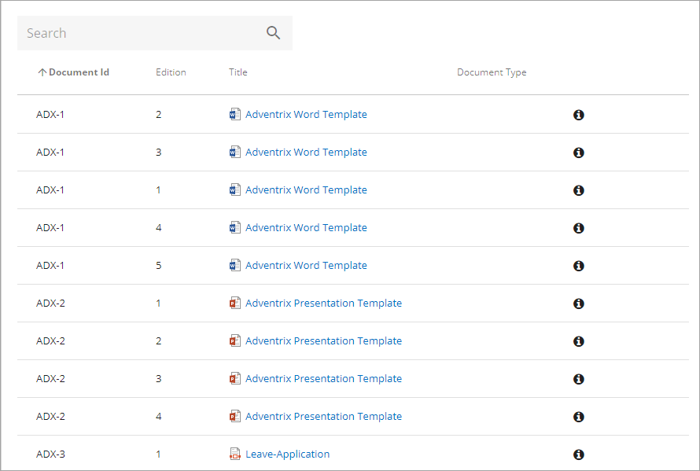
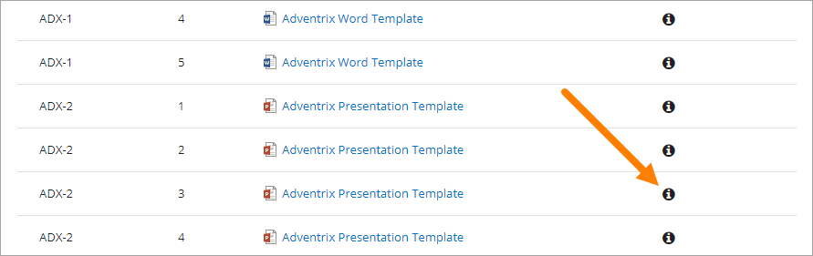
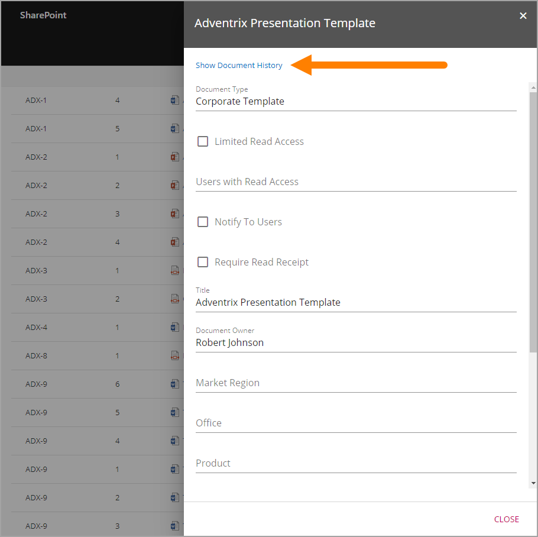
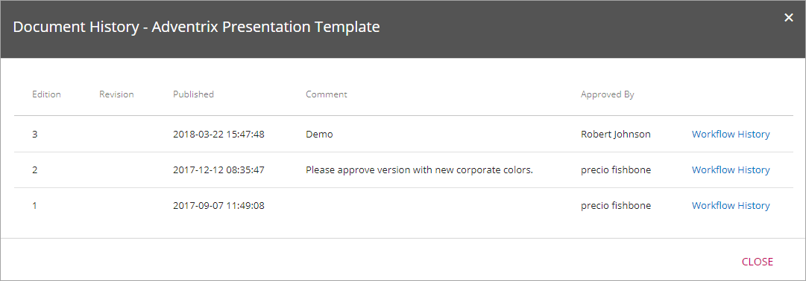
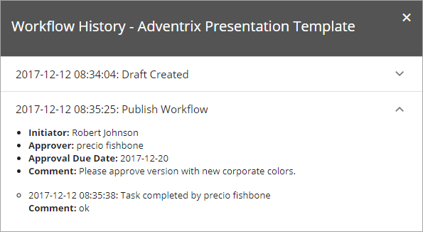

Archive
===========================

There is always at least one archive for an ODM installation, regardless of the number of sites used for authoring and publishing - but there can be several archives. The Controlled Documents Archive(s) are set up during installation. There is no settings you can do there.

A copy of all published document's editions are normally placed in an archive, but for some Document Types that really don't need to be archived, it can be turned off. In which archive douments of a certain Document Type should be archived (if there are several archives) can also be set for the Document Type.

The following information is available in the archive:

 
You can search for documents and sort the list on the headings, to make it easier to find information about a certain document edition.

To be able to see information about a specific edition, click the i-icon.

 
The property information for the document is shown to the right. To see the document history, for example the dates when the editions was available for users (published), click the link:

Something like the following is shown:

Note that the edition you selected, and the editions before that, is listed. To get a list of all editions you have to select the last one. In this example, there is an edition 4, that is not listed here, as we selected edition 3.

As you can see, you can even see the the workflow history for each edition listed. This is the same information that is available through the Published tab in the Controlled Documents library. Here's an example with one of the posts exapnded:

