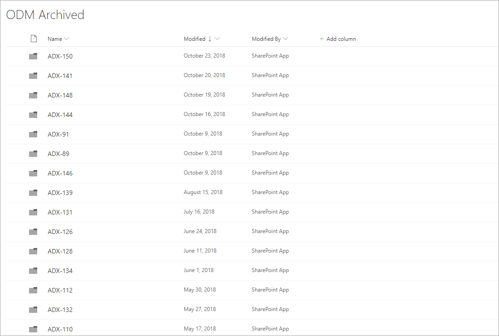
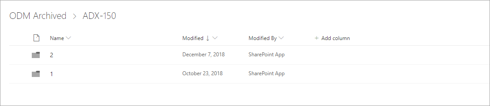
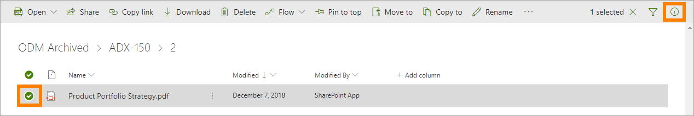
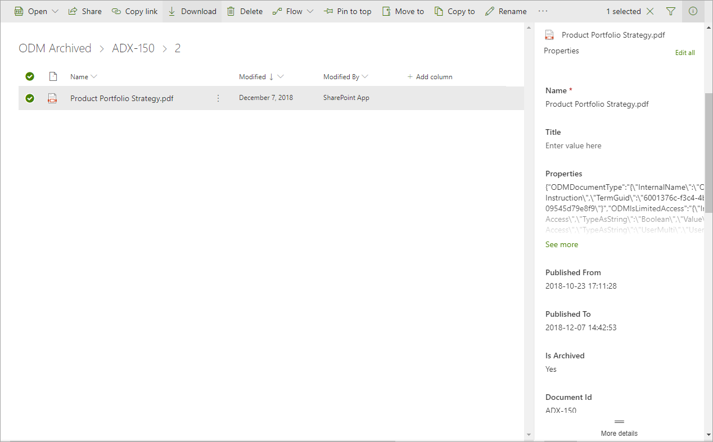

Archive
===========================

There is always at least one archive for an ODM installation, regardless of the number of sites used for authoring and publishing - but there can be several archives. The Controlled Documents Archive(s) are set up during installation. There is no settings you can do there.

A copy of all published document's editions are normally placed in an archive, but for some Document Types that really don't need to be archived, it can be turned off. In which archive douments of a certain Document Type should be archived (if there are several archives) can also be set for the Document Type.

The following information is available in the archive:

 
You can search for documents and sort the list on the headings, to make it easier to find information about a certain document edition.

There's a folder for all editions fo a document, and within that folder you find a folder for each edition.

To be able to see information about a specific edition, open the editions folder, select the document and click the i-icon.

 
Information about the edition, for example dates and time for the period when the edition was published, is shown to the right.

