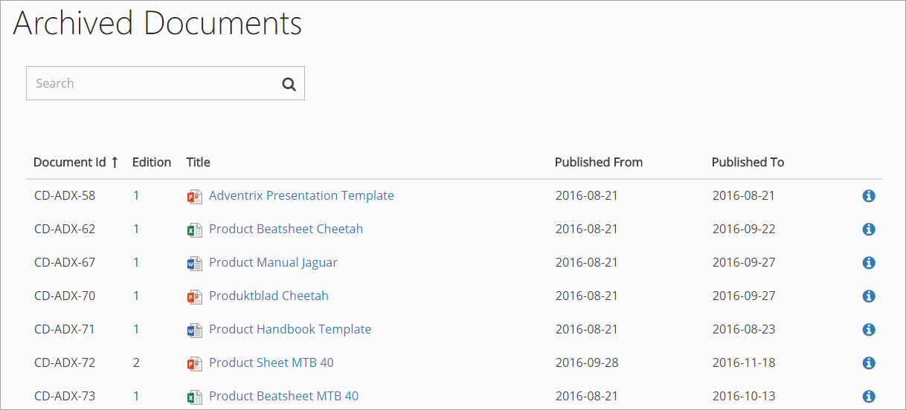
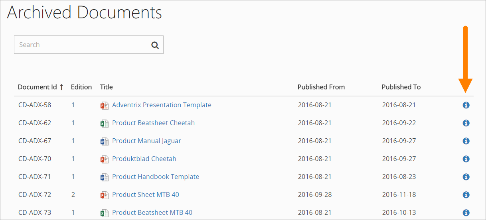

Archive
===========================

There is always at least one archive for an ODM installation, regardless of the number of sites used for authoring and publishing - but there can be several archives. The Controlled Documents Archive(s) are set up during installation. There is no settings you can do there.

A copy of all published document's editions are normally placed in an archive, but for some Document Types that really don't need to be archived, it can be turned off. In which archive douments of a certain Document Type should be archived (if there are several archives) can also be set for the Document Type.

The following information is available in the archive:

 
You can search for documents and sort the list on the headings, to make it easier to find information about a certain document edition.

+ To open the specific edition of a document, click the link.
+ To find out more about a documents edition, click the i-icon.

 
Here's an example of the information that can be shown:

.. image:: archive-icon-example.png

Note that you can view the Document History by clicking the link here. In the Document History, you can for examnple exact times for publication and comments added by the author during publication.

.. image:: archive-icon-dochistory.png

And from here you can even see the workflow history of the document, by clicking that link.

