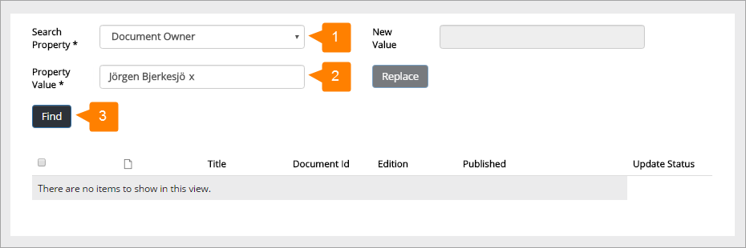

Documents Bulk Update
===========================

Use this option to bulk update any of the defined document management properties. One example could be if a colleague will no longer be document owner for a number of documents. With this option you can easily replace that name with another. Note that not all properties can be replaced, for example Approver. 

+ Start by selecting property, add the property value to be replaced, and then click "Find".

The list of published documents is displayed.

1. Select the documents to update (with other words, you can select any number of the documents in the list, to update).
2. Add a new value and click "Replace".
