Document Profiles
===========================

Here you can set up as many document profiles as you need, in the different languages you're using. A document profile has a specific set of properties, and has one or more defined document layouts.If you just have need of one, edit the name, set properties and select layout for the default document profile.  

Document profiles are used for Document Types. You select one Document Profile for each Document Type and select which Document Layout to use, from the list defined for the Document Profile.

**Note!**
Document profiles inherit properties from it's "parents", but you can change status for the properties on a specific profile when nedded. Therefore it can be a good idea to set up all properties that most of the profiles will share, at the top level. For a Document Profile that will not use a certain property, you can set that property to hidden there. A property can even be hidden at the top level, and shown on other levels. The same is true if you have many Document Profiles and work with groups of profiles, you can set all properties the group will share on the group's top level.

+ To create a new Document Profile, click the plus.
 
.. image:: document-profiles.png

You can even group Document Profiles.

.. image:: document-profiles-2.png

+ To create a sub profile, select the profile and click the plus.

Settings for Document Profiles
*******************************
The settings are organized in three tabs, see the sections below.

The General tab
****************
Enter or edit the name here. The name is displayed when selecting Document profile for a Document Type. If you are using several languages, the name can be set in each language. Save the name before entering another tab.

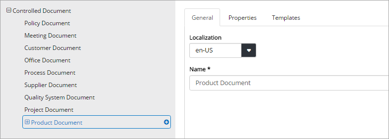

The Layouts tab
****************
A Template is a prepared document that an author can use as a starting point when creating a document of a certain type. A Template Document can contain as much content as is applicable. Regarding Microsoft Word Document Templates, the prepared document will normally contain a set heading and in some cases a set footer, with fields that can be populated with data when the document is published. See separate section for information on how to create Template Documents: (Link) [Creating a Template Document](/Docs/en-us/creating-a-layout-document/index.html)

There can be one or more templates defined for a Document Profile. Here’s an example:

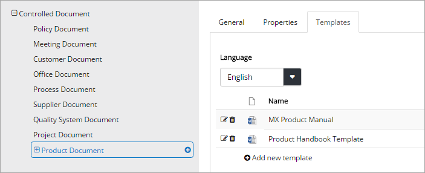

To see a list of templates for another of the languages you use, select the language in the list.

**Note!** This tab and the "Document templates" setting are connected. Changes you make here for Controlled Documents Templates are reflected in "Document Templates" and vice versa.

Adding a new template
--------------------------
Do the following:

+ Click "Add new template".

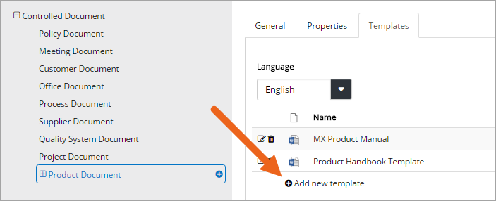

You can either link to an existing, published controlled document, or prepare and upload a new document, to use as a template.

Link to Document
-----------------
To link to a document:

+ Enter the document-id and click "Find".
+ When you have found the document, click "Save".

**Note:** When a new edition of the linked document is published, the template is automatically updated. When an editor creates a new document based on document type with a linked document as template, the latest edition is always used. Existing, published documents are not changed.

Upload document
---------------
To upload a document to use as a template:

+ Select "Upload Document".
+ Set a name. This name is displayed for the author, so make sure it’s really understandable.
+ Click "Browse"  to find the document on your computer and select it.

.. image:: dd-new-template-browse.png

+ Click "Save".

Editing and removing templates
-------------------------------
To edit or remove a template, use the icons:

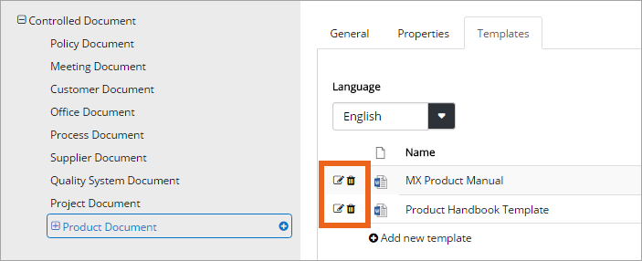

**Tip!**
When editing a template you can “update” by uploading another, updated file, but still use the same template name.

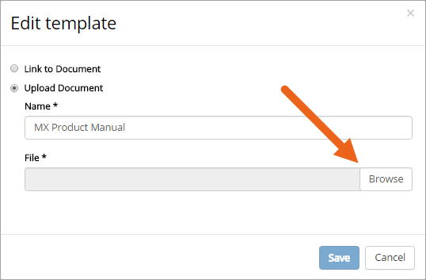

The Properties tab
*******************
Properties are inhereted, from the top settings ("Controlled Documents") and, if you are grouping Document profiles, sub profiles inherit from it's "mother", the top group profile.

You can set status for an inherited property on each profile as needed, see below. You can still add properties to any Document Profile as well. With other words, a Document Profile can have a number of inherited properties and a number of specific properties. Therefore it can be a good idea to start by adding the common properties to the top level.

**Note!** Properties can be hidden at top level but still displayed on some other level.

Adding common properties
--------------------------
If there will be properties you will use on most of the profiles, a good idea is to add them to the top level. You can change status for an inherited property on ecah profile, see below.

1. Select the top level, and then select the "Properties" tab.
2. Add new properties as described below and set a general, suitable status (remember that status can be changed for each profiler, if needed).

If you are working with profile groups, each group will inherit the properties from the top level, and you can add properties that is common for most of the profiles in the group. The sub profiles in the groupe will then inherit the group properties, as well as the top level properties.

To add, or edit, properties common for the group do the following when you have created the group:

1. Select the group.
2. Change status for top level properties, for the group's profiles, if needed.
3. Add additional properties that will be inherited within the group.

Adding a property
------------------
On the Property tab you define the properties fields to be used for this Document Profile. You do it the same way either you add a property that will be inherited, or you add a specific property to a Document Profile.

+ To add a new property, click the link.

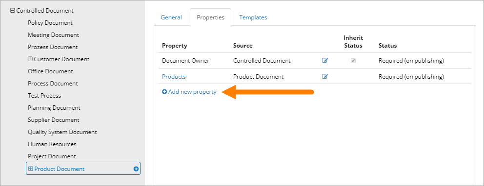
 
Set the following:

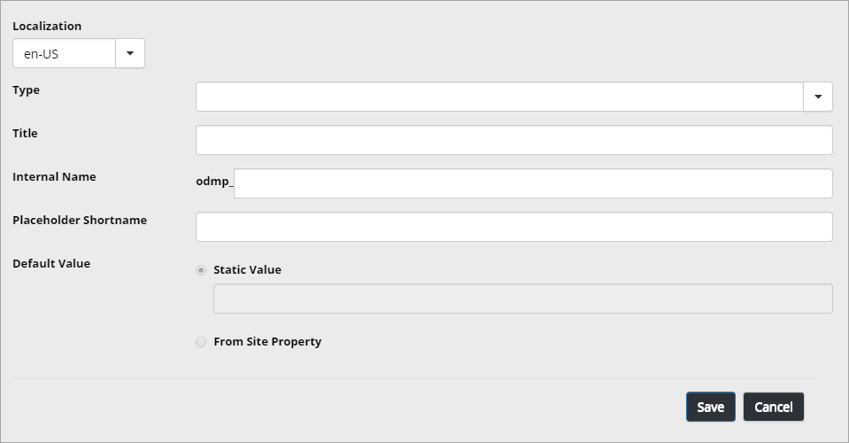
 
Use the fields the following way:

+ **Type**: Select type of field. If you select Managed Metadata, additional fields are displayed, see below.
+ **Title**: Title for the property, displayed for authors (and can be displayed for end users), and therefore very important that it is easy to understand. 
+ **Internal name**: Add a field name to use when the property is used as a field in a prepared Layout document. 
+ **Placeholder shortname**: As the internal name sometimes can be long, here you can enter a shorter name, more convenient to use in Word templates.
+ **Allow multiple selections**: Some fields, for example Person, can in some cases have more than one value. If that is the case for the property you are adding, select this option. (If the option is not applicable, it's not shown.)
+ **Default Value**: Setting a Default Value is always optional. See it as a way to help authors to set correct values. You can set either a fixed value or set that the value from one of the site properties should be used. If it should happen that no data is available in some instances, no default value will then be set.

When you select "Managed Metadata", additional options are displayed:
 
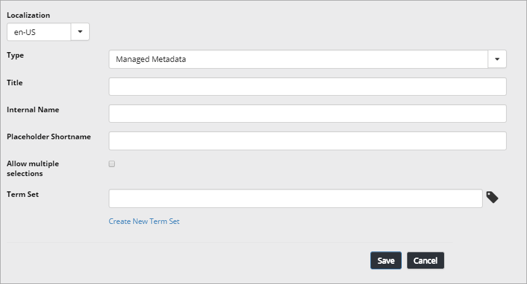

+ **Term set**: If a suitable term set exists, select it.
+ **Create new term set**: If no suitable term set exists, click the link to create a new term set.

If the term set has more than one level, for example country-city-office you can select which level to start on and also limit number of levels shown.

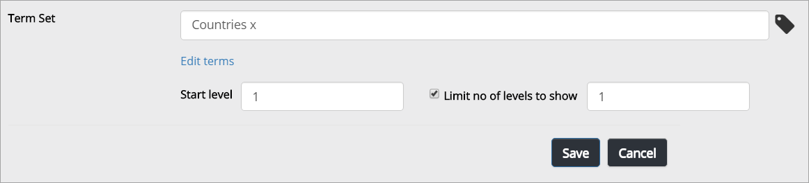

With this options you can make certain that for example only the cities in a chosen country can be selected, or only the offices in a chosen city can be selected, because only that part of the term set will be available.

Inherit Status and Status
--------------------------
In the list of properties for a Document Profile, you can see which propertis are inherited and which properties has been added "locally". An inherited property has a check box, either checked or not checked. If the status is the same as the "mother" the box is checked, if the status is altered, the box is not checked. In the column "Status" you can see actual property status for both inherited and locally added properties.

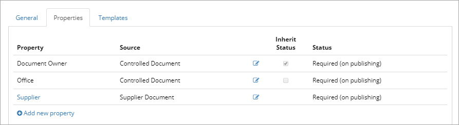

In the above example the property "Document Owner" is inherited and has the same status as the mother. "Office" is also inherited but the status is changed. "Supplier" is a locally added property.

Setting property status
------------------------
When you add a property on the top level ("Controlled Document") you set a default status for the property. The profiles that inherit the property can set another status, applied for that profile only, if needed.

Note! If you change status for an inherited property for a group, all new profiles you create in that group, will inherit the group status, not the top level status. You can still change property status for a sub profile, if needed.

Property status can be:

+ **Optional**: The editor can set this property when needed, but it can also be empty.
+ **Required (on publishing)**: The property must be set for the author to be able to publish the document.
+ **Hidden**: The property is not shown on this profile (and thus not on any document of a Document Type that uses this Document Profile). This option is set for example when an inherited property should not be used.

To set status for a property, do the following:

1. Click the pen symbol.

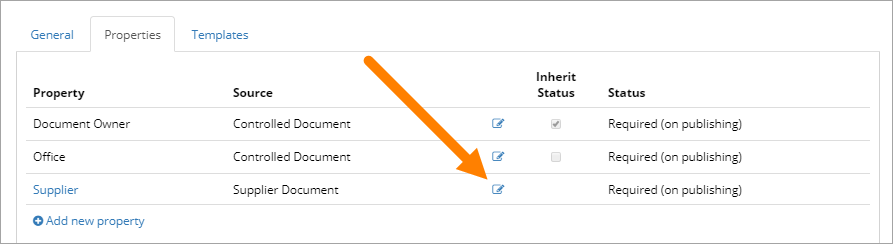

2. Select status from the list.

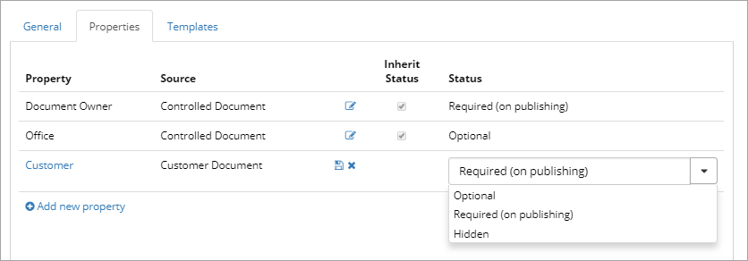

3. Click the disc symbol to save the changes.

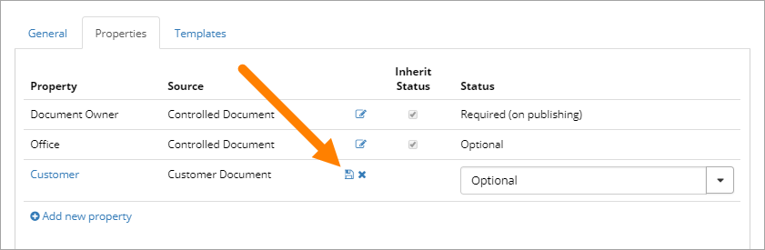

To not save the changes, click the x.

Changing status for an **inherited property** is just slightly different.

1. Click the pen symbol.

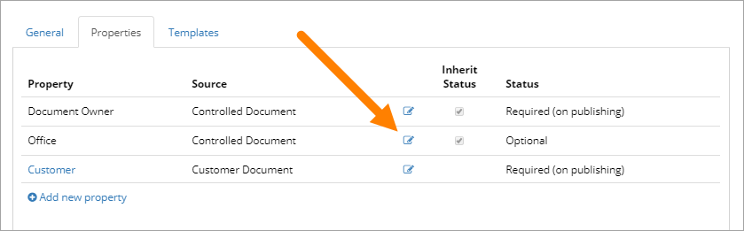

2. Click the Inhereted Status symbol to uncheck it.

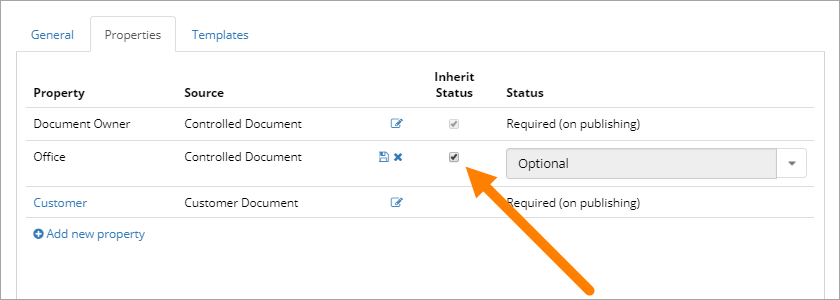

3. Select status from the list.

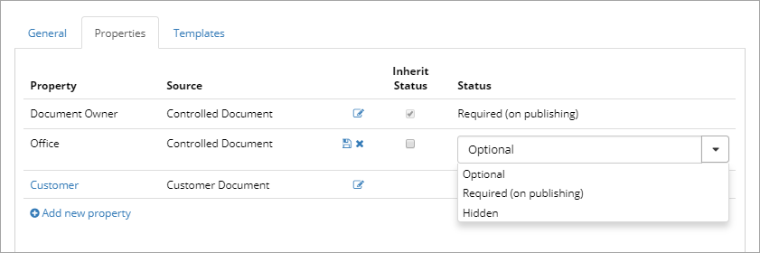

4. Click the disc symbol to save the changes.

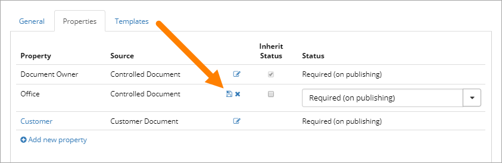

To not save the changes, click the x.

Edit or delete property
-------------------------
To edit a property, do the following:

1.click the link.

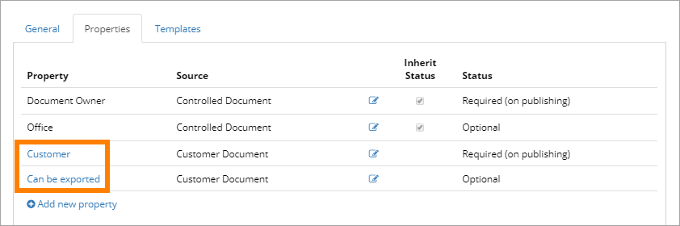

2. Make the changes.
3. Save.

**NOTE!** An inherited property can only be edited where it was added (at "mother").

To delete a property, do the following:

1. Click the link.

.. image:: delete-property-1.png

2. Click "Delete".

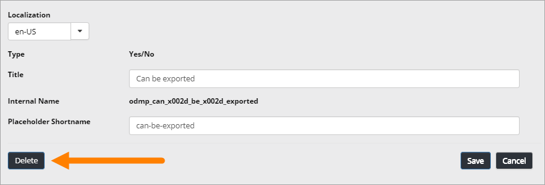

**NOTE!** An inherited property can only be deleted where it was added (at "mother"). For an inherited property to not be used on a profile, set status to "Hidden".

