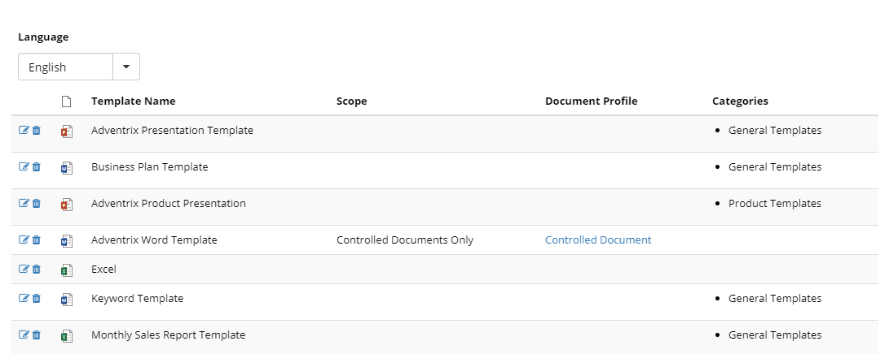
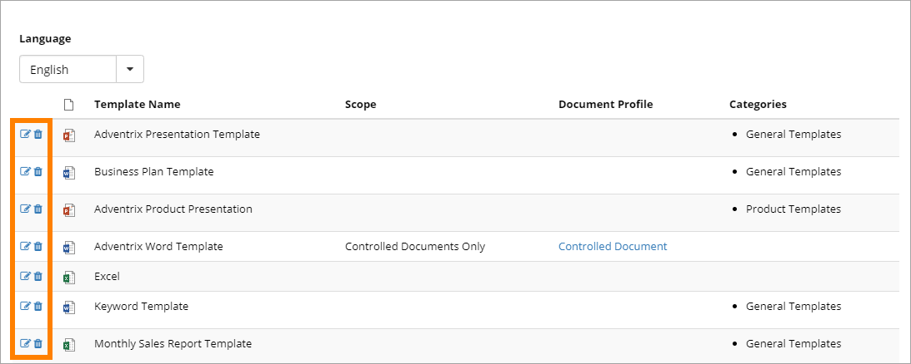
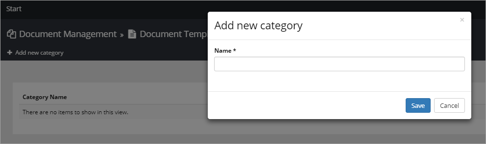
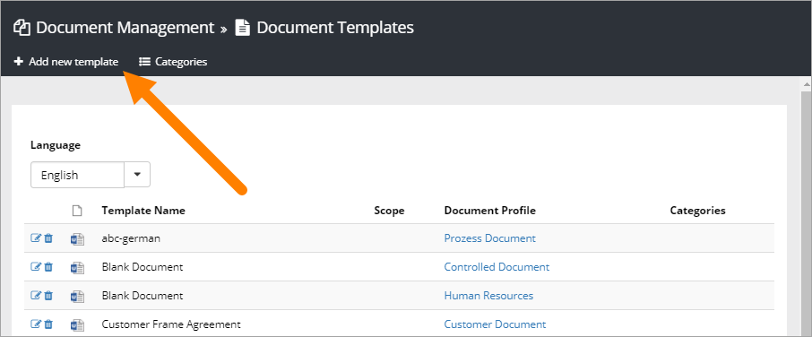
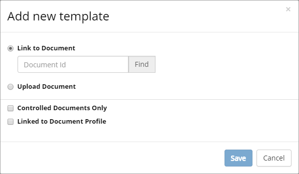
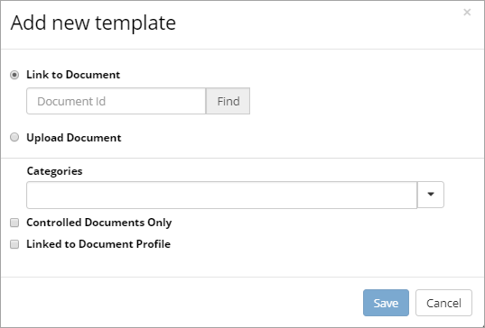
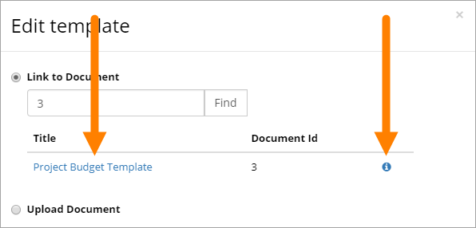
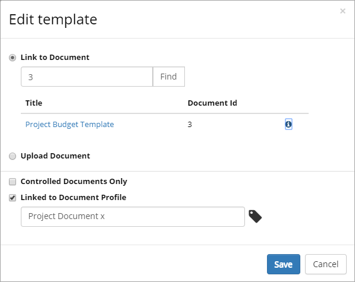
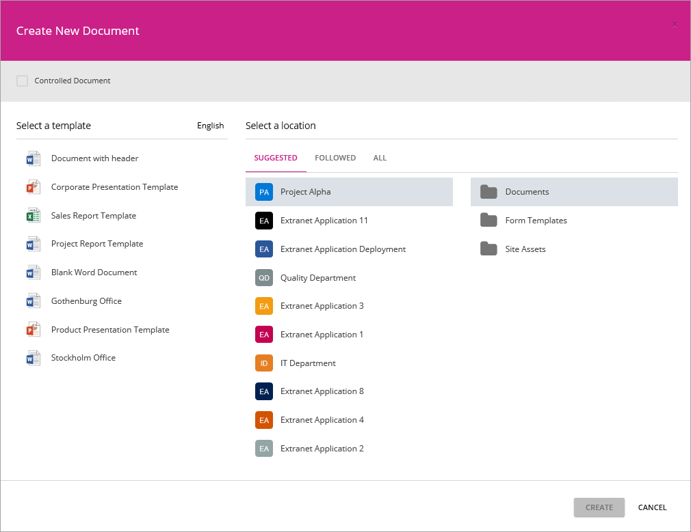

Document Templates
===========================

Management of Document Templates is handled here. The templates can be available for Omnia Document Management only or as general templates as well.

**Note!** This list and the list on the "Templates" tab under "Document profiles" are connected. Changes you make here for Controlled Documents templates are reflected in the list on the "Templates" tab and vice versa.

The list of available templates can look like this:

+ **Language**: Select language for a list of templates in that language.
+ **(Symbol)**: This colummn indicates the file type.
+ **Template Name**: Name of the template.
+ **Scope**: In this column you can see if the template is applicable for Controlled Documents Only, or for general documents as well (in this case the field is empty).
+ **Document Profile**: States which Document Profile the template is connected to. You can go to the settings for the Document Profile by clicking the link.

To edit the settings for a template, or to delete it, use the icons:

**Tip!** When editing a template you can “update” by uploading another, updated file, but still use the same template name and other settings.

Using Categories
*****************
If there are many templates you can use Categories to group them. It's most likely more useful for templates that will be used for general, non-controlled documents.

The first step is to create the Cateogories you will use (you can of course add more Categories later) and then add Categories when adding or editing templates. Using Categories is never mandatory, and even if you use them, some templates can still have no Category. On the other hand, a template can belong to more than one Category.

If Categories are used, users will see them as "folders" in the Document Wizard.

Adding a new template
**********************
Do the following:

1. Click "Add new template".

The following is shown:

You can either link to an existing, published controlled document (and by this handle templates in both a controlled and useful manner), or prepare and upload a new document, to use as a template.

If Categories are used (which they are not in the following examples) a list of available Categories is available, for example:

Link to Document
-----------------
To link to a published controlled document:

1. Enter the document-id and click "Find".
2. When you have found the document, click "Save".

**Note:** When a new edition of the linked document is published, the template is automatically updated. When an editor creates a new document based on document type with a linked document as template, the latest edition is always used. Existing, published documents are not changed.

**Tip:** You can click the link to downlad the template (for example to create a new template). You can click the i-icon to view the document's properties.

Upload document
---------------
To upload a document to use as a template:

1. Select "Upload Document".
2. Set a name. This name is displayed for the author, so make sure it’s really understandable.
3. Click "Browse"  to find the document on your computer and select it.
4. Click "Save".

Controlled Documents Only or general template
----------------------------------------------
If this template is applicable for Controlled Documents only, do the following:

1. Select "Controlled Documents Only".
2. Select Document Profile to connect the template to.

If this template is applicable for general documents, as well as for Controlled Documents, do the following:
 
1. Select "Linked to Document Profile".
2. Select Document Profile to connect the template to.

Here's an example of the settings for a template that is a published controlled document (linked to), used both as a general template and as a template for Controlled Documents:

The Document Wizard
********************
If the feature "Omnia Document Management New Document Wizard" is activated for the tenant, all Documents libraries will use the Omnia Document Wizard when a new document is created. Here's an example:

The available general templates are displayed to the left and selected there for the new document. Furthermore, the author can choose any site he or she has access to, for a location to save the document, even down to selecting a specific folder.
 
