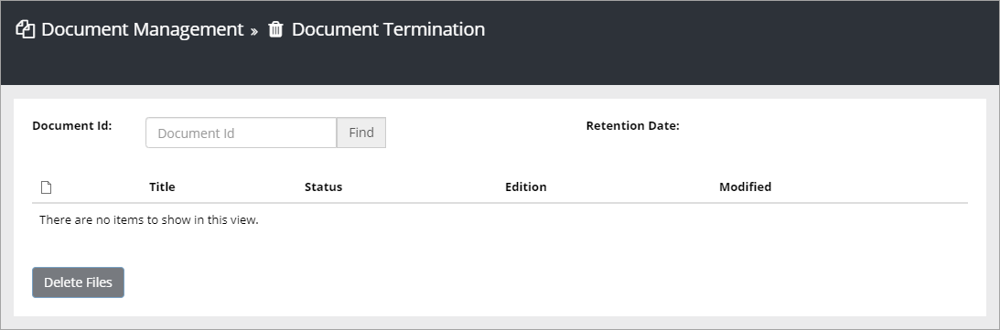

Document Termination
======================

When the Retention Date of a document is reached, the Retention Manager will receive an e-mail. The e-mail contains a link to the Document Termination page:

To be able to terminate a document (completely remove it from the system), the Retention Manager needs to enter the Document Id. The Document Termination list will then show all files (drafts, appendices, hidden files, published and archived files) connected to that Id. Here's an example:

.. image:: dm-documenttermination.png

All documents can be opened by clicking the links (even appendices) to check the contents. When all checks are done, the Retention Manager clicks "Delete Files" to terminate all files present in the list.

Once a controlled document is terminated, it can not be restored. (The individual files can be recycled from SharePoint for an additional period of time).
