Document Types
===========================

When creating a new controlled document an author selects a Document Type. Document Types can be grouped. In that case the author first selects group and then Document Type within that group.

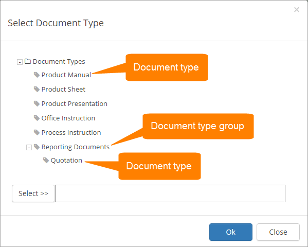

A Document Type contains the following:

+ A document Profile.
+ Document templates selected from the templates defined in the profile.

Creating a Document Type or Group
**********************************
To create a new Document Type or a group:

1. Click the plus and select what you will do.

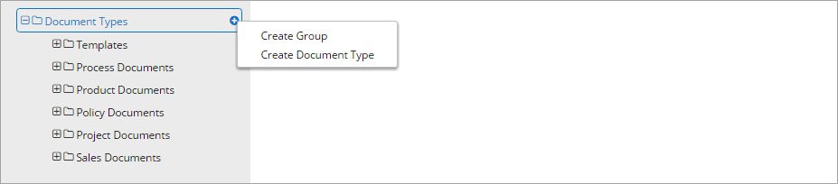
 
If you create a group, a name is all that is required. The name can be set in the languages you use.

2. To create a Document Type in a group, select the group and click the plus there.

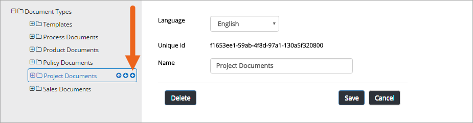

It's also possible to create sub groups this way.

You can sort if you want to present the list in a specific order to the editors.

1. Select the group or Document Type to move and use the arrows.

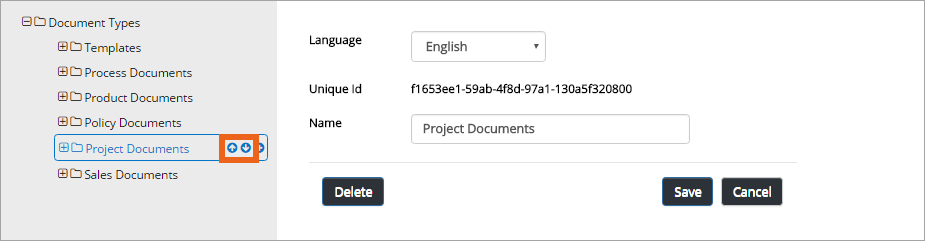

Edit, delete or move a Document Type or group
**********************************************
1. Select the type or group and use the buttons.
 
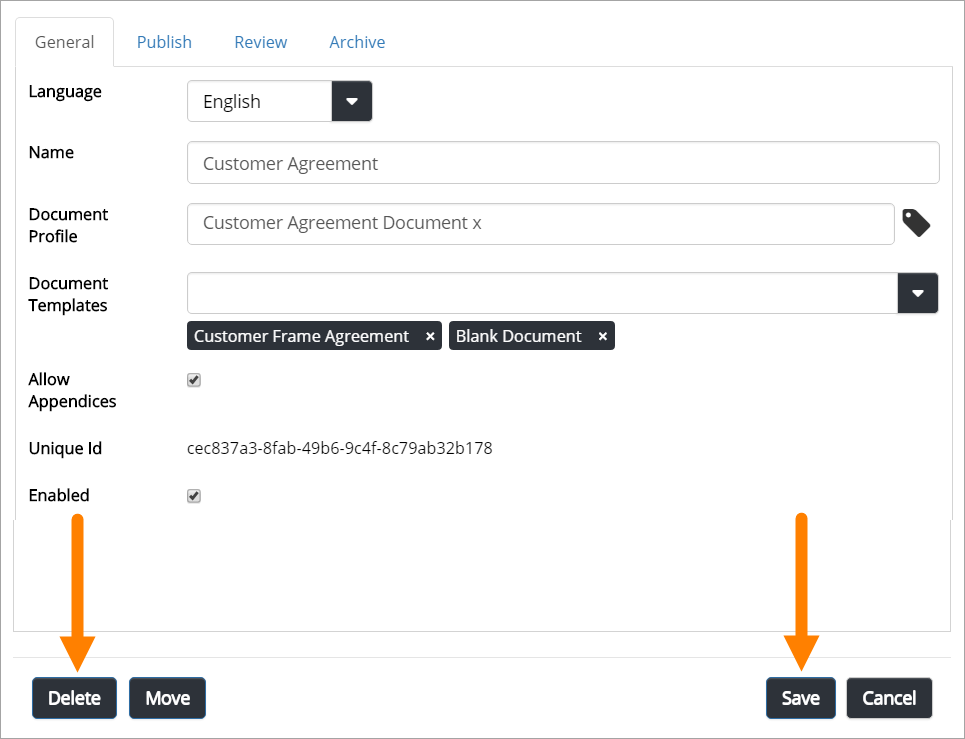

You can move a Document Type to another group, if needed.

1. Select the type and click "Move".
 
.. image:: doctype-move-new.png

2. Select group to move to, and click "OK".
 
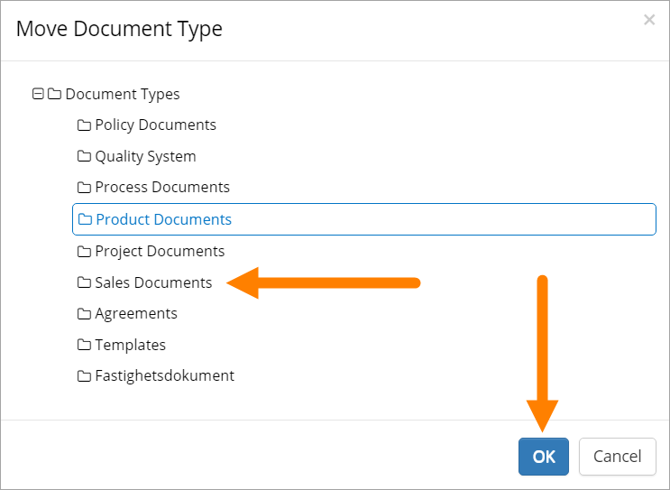

Settings for Document Types
****************************
The settings are organized into four tabs, see the sections below.

The General tab
--------------------
Use the fields on this tab the following way:  

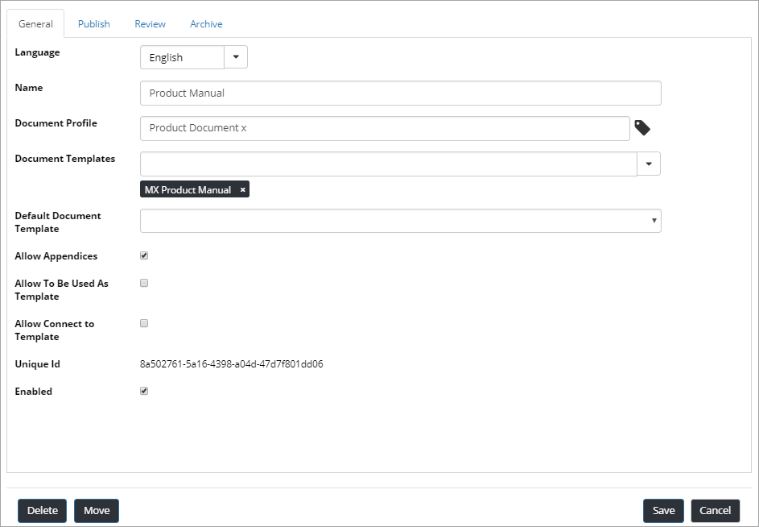

+ **Language**: Select language for documents from this Document Type.
+ **Name**: The name is displayed when the author selects Document Type to create, so make sure it’s understandable.
+ **Document Profile**: Select a Document Profile.
+ **Document Templates**: Select one of the templates defined for the profile you have chosen. You must always do that even if there’s just one template.
+ **Default Document Template**: Use this option to select one of the templates for this Document Type as the default template. When selecting the Document Type, the author then has this template pre selected.
+ **Allow appendices**: Check this option to allow for appendices. Authors can then tie other documents as appendices to the main documents. This option must be checked to make it possible for this document type.
+ **Allow to be used as template**: (A description will be added soon).
+ **Allow Connect to Template**: (A description will be added soon.)
+ **Unique id**: Created by the system.
+ **Enabled**: When selected, this Document Type will be available for authors.

The Publish tab
-----------------
Here you select options for approval and PDF conversion for this document type.

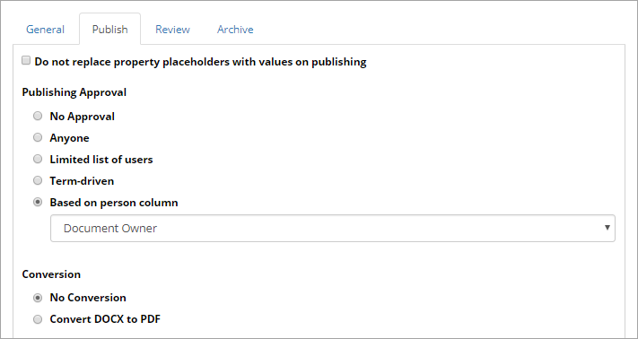

When a document is published, the placeholders will be replaced with metadata, but for a document that will be used as a template, you will probably not want that to happen. In that case, select "Do not replace property placeholders with values on publishing".

Publishing Approval
'''''''''''''''''''''
+ **No approval**: As it says - no approval will take place. A document will be published immediately when an author clicks "Publish".
+ **Anyone**: The author can select any user of the portal as approver.
+ **Limited list of users**: Authors can select approvers from a defined list only (see below for more information).
+ **Term-driven**: Authors can select approvers from a defined list only (which approvers will be available depends on the Properties selected for the documents, see below for more information).
+ **Based on person column**: You then select one of the person columns defined, most often Document owner or Approver.

Define limited list of approvers
'''''''''''''''''''''''''''''''''
Follow these steps to define a list of approvers for authors to choose from. This list will then be available for all documents, in the Approval Workflow.

1. Select "Limited list of users".
2. Add all portal users that should be able to act as approvers, to the field.

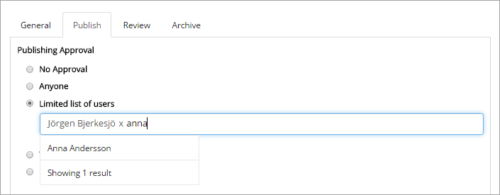
 
(You don’t save the list separately, you save the list when you save the Document Type.)

Define term-driven lists of approvers
'''''''''''''''''''''''''''''''''''''''
Here you can define separate lists of approvers for each metadata term (property) available in the Document Profile. The appropriate list will then be shown for the author, in the Approval Workflow, depending on properties selected for the document.

Follow these steps:

1. Select "Term-driven".
2. Select metadata (Property) field.

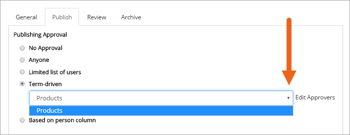

3. Click "Edit approvers".

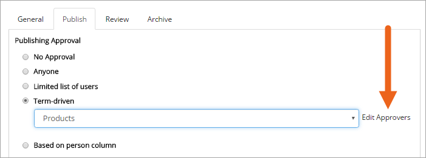
 
4. Select property (main property or sub property).

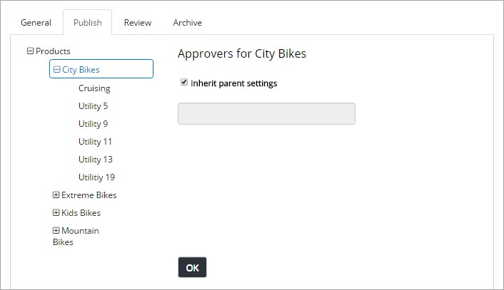

**Note!** If you select a main property, the settings will apply for all sub properties as well.

5. Add all portal users that should be able to act as approvers for the selected property/properties, to the field.

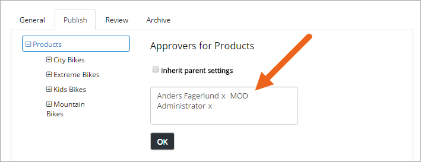

6. Click "OK".
 
Conversion
''''''''''''
At the moment, only conversion of docx files is possible.

1. First select if conversion should be available for the document type or not. Conversion is availbale as default.
2. Then, if conversion is on, you can select available options for the author:

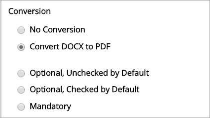

+ **Optional, unchecked by default**: Author can select to convert or not for each document. Default: unchecked.
+ **Optional, checked by default**: Author can select to convert or not for each document. Default: unchecked.
+ **Mandatory**: All documents of this document type will always be converted when published.

The Review tab
---------------
This tab is used for review and feedback settings.

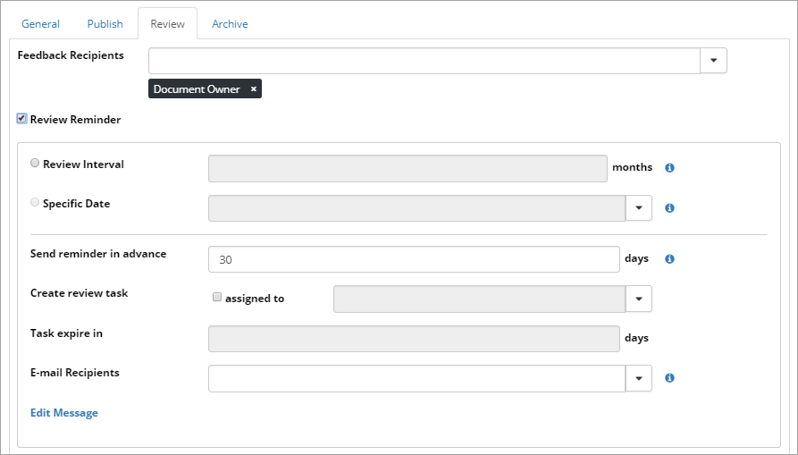

+ **Feedback Recipients**: Select either Document Owner or Approver.
+ **Review reminder**: Select this box to activate review reminders.

When review reminders are activated you can set the following:

+ **Review interval**: Set number of months for Review interval. Each month a list is created for you and sent by e-mail. The lists contain all Document Types that needs a review the upcoming month.
+ **Specific date**: If this document type is connected to a document profiles that contains a date field, you can set review related to the date entered there.
+ **Send reminder in advance**: Set the number of days that a reminder should be sent, before the reminder date.
+ **Create review task**: If a review task should be created, check the "assigned to" box. Then use the list to select who to assign the task to.
+ **Task expire in**: Set the number of days before the task will expire. 
+ **E-mail Recipients**: Select either Document Owner or Approver.
+ **Edit message**: Klick this link to edit the text for the e-mail or the text for task.

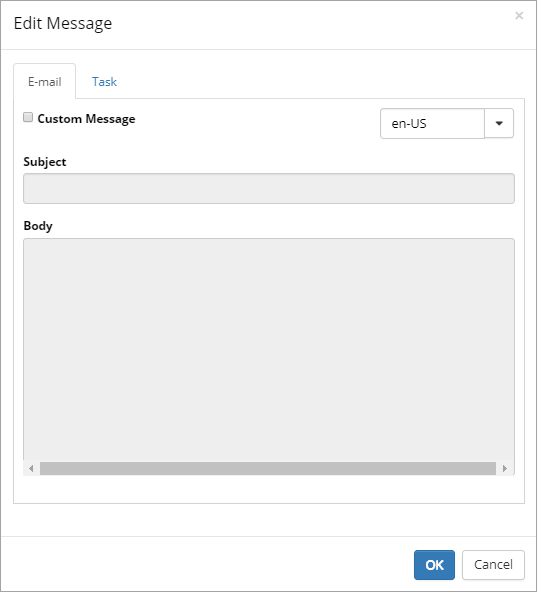

Select "Custom message" to override the standard message with one of your own, select language and type a subject and text's body. Don't forget to save when you're done.

The Archive tab
----------------
You can decide that a certain Document Type should not be archived. If the Document should be archived, you can set archive to be used.

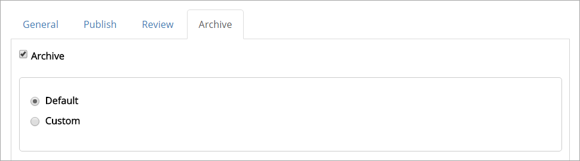

Do the following, if you don't want to use the default settings:

1. Select "Custom".
