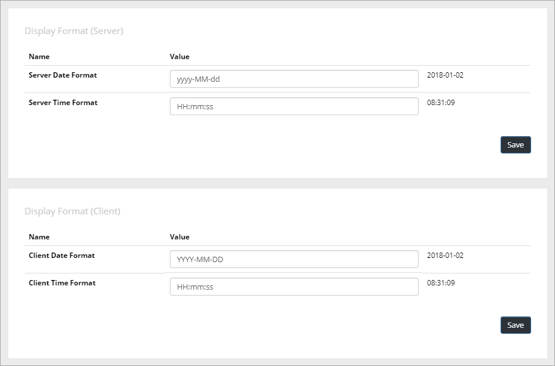
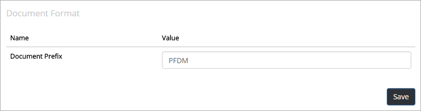
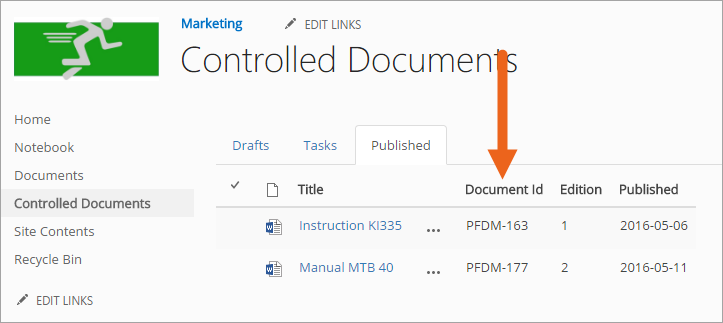
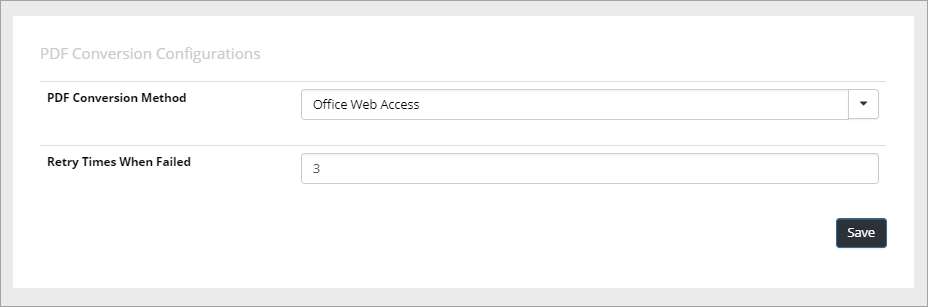
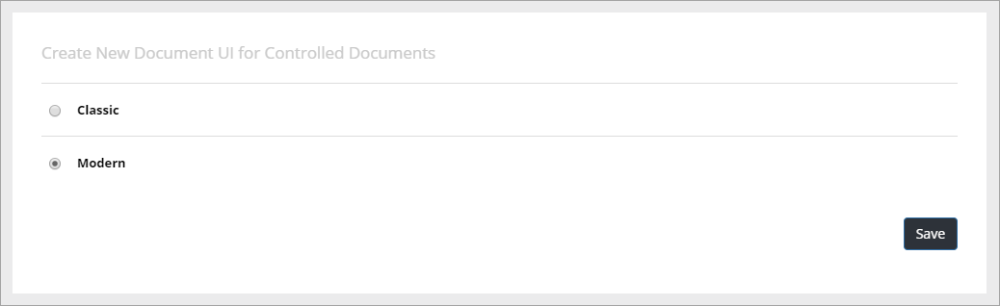
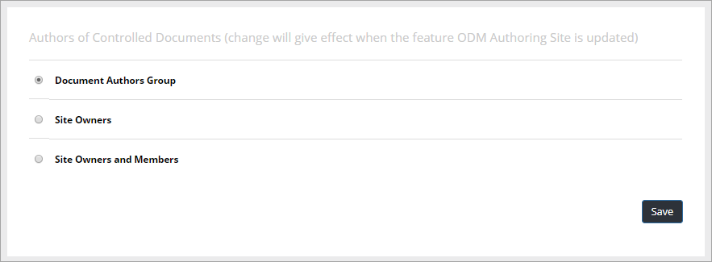

Settings
===========================

Under "Settings" in Omnia Admin, the following is available:

Display Format (Server or Client)
***********************************
Set the date and time format that should be used in ODM. I needed, you can set different values for the server and clients respectively. If you’re not certain what the result will be for a certain format, a preview is shown to the far right:

Document Format
****************
Here you set the prefix for the Document id for this tenant.

 
When a new controlled document is published the first time, a document id is set for the document, based on the prefix from the settings. This document id is then the same in all future editions of the document and is an important part of tracking published editions of the document.
 

Search Configurations
**********************
Here you set the review date property name for this tenant.

.. image:: search-configuration.png

PDF Conversion Configurations
*****************************
Here you can set a number of options that may be needed for PDF conversions.

First select the conversion method to see the settings for the method.

Create New Document UI for Controlled Documents
***********************************************
Select Classic or Modern UI for new document in Controlled Documents.

Authors of Controlled Documents
***********************************
Here you can set the type of permissions to be used in Controlled Documents libraries in the tenant.

+ **Document Authors Group**: This is the default setting. A specific permission group will be used for authors.
+ **Site Owners**: All site owners will have permissions to work with Controlled Documents. No specific permission group for authors is needed.
+ **Site Owners and Members**: All site owners and all Members will have permissions to work with Controlled Documents. No specific permission group for authors is needed.

**Note!** This setting is not activated right away. It's actived when the feature "Omnia Document Management Authoring Site" is either activated or updated for a site.
