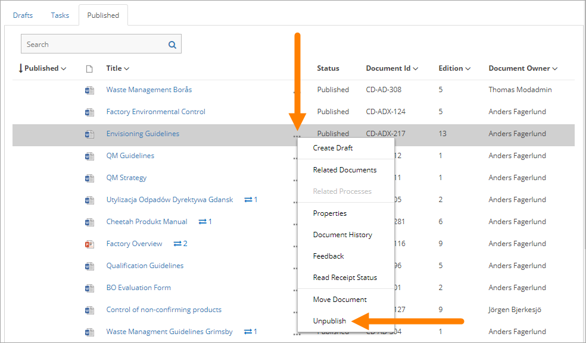

Unpublish
===========================

If needed, a published document can be unpublished. The document will then not be available for reading. The document is also removed from the Controlled Documents library and a copy is placed in the archive.

**Note!**
A document can't be unpublished if a draft has been created for that document.The draft must first be deleted.

The "Unpublish" option can be used on the "Published" tab and is found in a documents menu, for example:

 
