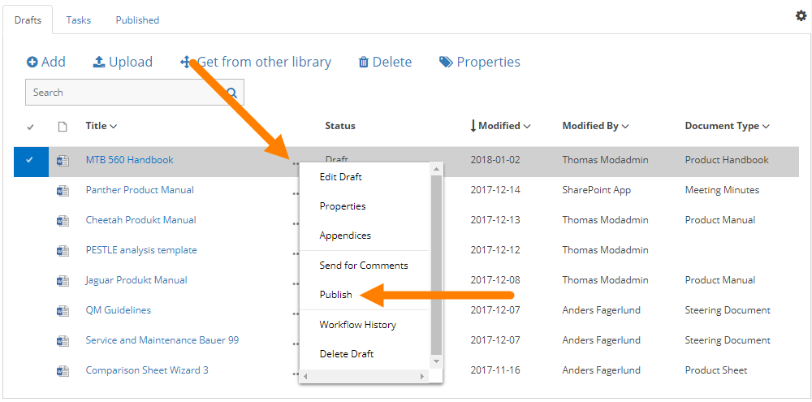
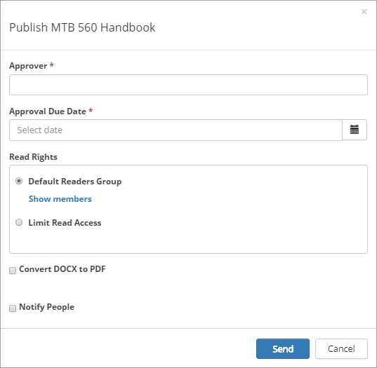
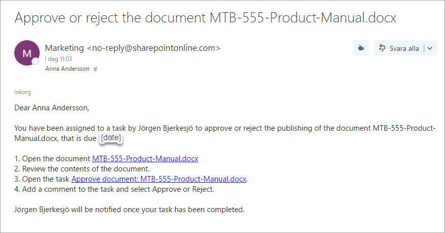
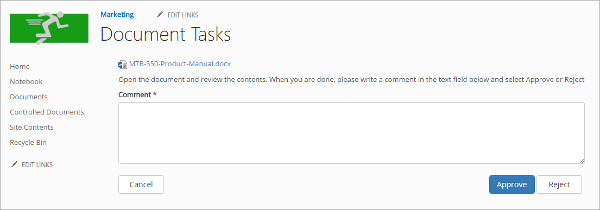

Approval Workflow
===========================

When a document has reached a final version, the document must be published, and, if approval is activated, be approved for publication, to be available for readers. The author then starts an Approval Workflow by selecting "Publish".

All metadata must be properly set before the Approval Workflow is started, so the document will be available in the right lists – if applicable. Some metadata can be mandatory. If all mandatory metadata has not been added, the Approval Workflow can not be started.

**Note!**
Metadata can also have impact on who is available as approver.

Any Send for Comments Workflow must be ended before an Approval Workflow can be started.
 
When the author publishes a document, something like the following is shown:

Exactly which options are available here depends on a a number of settings. These shown in the image are the most common.

+ **Approver**: The author selects one approver from the list. Available approvers depends on various settiings and how the system si set up.
+ **Approval Due Date**: Here the author adds a date when the approval should be made, at the latest. This is just information for the approvers. The Approval workflow is not stopped if this date is passed.
+ **Read rights**: The default selection is to use the Default Readers Group from the site’s permissions. If needed, the author can click "Show members" to see the permissions. A site administrator (owner) can edit the default read rights. If, for some reason, the Read Rights for this particular document should be different, the author can select "Limit Read Access", and enter the names of the readers, or any group memberships, for example AD groups.
+ **Convert DOCX to PDF**: An administrator can set how this will work, in Omnia Adm, and it can be different for each Document Type – it can be available or not available. Conversion to PDF is only available for docx documents.
+ **Notify people**: The author can use this option to notify certain people or groups about the new edition of the document. The notification is sent when the document is approved.

When the author clicks Send, a task is created for the approver, and an e-mail is sent, with a link to the document. Here’s an example:

 
The task can look like this:

 
The approver automatically has read access to the document (note! Read access only), until the task is completed. If Omnia Intranet is used, the approver is also notified in the notification panel, about the new task, and can choose to open the task from there. 

The workflow will be active until the task is completed and the document will be locked for editing during that time.

Approved or Rejected
********************
If the document is approved for publication, it’s now available for readers. The author will receive an e-mail stating that.

If it’s rejected, there’s some changes the approver would like the author to do. The author will receive an e-mail stating that the document was rejected and the e-mail also contains a message from the approver. After changes has been made the changes, the author starts a new Approval Workflow the same way as before.

