Controlled Documents Library
===========================

When a group site has been set up for Controlled Documents authoring, the following will be available for Controlled Document authors:

+ A documents library (Controlled Documents) that only users defined in the author’s permission group can work with.
+ A Send for Comments Workflow.
+ A Publish Workflow.
+ A Tasks list.
+ Workflow History.
+ Document History for drafts.
+ Document History for the published editions.
+ Options for relating to other documents.
+ Options for relating to QMS Processes (if Omnia QMS is installed).
+ Options for creating a new draft from a published document.
+ Options for unpublishing a published document.

In the Controlled Documents library, authors can find three tabs:

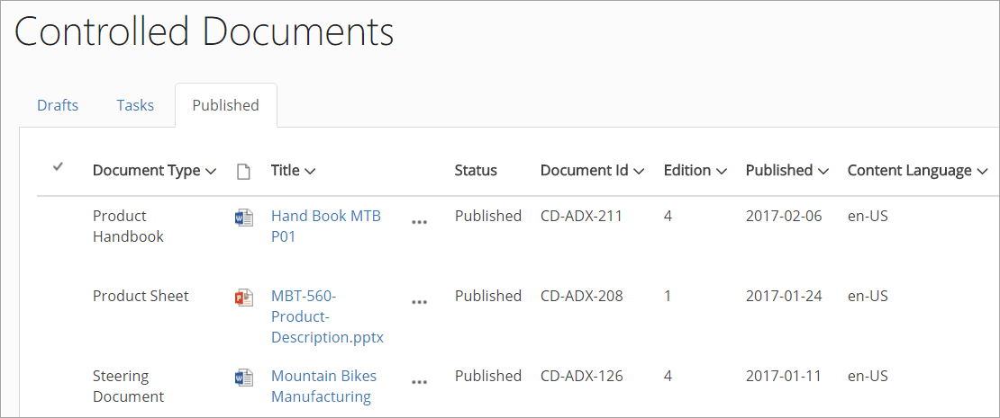

"Drafts" is used when creating and editing drafts for new Controlled Documents or when updating an existing document for a new edition. Note that there are several options available for creating a new draft document, see below.

"Tasks" is a list of tasks for the documents – either for review or for publication – both active and finished.

When a document is published (approved for publication) it is removed from Drafts and is available on the "Published" tab. Here the options for creating a new draft, unpublishing and Document History are available.

Most headings can be used to sort the list.

What fields to display on each tab can be selected in the settings, se below, but note the following fields on the "Published" tab:

+ **Status**: You can see this column on the Drafts tab as well. On the Published tab, status can either be Published or Unpublished.
+ **Document Id**: The first time a Controlled Document is published, it’s assigned a Document Id. This id is then the same through all published editions.
+ **Edition**: Here you can see which edition is the latest for each document. 
+ **Document Owner**: Displays the name of the Document Owner.

Settings for the Controlled Documents library
**********************************************
As a Site Administrator you can set a number of settings for the three lists in the Controlled Documents library.

Don't forget to save when you have changed any settings. The "Save" button is at the very bottom of the window.

The General tab
-----------------
Here you can use the following settings:

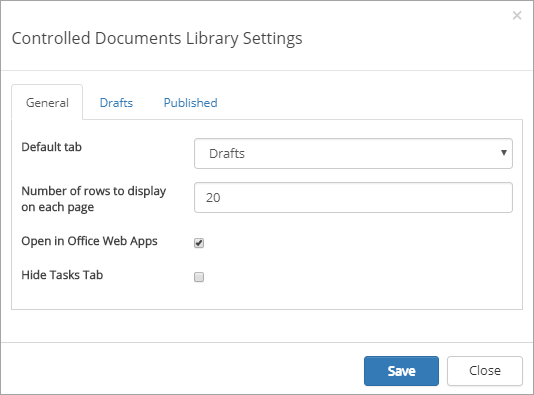

+ **Default tab**: Decide which tab will be shown when an author enters the Controlled Documents library.
+ **Number of rows to display on each page**: Set the number of rows to display before navigation to the next page will be shown at the bottom of the list.
+ **Open in Office Web Apps**: If documents should be opened in Office Web Apps, instead of a locally installed application, select this option. (If you select this option, authors can still choose to edit the document in the locally installed application, when the document is open.)
+ **Hide Tasks Tab**: If the Tasks tab should not be displayed for authors, select this option.

The Drafts tab
----------------
Here you can set the following:

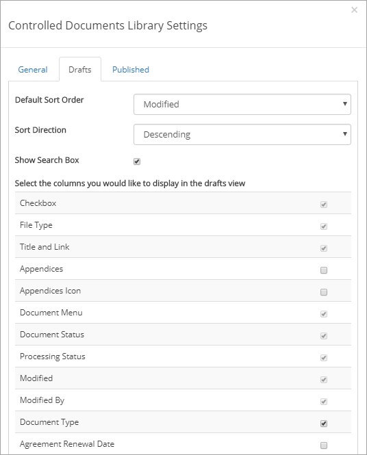

+ **Default Sort Order**: Select the column for default sort order for the list.
+ **Sort Direction**: Select Descending or Ascending for the default column selected above.
+ **Show Search Box**: If authors should be able to search for drafts here, select this option.
+ **Select the columns .....**: Check the columns to display in the Drafts list, and uncheck columns you don't want to display. (But note that the some columns can't be unchecked, they are mandatory.)

The Published tab
-------------------
Here you can set the following:

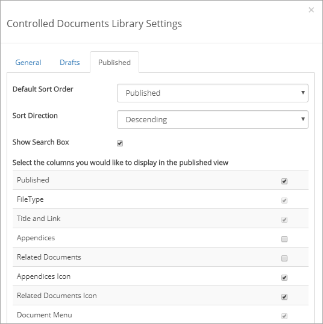

+ **Default Sort Order**: Select the column for default sort order for the list.
+ **Sort Direction**: Select Descending or Ascending for the default column selected above.
+ **Show Search Box**: If authors should be able to search for documents in the Published list, select this option.
+ **Select the columns .....**: Check the columns to display in the Published list, and uncheck columns you don't want to display. (But note that the some columns can't be unchecked, they are mandatory.)

Creating a draft document
**************************
When adding documents to a Controlled Documents library the author can either create a new draft or upload a document. If it’s a Controlled Document the author will actually work with here, a document should normally be created from scratch. 
If it’s a document that will be used as it is, for example as an appendice, it makes more sense to upload the document.

Creating a new draft document
----------------------------------
When creating a new draft document from scratch, the first step is to select language and a Document Type:

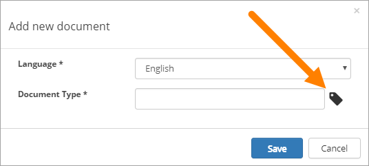

The Document Types are set up in Omnia Admin.

One or more Document Templates are available for a Document Type. If more than one is available, the next step is to select template.

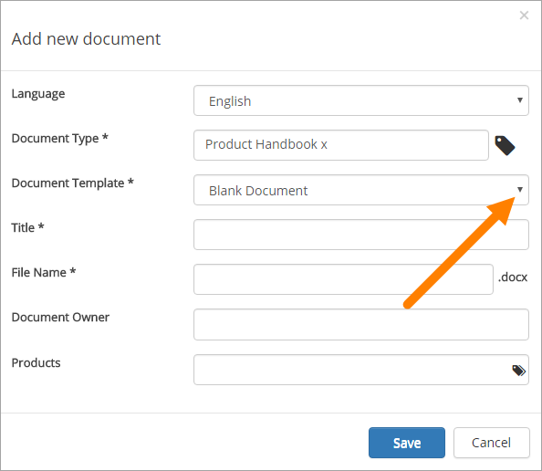

And then, the next step is to enter information for the document’s properties (metadata). What that will look like depends on the Document Type. Here’s an example:

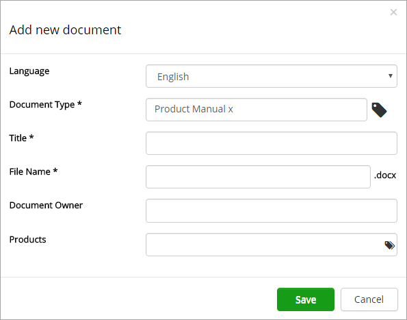

A number of mandatory fields can be present, marked with an asterisk (*). All mandatory fields must be filled in, or the document can  not be published, but it does not have be now.

Metadata can also, in some cases, be used as a filter for document lists, to make Controlled Documents available for users when they are published. Besides that, available approvers can depend on the metadata added. It’s always very important that information in metadata fields are added thoroughly.

A "tag" icon to the right in a field always indicates that it is a managed metadata field, for example:

.. image:: new-draft-4-border.png

When the properties has been entered and the author clicks "Save", the editing program (for example Microsoft Word for Word files) starts with the chosen document layout. Text and so on is entered the normal way. 

**Note!** Metadata fields visible in the document, displayed within double brackets, should not be used in the editing process. Information will be added to these fields when the document is published.

Uploading documents
--------------------
An alternative is to upload an existing document, but normally it should be used just for documents that will be added as they are, but will still be handled as Controlled Documents, for example with approval before publishing.

A Document Type has to be selected for an uploaded document and the document has to be tagged with the required metadata, or he document can't be published.

The template for the Document Type is not used for the first edition of the document, the document will be used with the exeisting template (of any). The next time a draft is created for an uploaded document, the template can be altered, if needed.

To select Document Type and add metadata, use the option "Properties" in the document's menu, after the document has been uplodade.

Upload Appendices
------------------
To upload documents to use as appendices to another document, the main Upload option does not have be used. 

1.	Open the dot menu for the document to add appendices to, and select "Appendices".
2.	Click "Upload" in the window shown.

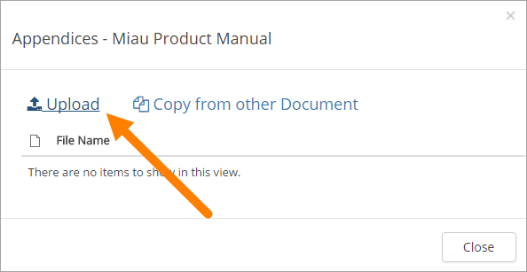
 
3.	Drag and drop one or more documents to the upload window.
4.	Click "Upload Files" to start the upload.
 
When the upload is finished the file(s) is visible in the Appendices list for the document, for example:

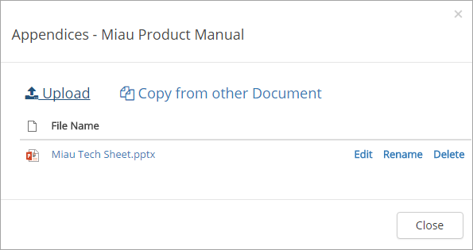
 
"Edit" can be used to edit the content of the appendix, if the file format is editable. "Rename" can be used to change the document's name. Use "Delete" to remove an appendix from this list.

Appendices can be added to this list continuously up to publication of the document. If appendices needs to be removed or added for a published document, a new edition of the document must be published.

**Note!** An appendix uploaded as shown above will not be visible in the Drafts list, but will only exist as a part of the main document. When a document with appendices is published, both the main document and the appendices are approved in one go. The appendices does not have to be approved separately (but also see below).

Published documents as Appendices
-----------------------------------
Another option is to add a copy of a published document as an Appendice. It must be a document that is published in this Controlled Documents library.

**Note!** In this case it is a copy of a document that will be added. There is no link between the published document and the copy, so if a new edition of the Appendice document is published, the copy used as an appendix is NOT updated.

1.	Open the dot menu for the document where you want to add appendices, and select "Appendices".
2.	Click "Copy from other Document" in the window shown.

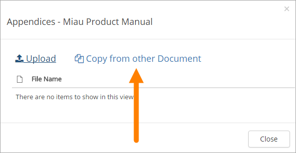
 
3.	Search for the document. 
4.	Select the documents to add (a copy of) as appendices and click "Copy", for example:

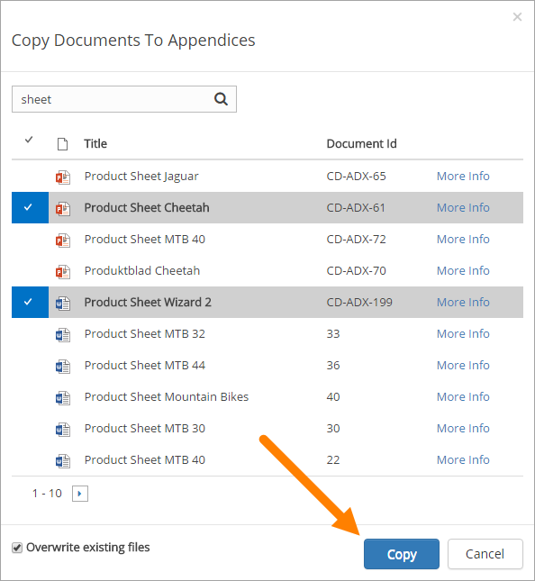
 
The documents added to the Appendices list this way is handled exactly the same way as a document uploaded as an appendix, see above. (And remember that it is a copy of the original document.)

If the Appendices column is shown on the Drafts tab, the number of appendices for a document, if any, is shown there, for example:

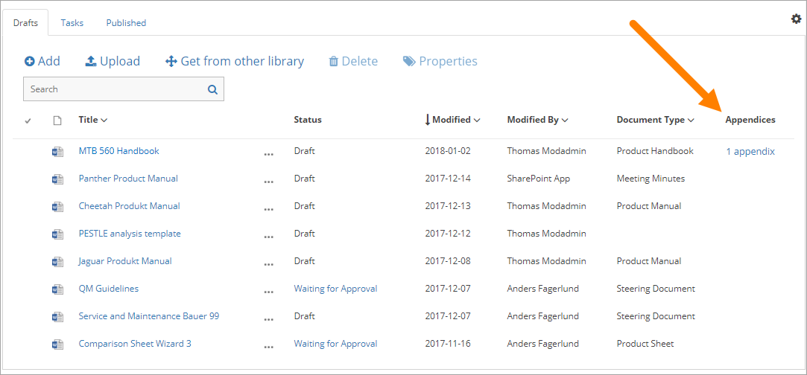
 
Creating a new draft from a published document
***********************************************
The work on a draft for a new edition of a document can be started whenever it’s convenient. The existing published edition is still available for readers until it’s replaced, when the new edition is published.

To create a new draft of a published document, do the following:

1.	Open the "Published" tab.
2.	Click the dot menu for the document.
3.	Select "Create Draft".

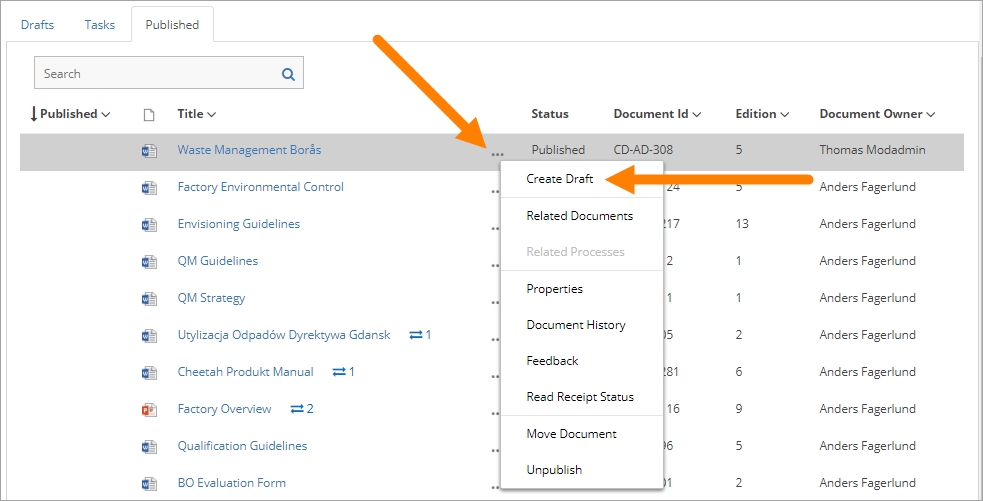

The new draft is created and the "Drafts" tab is automatically activated. The work on the new draft is done exactly as the first time, that a dokcument has been published before does not makes no difference.

**Note!** There can be only one draft of a given document. If there already is a draft for the document and an author tries to create another on, a message is shown. 
 
New draft and templates
-------------------------
If there is a new version of the template used for the document, the author will be notified and can choose to use the new version of the template, or stick to the old one.

A special case is when a new draft is created from a Word or Excel document that was uploaded rather than created from scratch. When a new draft for a second edition is created, the template can be altered (or rather selected). But using a  template for an uploaded document is never mandatory, the document can always be used as is.

When selecting a template for an uploaded dopcument, it’s always a good idea to use the preview to make sure the selected template actually works for the document.

If a template is selected, this document is from now on related to the template the same way as when a new document is created from scratch on the "Drafts" tab.

Evene if a template is not selected for the second edition, the author get a new chance the next time a new draft is created.

