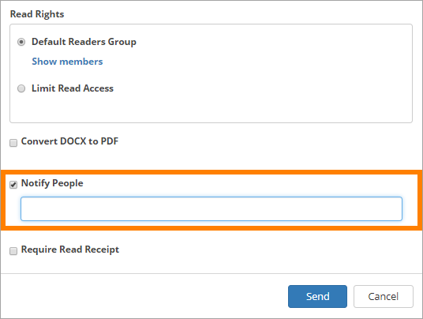
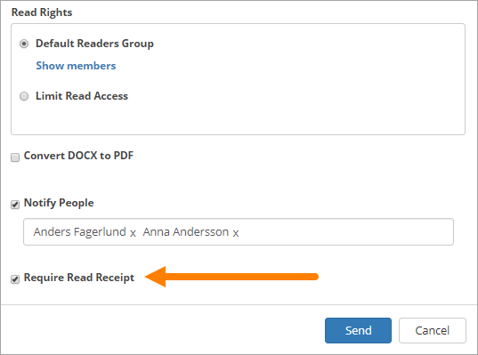
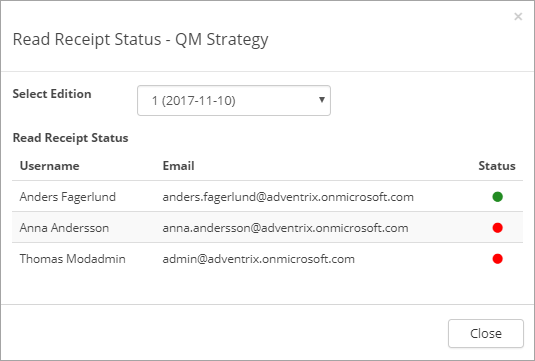

Read & Understood
===========================
When a controlled document is published, the author can choose to send a notification to some users, and when doing so, can also choose to receive read receipts, to make sure the notification has reached them. The notifications are sent when the document is approved for publishing.

Sending notifications is always voluntary. The decision is made when the document is published. If any colleagues should be notified of the new edition, "Notify people" is selected and people or groups are then added to the field.

Some notes on using groups for notifications:

+ Sharepoint groups and AD groups can be used (Office 365 groups can not).
+ Regarding	Sharepoint groups: Only Sharepoint groups within the active site collection can be used. There can not be an AD group defined in the Sharepoint group.
+ Regarding AD groups (Security groups): The AD group must be e-mail enabled. Read receipts can not be used for AD groups.

To make sure recipients has received the notification, the author can select "Require Read Receipt". (Also see above regarding AD groups.)

Check Read Receipt Status
***************************
Read Receipt Status can be checked for a document on the "Published" tab, this way:

1.	Click the dot menu for the document.
2.	Select "Read Receipt status". 
3. Select the edition to check.

A list of those that has received a notification with read receipt request is now displayed, there e-mail address and the status are shown. It can look like this:

 
A green dot means that the recipient has read the message, a red that he or she has not.

