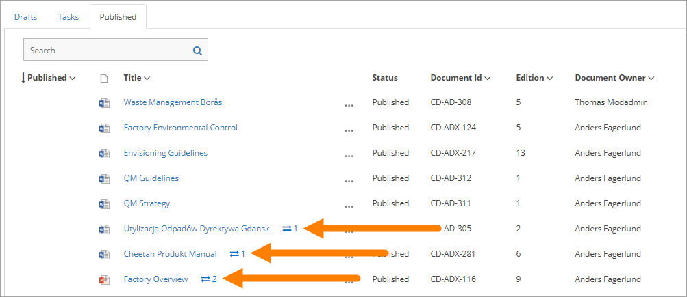
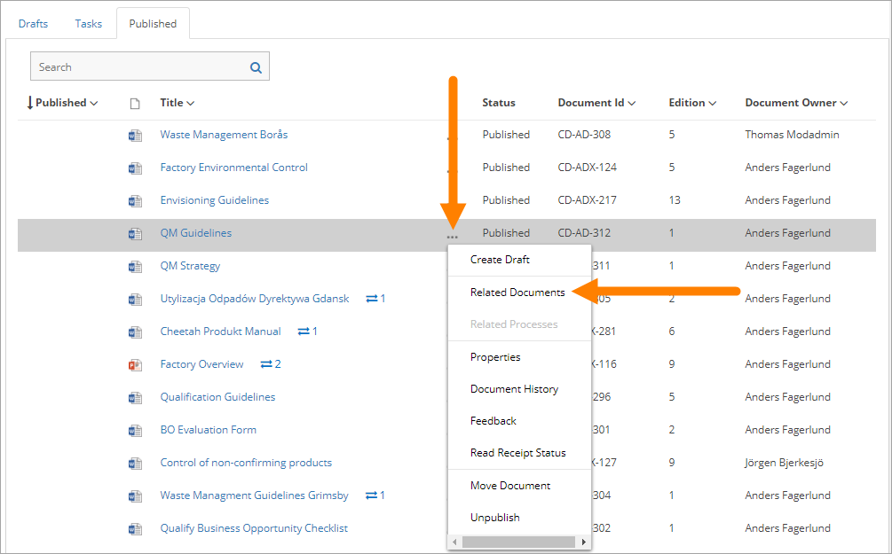
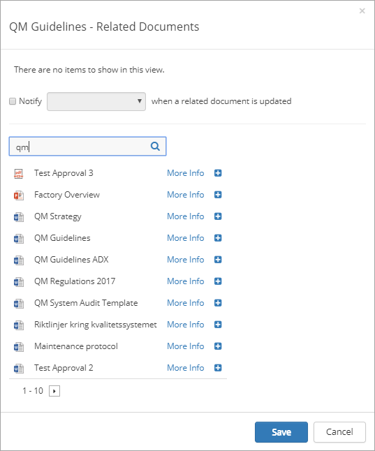
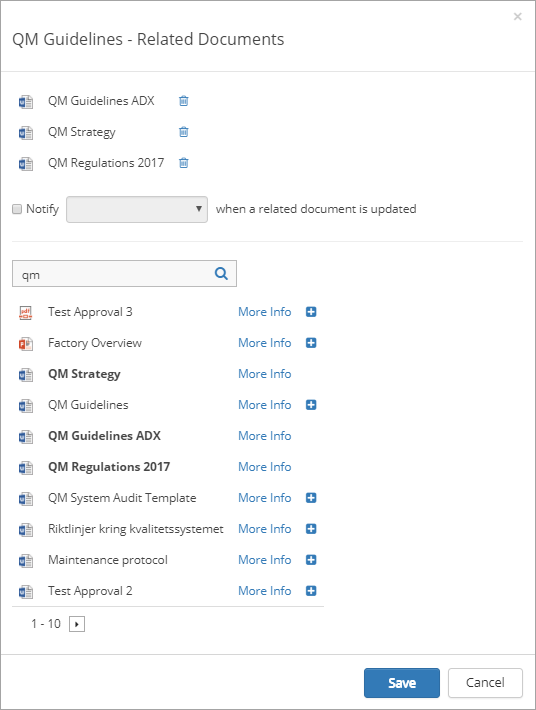
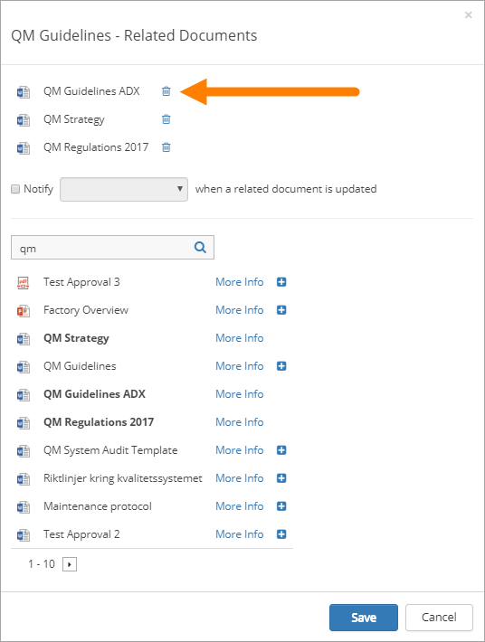
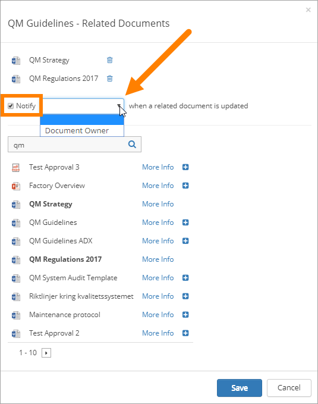

Related Documents
===========================

An author can use this option to relate a controlled document to other controlled documents, as information that can be shown to document readers. This option can alos be used to make sure someone, for example the document owner, will be notified when a new edition is published for any related document. Any published controlled document can be related to.

The number of related documents is shown to the right of the title, for example:

 
**Note!**
Relations between documents works just one way. If document A is related to document B, that is not shown for readers of document B. If document B should be related to document A as well, that has to be added for document B.

Relate documents
*****************
Authors can relate documents using the menu for the document on the "Published" tab:

 
Then a search for documents to relate to can be conducted. Here’s an example:

 
"More" info can be used to see a document’s properties. Click the plus to create a relation to a document. Click the triangle at the bottom by 1-10, to go to the next serach page.

Any number of documents in the search result can be related to, and a new search can be conducted to relate to even more documents, if needed. The related document(s) is shown at the top, for example:

 
Relations to documents are updated for the readers immediately. No new publication is needed.

Remove a related document
**************************
To remove a related document from the list, just click the dust bin for the document.

 
Being notified when any related document is updated
****************************************************
To activate notification for related documents, select who is going to be notified. When the option is activate an e-mail is sent to the receiver every time a new edition is published for any related document.

Document Owner is always available but other person fields can also be available depending on how Omnia Document Management is set up.

