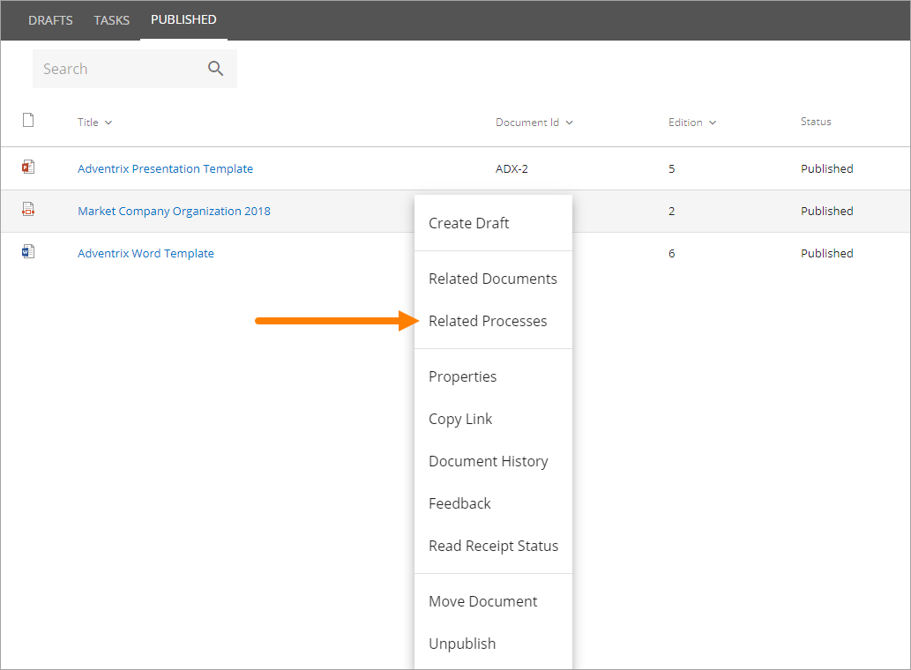
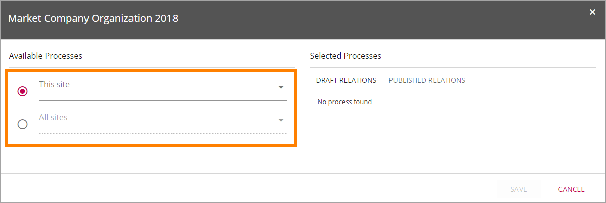
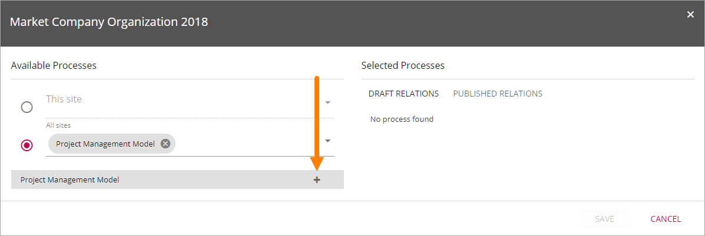
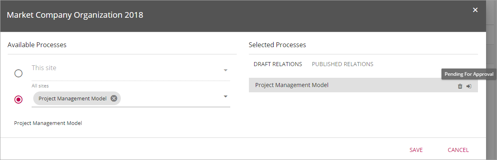

Related Processes
===================

If both Document Managament and Quality Management is installed in the current Omnia tenant, editors of controlled documents can relate a published document to a process. It’s then up to the Process Owner to decide to make the document available at the process in the Process viewer, or not. That second step is done in the Process Library. For more information see the heading *The Related Documents tab" in this page: :doc:`Process Library </quality-management/author/process-library/index>`.

Relate to processes
*********************
Authors can relate documents to processes using the menu for the document on the "Published" tab:

 
The next step is to choose to relate to processes in this site or to a site anywhere else (All sites):

If "This site" is selected, use the list to select a Process Library in this site.
If "All sites" is selected, search for a Process Library by typing in the field.

Click the plus to create a relation to a Process Library. 

By pointing at the icon to the right of the site name, you can see the status:

 
The information in this example means that the Process Owner has not yet approved the relation. The relation must be approved and the process needs to be published, before the document becomes available in the Process Viewer. The document can still be made available in other places, using a Controlled Documents Viewer.

To remove a relation to a process, click the dust bin.

