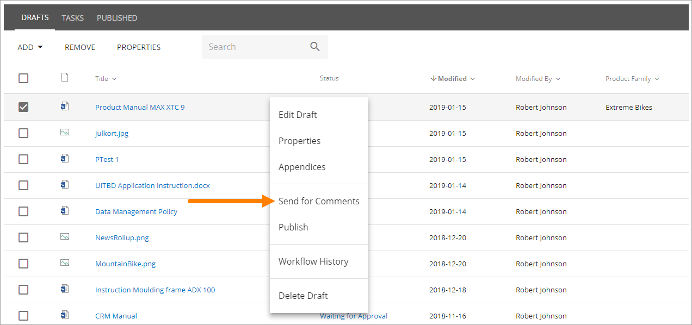
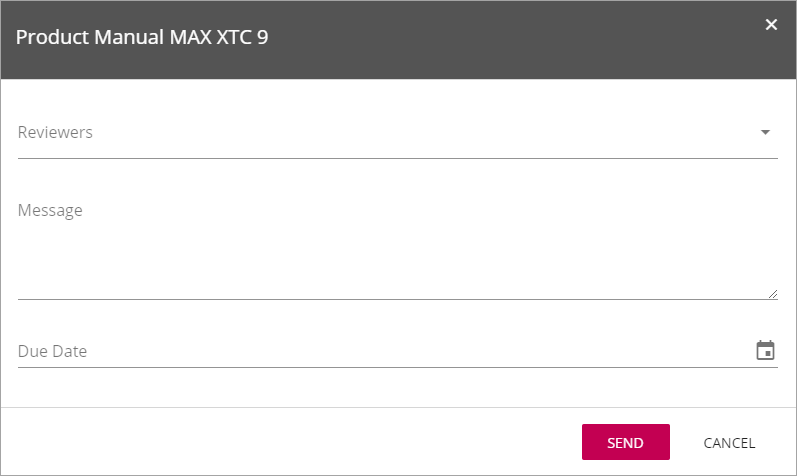
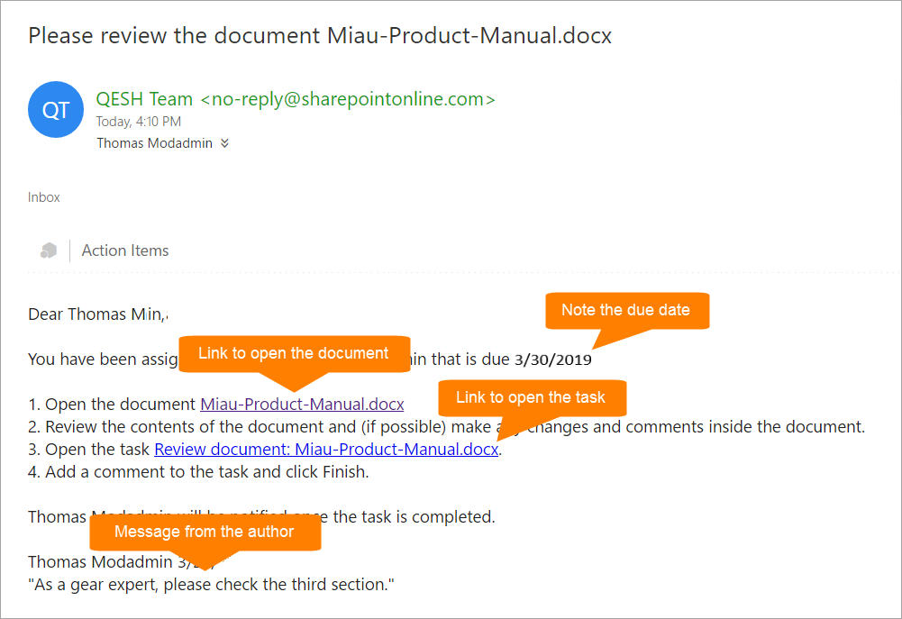
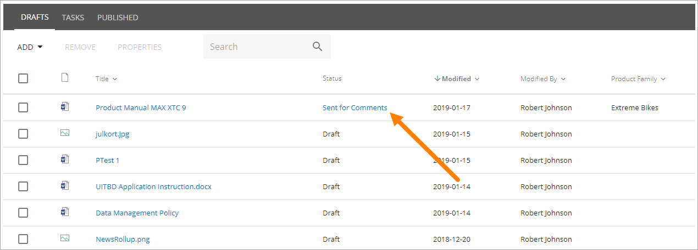
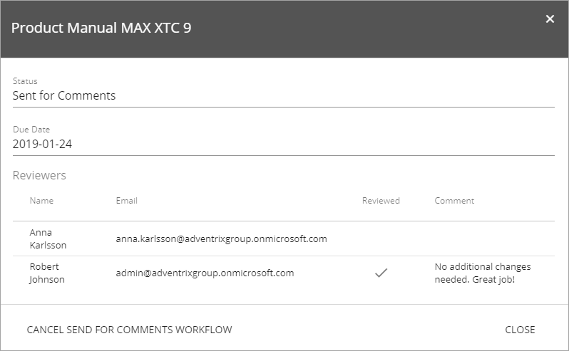
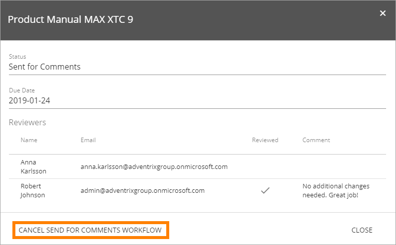
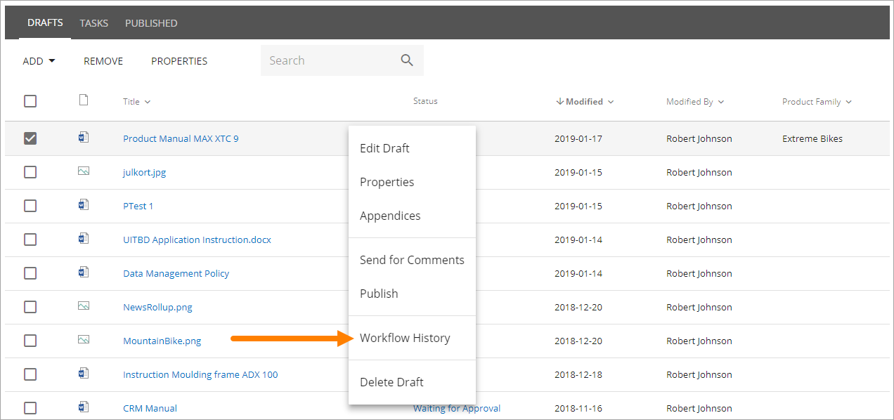
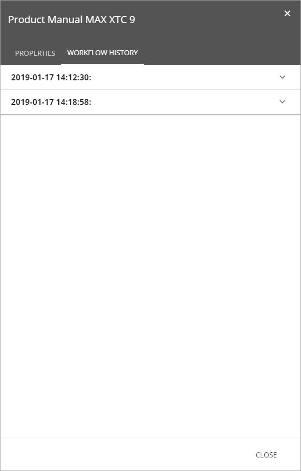
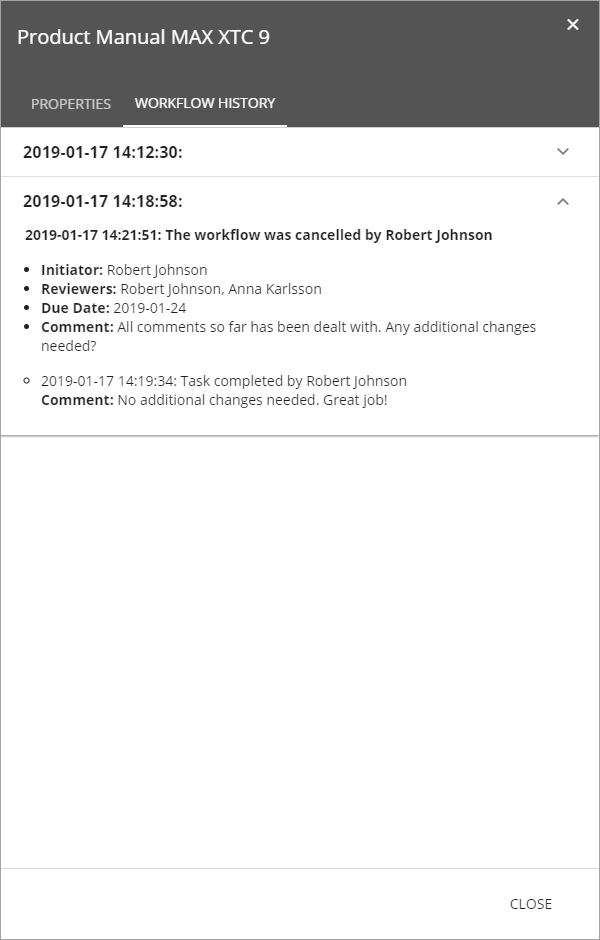

Review Workflow
===========================

Authors can use the Review Workfloe to get input from one or more colleagues in an organized way, or even to get help to type some part of the text. When the Workflow is active, all users that has been added as reviewers can edit the document, regardless of what access they normally have to the site. If it’s a Microsoft Word document – the option “Track changes” is automatically turned on so all comments/changes can be seen by everyone.

The option is called "Send for Comments workflow" and can be sued as many times as is needed before publication of an edition, but there can only be one such workflow active at a time, for each document. On the other hand, using this the workflow is optional. The author can always choose to publish directly. 

**Note!**
Everyone that is appointed as reviewer automatically receives edit access to the document when the workflow is active, and that access is removed when the colleague’s task is completed. Also note that publication is not allowed while a Review Workflow is active for the document.

To start the workflow, the author selects "Send for Comments" in the menu for the document, on the Drafts tab, for example:

The following is shown:

+ **Reviewers**: In Reviewers, all colleagues to send to (=appoint as reviewers) is added. Normally, any colleague can be added here. 
+ **Message**: A message to the reviewers is added here. Note that you can only use one message even if you send to several colleagues. 
+ **Due date**: A date when the review should be finished is entered here. It's only information to the reviewers. Nothing happens when the date is passed.

A task is then created for each colleague, and an e-mail is sent to each, with the message entered, and with a link to the document. Here’s an example:

 
If Omnia Intranet is installed, the colleagues are also notified in the notification panel, about the new task, and can choose to open the task from there. 

The workflow will be active until all tasks are completed, or until the workflow is cancelled på the author.

Check status for a Send for Comments Workflow
**********************************************
Status for a workflow can be checked at any time. Here’s how:

1.	Click the link in the column "Status".

 
Something like the following is shown:

 
Which reviewers has finished the task and not, is shown here. For a finished task the comment entered by the reviewer is also shown. To see comments and/or changes in the document, open the document.

Cancel a Review Workflow
************************************
If needed, a Review Workflow can be cancelled, for any reason. Note that publication is not possible if a Review Workflow is active for the document.The Review workflow has to be cancelled before the Publication Workflow can be started.

1.	Click the link in the column "Status". 
2.	Click "Cancel Send for Comments Workflow".
 

 
Everyone in the workflow are now notified by e-mail that the workflow is cancelled. And their edit access to the document is also removed.

See Workflow History for the draft
***********************************
A workflow History is available for the draft document, showing all finished or cancelled workflows for this draft version. The option is available in the menu for the document, for example:

Something like the following is shown:

 
Click the workflow to see the details, for example:

 

