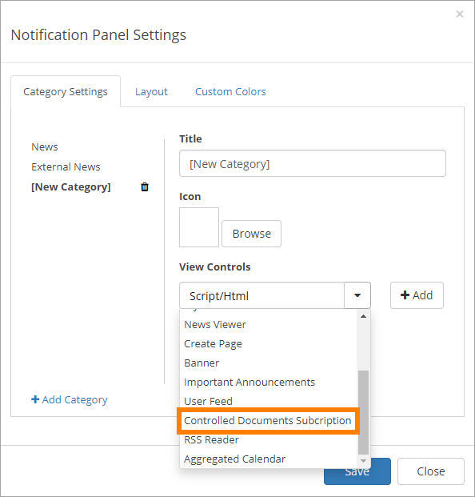
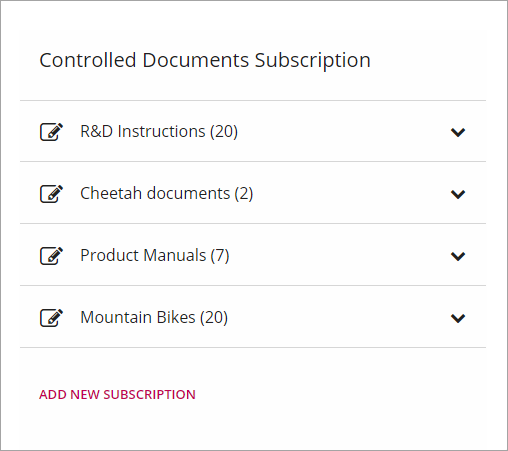
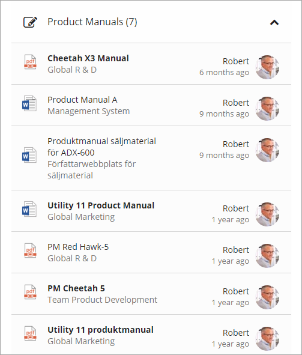
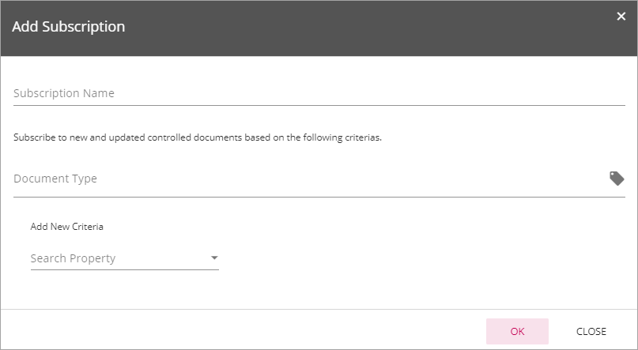
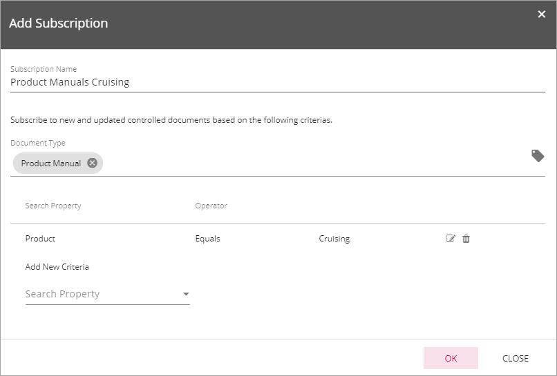

Controlled Documents Subscription
=================================

This block is used to display notifications for Controlled Documents the logged in user subscribes to, and to make it easier for the user to add additional subscriptions. The block can be added to any page but is really meant to be part of the Notification Panel.

Here's an example of a Notification Panel block showing Controlled Documents Subscriptions:

The user can expand a heading to select a document in that list, for example:

The user can add additional subscriptions by clicking "Add New Subscription" and use the following settings:

+ **Subsciription Name**: Add a suitable name for the subscription here.
+ **Document Type**: Enter one or more Document Types here or open the list and select them. When Document Type is selected, use the fields below to set details for what to display. 

Here's an example on detailed settings to display notification about Product Manuals for the Citybike Cruising:

As mentioned, these settings are done by users. There are now settings the page author/administrator can set.

