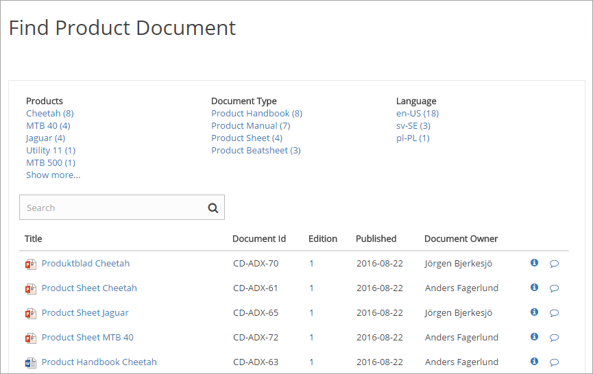
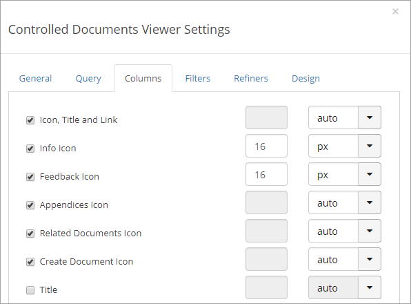
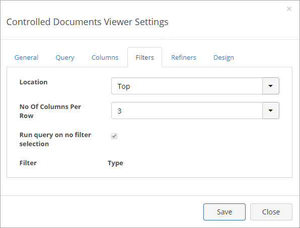
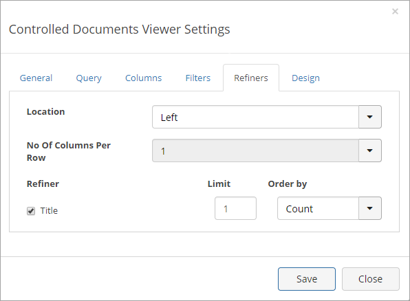
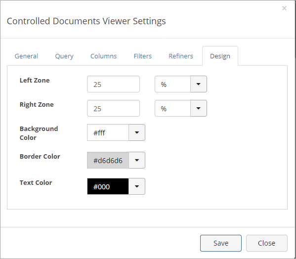

Controlled Documents Viewer
===========================

The Omnia Controlled Documents Viewer can be used on any publishing page to make certain controlled documents available for users. The control can even be used several times on the same page, for different lists of controlled documents.

Access permissions apply, a user can never be able to read a controlled document he or she does not have permission to read. The system takes care of that. Reading access is handled in the permission group that is called something like "Readers of controlled documents", in group sites where controlled documents are published.

The Omnia Controlled Documents Viewer can be added and edited by any editor that has edit access to the page.

Here's an example of a list of controlled documents, using the Controlled Documents Viewer:

Settings for the control
*************************
The settings are organized in six tabs, see the sections below.

The General tab
-----------------
On this tab the following settings are available:

.. image:: cd-viewer-general.png

+ **Search scope**: The search scope can be either Published Documents or Archived Documents. Published Document is the default.
+ **Default Sort Order**: You can select a default sort order from the list.
+ **Sort Direction**: Set sort direction - Ascending or Descending.
+ **Page Size**: Set the number of documents to be shown on ech "page" of the list.
+ **Show Search Box**: If users should be able to search the documents displayed by the controll, the option should be checked.
+ **Open in Office Web Apps**: If a document, when a user clicks the link, should be opened in Office Web Apps, the option should be checked. If not checked, documents will open in the full application. 
+ **Show "Subscribe To..."**: If the "Subscribe To" column should be displayed, select the box.

The Query tab
--------------
This tab is used to decide which Controlled Documents to display in the control.

.. image:: controlled-documents-viewer-settings-query.png

The Columns tab
-----------------
Use this tab to decide which columns to display for the list.

Just select the columns to display. The options to the far right can be used to set an exact width for the column.

Some of these columns are system fields, other are property fields defined for this Document Management installation. 

The Filters tab
-------------------
On this tab you set filters to show in the viewer:

(A description will be added soon.)

The Refiners tab
-------------------
This tab is used to set property fields to use as refiners.

+ **Location**: Select where the refiners should be placed: left, right, top.
+ **Limit**: Set the number of values for the refiner to be displayed. If there's more a "Show more" links is shown.
+ **Order by**: Set the sorter order for the values. Can be either alphabetical order (default) or by Count (number of documents).**Sort + **Direction**: Set sort direction - Ascending or Descending.
+ **Page Size**: Set the number of documents to be shown on ech "page" of the list.
+ **Show Search Box**: If users should be able to search the documents displayed by the controll, the option should be checked.
+ **Open in Office Web Apps**: If a document, when a user clicks the link, should be opened in Office Web Apps, the option should be checked. If not checked, documents will open in the full application. 
+ **Show "Subscribe To..."**: If the "Subscribe To" column should be dispplayed, select the box.

The Design tab
---------------
Here you can set the width for the left and right zone and select colors, if needed.

