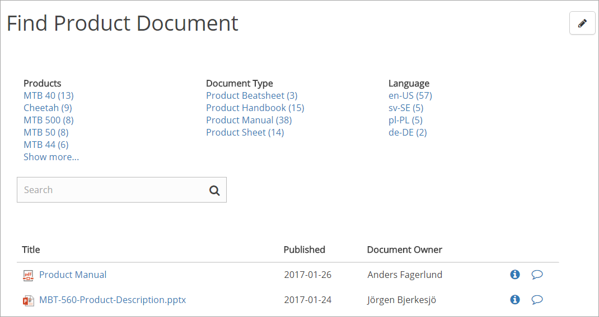
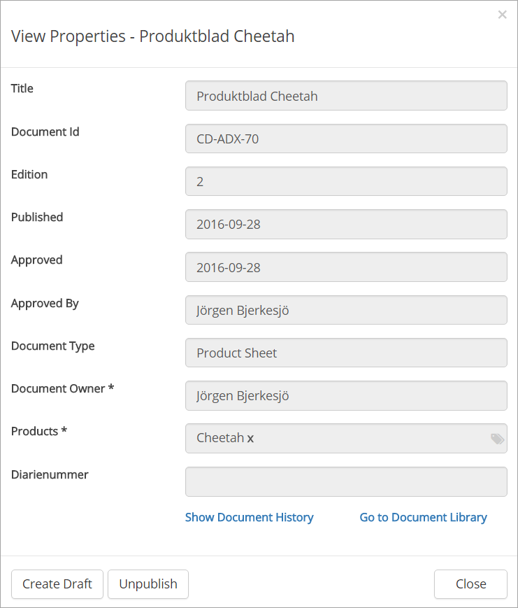
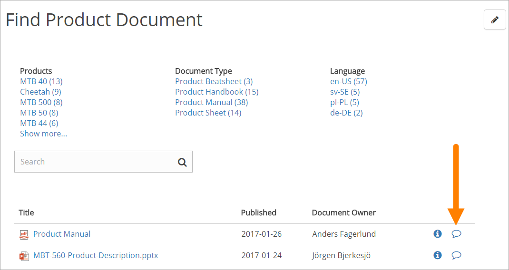
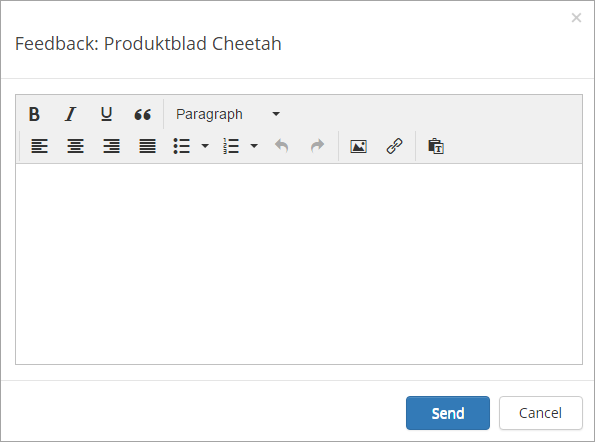

Controlled Documents Viewer
===========================

The Omnia Controlled Documents Viewer can be used on any publishing page to make certain controlled documents available for users. The control can even be used several times on the same page, for different lists of controlled documents.

Access permissions apply, the controlled documents the user can find using the control, are documents that the user has read permission to. Read permissions are handled in the team sites used by authors to publish Controlled Documents.

The Omnia Controlled Documents Viewer can be added and edited by any editor that has edit access to the page.

The user experience
*******************
Once a Controlled Documents Viewer has been added to a publishing page and set up by an editor to decide what Controlled Documents to display, any user that has access to the page can use the control to find Controlled Documents.

At the start, the list contains all documents the control has been set up to display. The refiners can be used to display only the documents tagged with a certain property value.

In this example there are 9 documents tagged with the product Cheetah and if that refiner is selected, the list could look like this:

.. image:: controlled-documents-viewer-refined-new.png

Search (if turned on, which is the default) can be used to search for content in the displayed documents.

The columns contain information about the documents. To the right there can be two very useful icons (if turned on, which is default).

Users can click the i-icon to display all properties for the document, for example:

Everyone can use the links at the bottom (to be able to open this window, a user must have access to the document) to see the Document History or go to the library to read the other Controlled Documents published from there.

If you are assigned as author to the Controlled Documents library where the document reside, you can use the buttons to create a new draft of the documents or unpublish the document. No one else will see these buttons.

The icon to the far right...

... can be used to send feedback on the document.

The feedback is sent to the Controlled Documents library from where the document is published, and the authors can read it there. A mail can also be sent (depends on settings) to either the document owner or the approver.

Settings for the control
*************************
The settings are organized in six tabs, see the sections below.

The General tab
-----------------
On this tab the following settings are available:

.. image:: cd-viewer-general.png

+ **Search scope**: The search scope can be either Published Documents or Archived Documents. Published Document is the default.
+ **Default Sort Order**: You can select a default sort order from the list.
+ **Sort Direction**: Set sort direction - Ascending or Descending.
+ **Page Size**: Set the number of documents to be shown on ech "page" of the list.
+ **Show Search Box**: If users should be able to search the documents displayed by the controll, the option should be checked.
+ **Open in Office Web Apps**: If a document, when a user clicks the link, should be opened in Office Web Apps, the option should be checked. If not checked, documents will open in the full application. 
+ **Show "Subscribe To..."**: If the "Subscribe To" column should be displayed, select the box.

The Query tab
--------------
This tab is used to decide which Controlled Documents to display in the control.

.. image:: controlled-documents-viewer-settings-query.png

The Columns tab
-----------------
Use this tab to decide which columns to display for the list.

.. image:: cd-viewer-columns.png

Just select the columns to display. The options to the far right can be used to set an exact width for the column.

Some of these columns are system fields, other are property fields defined for this Document Management installation. 

The Filters tab
-------------------
On this tab you set filters to show in the viewer:

.. image:: cd-viewer-filters.png

(A description will be added soon.)

The Refiners tab
-------------------
This tab is used to set property fields to use as refiners.

.. image:: cd-viewer-refiners.png

+ **Location**: Select where the refiners should be placed: left, right, top.
+ **Limit**: Set the number of values for the refiner to be displayed. If there's more a "Show more" links is shown.
+ **Order by**: Set the sorter order for the values. Can be either alphabetical order (default) or by Count (number of documents).**Sort + **Direction**: Set sort direction - Ascending or Descending.
+ **Page Size**: Set the number of documents to be shown on ech "page" of the list.
+ **Show Search Box**: If users should be able to search the documents displayed by the controll, the option should be checked.
+ **Open in Office Web Apps**: If a document, when a user clicks the link, should be opened in Office Web Apps, the option should be checked. If not checked, documents will open in the full application. 
+ **Show "Subscribe To..."**: If the "Subscribe To" column should be dispplayed, select the box.

The Design tab
---------------
Here you can set the width for the left and right zone and select colors, if needed.

.. image:: cd-viewer-design.png

