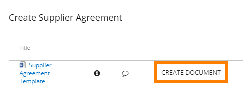
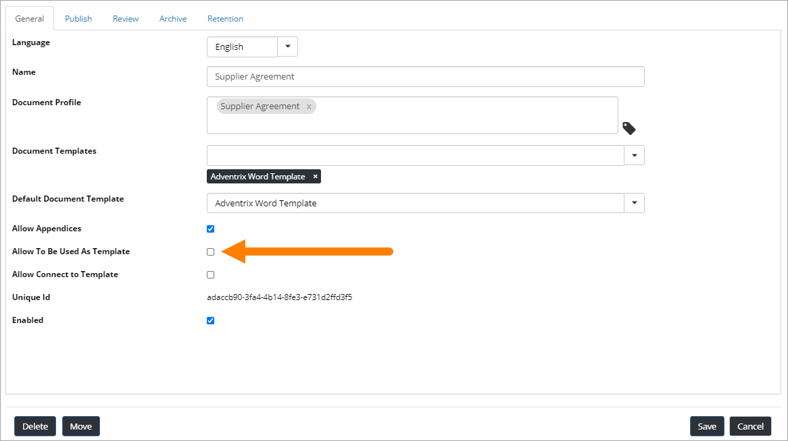

Create a document from the Controlled Documents Viewer
========================================================

There's a very clever way of creating certain documents, which can be done directly from a list of documents, displayed in a Controlled Documents Viewer block.

If it's possible, this link is available:

Settings needed
*****************
To make this possible, Document Types for templates to be used this way must be set up as "Allow To Be Used As Template":

In a Controlled Documents Viewer that should contain such document templates, the column "Create Document Icon" must be added:

image:: doc-rollup-create.png

Then, when a Controlled Document is published that belongs to that Document Type, a user can click the link. The Create New Document Wizard starts with the template document selected.

See this page for more information on how to use the wizard: :doc:`Create Document Wizard </document-management/end-user/create-document-wizard/index>`

