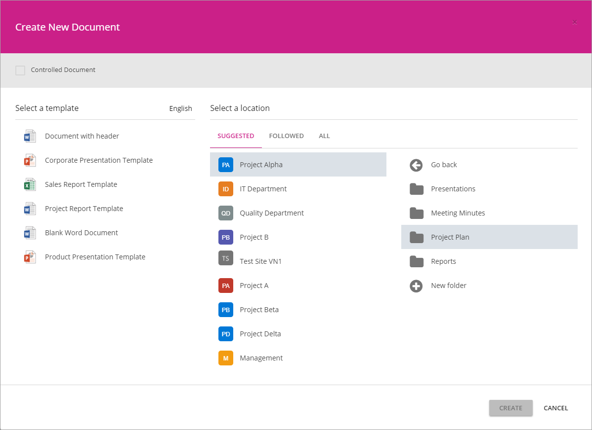
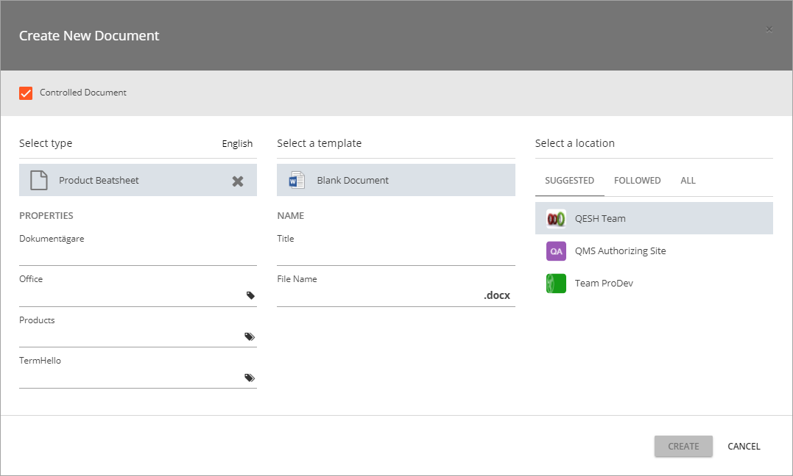
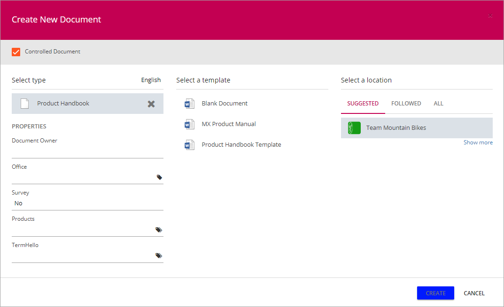

Create Document Wizard
===========================

The Omnia Create New Document Wizard can be used in any site in the tenant, to create new documents, both Controlled Documents and "normal" documents, based on templates set up in the Document Management Settings. Regarding Controlled Documents a new document can even be based on any published Controlled Document.

When this Site feature ("Omnia Document Management Create Document Wizard") is activated for a site, the Omnia Wizard replaces the standard options for "New" in classic document libraries and "Add" in "Controlled Documents" libraries.

The Wizard works slightly differently for Controlled Documents and for "normal" documents. Here's an example when used for normal documents:

When used for "normal" documents the steps are as follows:

1. Select template.
2. Select list of team sites: "Suggested", "Followed" or "All". Default is the site where the wizard was started.
3. Select a team site to save the document in (in the Documents library there). Any site the user has access to can be selected.
4. If applicable, select a folder in the chosen site (in the Documents library there), or create a new folder. 

This means any user can use the wizard from any site where the feature is activated to create a document, and save it in the Documents library in any other site that user has access to.

Here's an example when used for Controlled Documents:

Any author of Controlled Documents can use the wizard to create a Controlled Document in any Controlled Documents libary the author has access to.

When used for Controlled Documents, the steps are as follows:

**To the left**:

1. Select type of document to create. 
2. Add properties in the available fields.

**In the middle**:

3. Select template (there can be several for each type), or select a published Controlled Document as the template (if any is displayed).
4. Type a name for the document.

**To the right**:

5. Select the team site where the document will be saved in the Controlled Documents library. Only team sites with a Controlled Documents library, and that the author has access to, are shown inte list.

If there are any suitable published Controlled Documents to use as a template, they will be displayed in the list in the middle, after  type if document has been selected. Here's an example:

In the above example, the "MX Product Manual" is such a document. If there are no documents displayed, there are simply no suitable published document available.

