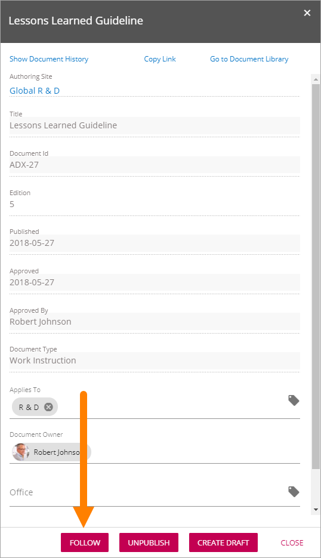
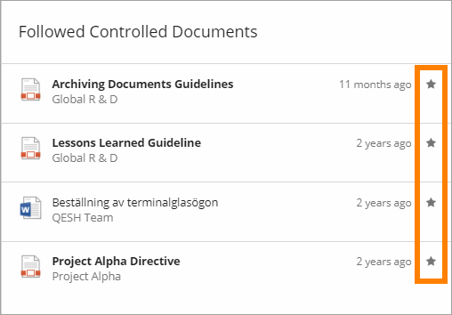
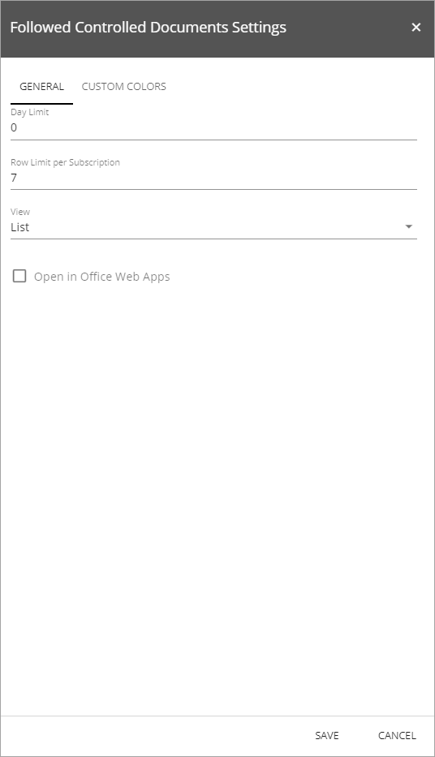
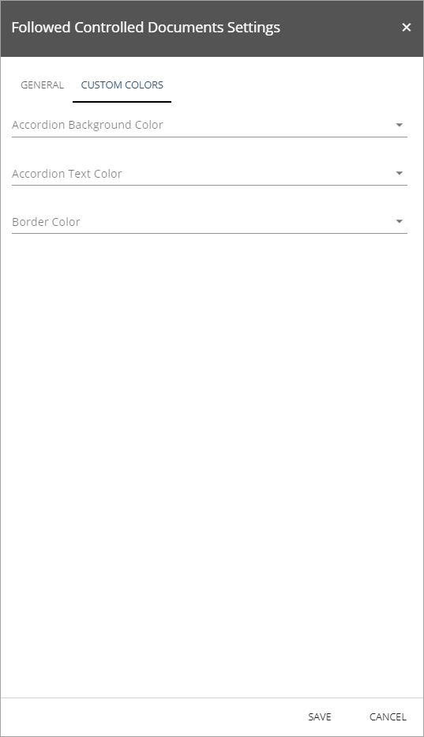

Followed Controlled Documents
===============================

Use this block to display a list of the controlled documents the logged in user follows.

When a users reads the information about a document (available by clicking the i icon) in the Controlled Documents Viewer , the user can choose to follow the document:

(A user can unfollow a document the same way, but also see below.)

The list of followed controlled documents can look like this.

.. image:: followed-controlled-documents-example.png

The user can unfollow a document here by clicking the star:

Settings
**********
The following settings are available for this block:

General
---------

Here, you can se these settings:

+ **Day Limit**: If you don't want old documents in this list, set the maximum number of days since last update for a document. If it's more days than that, the document will not be displayed in the list. 0 means any number of days.
+ **Row Limit per Subscription**: (A description will be added soon.)
+ **View**: Select View for the list; "List" or "Grouped By Timespan". In the example images above, View is selected. 
+ **Open in Office Web Apps**: When this box is selected, documents are opened in the web application. When not selected, in the installed application on the users computer.

Custom colors
--------------
Use this tab to set custom colors, if needed.

Accordion Background Color and Accordian Text Color are settings for the accordion used for the grouped view.

