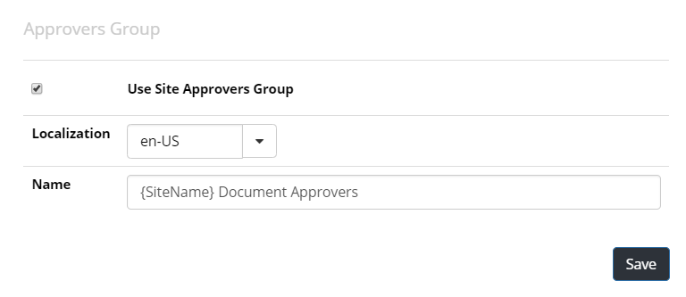

Setup Site Approvers Group
====================================

One of the approval options of a Document Type is that the document should be
approved by someone in the site approvers group.

 .. image:: dm-publishing-siteapproversgroup.png

Follow these steps to setup this feature:

1. Go to Omnia Admin > Document Management > Settings.
2. Scroll down to the setting for Approvers Group.

3. Check the box "Use Site Approvers Group" and select a name for the group. Note! It is possible to use the placeholder {SiteName} if you want the name of the team site to be included in the name.
4. If you have team sites already setup, you have to upgrade the feature 
