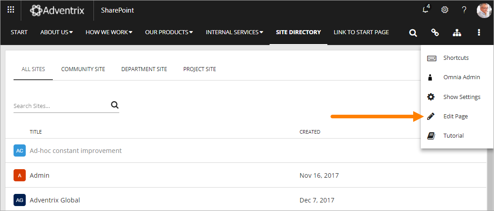
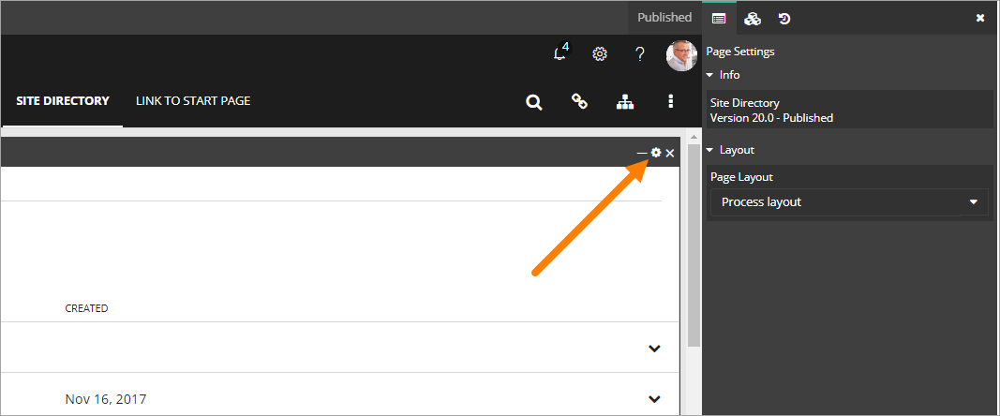

Introduction
===========================

This documentation is intended for administrators of Omnia Tenants. Settings and Controls in the following Omnia Products will be described here:

+ Omnia Foundation
+ Omnia Intranet
+ Omnia Document Management
+ Omnia Quality Management

You always have to have the necessary permissions to be able to edit settings. If you can't find any of the options described on this page, you are not permitted to edit settings.

Omnia Admin settings
*********************
You find the settings in Omnia Admin the following way:

1. Open the Actions Menu. 

2. Select "Omnia Admin". 

Settings for a control
***********************
Most Omnia Controls has additional settings. Settings for a control are normally control scoped. To edit settings for the control, do the following:

1. Go the the page where the actual control is placed.
2. Open the Actions Menu and select "Edit Page".

3. Open the settings by clicking the cog wheel, for example:

**Note!** You have to point at the right control heading to see the cog wheel. The control heading is not shown until you point at it.

To add a control to a page
***************************
The first step is always to add a web part to a legacy page or a block to a Quick Page, for the control.

Here's how to add a web part to a legacy page:

1. Go to the page.
2. Edit the page in advanced mode.
3. Add the web part to a suitable web part zone. The web part is found in the "Omnia" Category.
4. Check in the page. (You must do that to be able to access the settings.)

Here's how to add a block to a Quick Page:

1. Go to the page.
2. Open the Actions Menu and select "Edit page".
3. Open the list of blocks.
4. Use drag and drop to add the block to a suitable area.

To access the settings for the control, see above.
