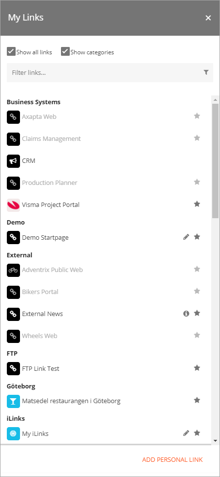
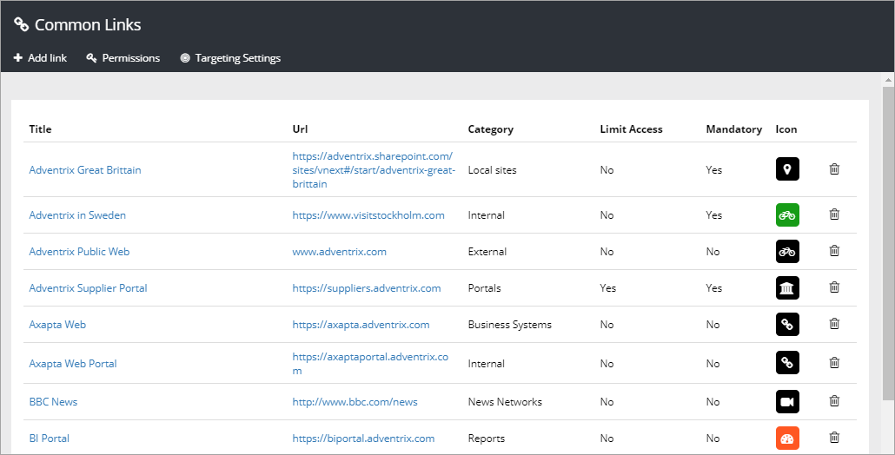
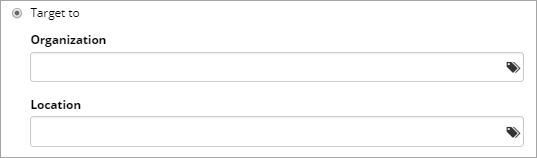

Common Links
============

Common Links is a tenant scoped feature - the settings are used across all SharePoint sites in Omnia. It makes it possible to create a central list of links, in Omnia Admin, to resources that are commonly used within the organization.

Some links can be mandatory and it's also possible to target links to certain groups. Permissions to work with Common Links can be delegated to other colleagues.

The end user can access the common links in the My Links control. The list contains all active links. The user can decide which non-mandatory links to display and can add personal links there. Here's and example:

More information about the My Links control is found here: My Links

The Omnia Admin settings
************************
The existing links are shown in the Common Links list, for example:

To edit a common link, click the Title in the list. The same window as when you add a new link is shown, see below.

To delete a common link, click the dustbin for the link.

Add link
--------
Use this window when adding a new common link or editing and existing:

.. image:: new-link.png
   :width: 40pt

+ **Title** The title is shown as the clickable text, in My links.
+ **Url** The url to go to when the user clicks the link.
+ **Category** Links that are the same category will automatically be sorted together when the user chooses to display the categories. (in the My Links example above, the links are sorted by Category).
+ **Information** This field can be used for additional information about the link. If you enter something here, an information icon is shown next to the link, in My links. Users can click the icon to read the information. Not mandatory. 
+ **Open in New Window** Select to open the url in a new browser window. Normally a good idea for external links.
+ **Mandatory** If selected, the link is always shown for all users (or the limited set of users, if targeted), and can not be deselected.
+ **Targeting settings** Select "Target to", to target the link to a certain group. See more information about targeting below.
+ **Icon** An icon is always shown for a link. If you would like another icon for this link, select the "Built-in" icon set or "Custom", and choose icon.
+ **Icon Background Color** Set the background color for the icon here. If note set, default icon background color is used.

Targeting a link
----------------
A link can be targeted to any receivers that has been defined in the Target Definition selected for Common Links. A targeted link is only available for selection by the target group. No one else will see the link. For more information on Targeting Definitions, see:

[Targeting Definitions](/Docs/en-us/omnia-foundation-admin/targeting-definitions/index.html)

When you select "Target to", the the available target groups are shown, for example:

You select targets for the links from the list(s) the normal way.
