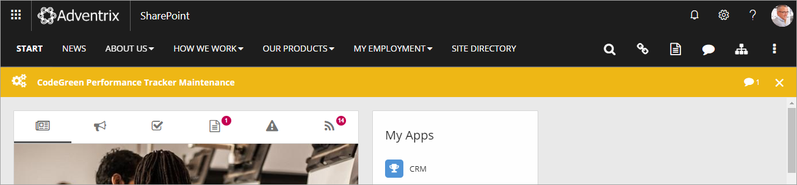
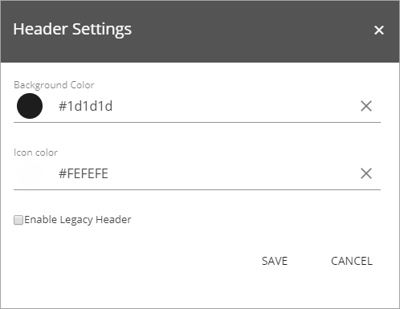

Cross Site Header
===========================

The Omnia Cross Sites Header is shown in all sites in the tenant and it's where the main menu, the logo /which can be used to go back to the start page), Quick Search, and other options like My Links and My Sites can be found. It's based on a master navigation term set in the main publishing portal of the tenant. Here's an example:

The settings
-------------
The following settings are availble:

+ **Background color**: The background color for the Cross Sites Heading is set here.
+ **Icon Color**: You can also set color for the icons.
+ **Enable Legacy Header**: If you for some reason would like to use the Sharepoint standard header instead, select this option.

