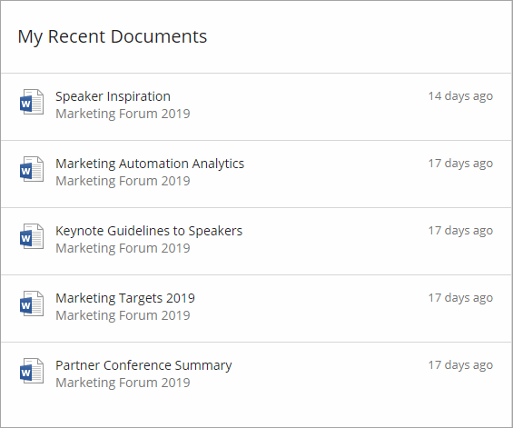
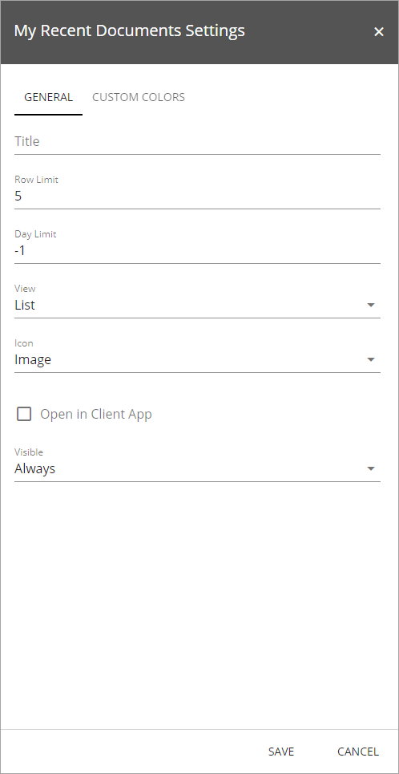
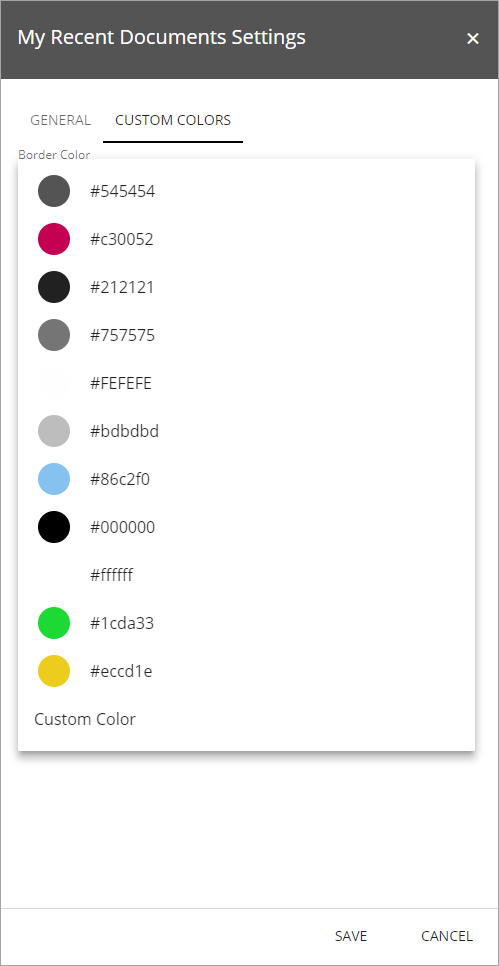

My Recent Documents
===========================

You can use the My Recent Documents control on any publishing page. The control displays a list of all documents the logged in user recently has edited. Here's and example:

My Recent Documents is avaiable as a block for Quick Pages and as a web part.

Settings for the control
************************
The following settings are available:

The General tab
----------------
On this tab you can set the following:

+ **Label**: Enter the title to be displayed for the control.
+ **Row limit**: Enter number of rows for each "page" in the list.
+ **Day limit**: Select how far back "recent" should bes.
+ **Use direct file link**: If you would like the document to always be opened in the full version of application (the version installed on the computer, not the web version), check this box.
+ **View**: Select a simple listing in time order or Grouped by site. 
+ **Icon**: Select how to display the icons for the document type, Sketched (black and white) or Image (color).
+ **Visible**: Set when the control will be visible; always, withing a maximum width or within a minimum width.

The Custom Colors tab
---------------------
You should primarily set colors through Theme colors in Omnia Admin (System/Settings/Default colors). If you still would like custom colors for the control, you can set them using this tab.

