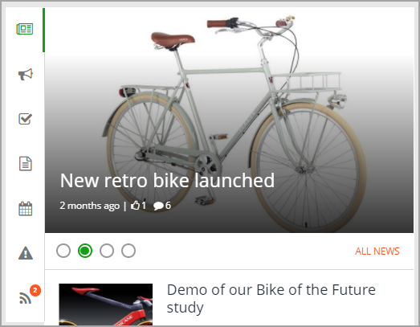
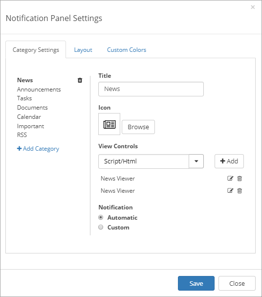
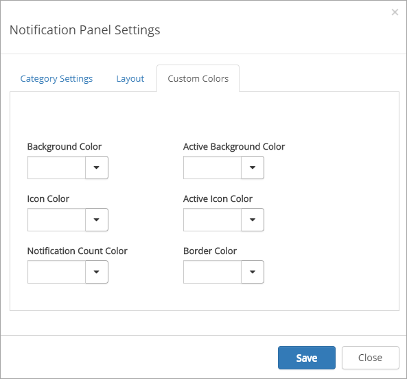
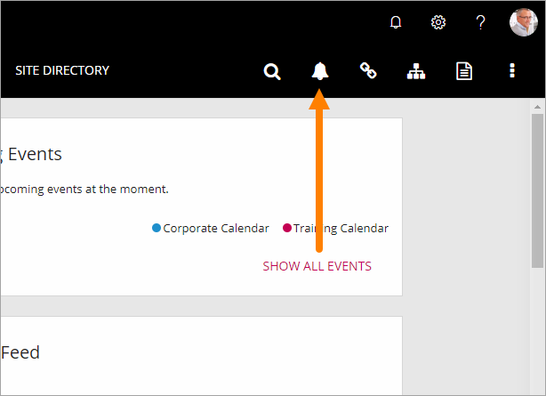
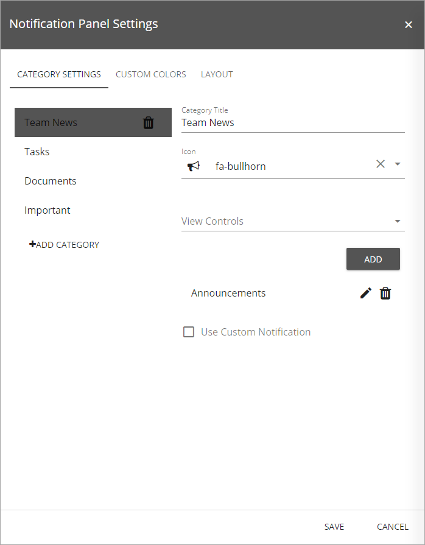

Notification Panel
===========================
The notification panel is a concept in Omnia Intranet mainly used on a start page. The purpose is to help end users find out what information has been updated within different areas of the intranet. There are a number of settings for the visual appearance, here's a common example:

The following built-in controls, if added, will generate automatic notifications in the Notification Panel:

+ Aggregated Calendar: New events appearing in the view.
+ Announcements: When a new announcement is posted which the current user has read access to.
+ Controlled Documents Subscription: When a Controlled Document the user subscribes to has been updated (Omnia Document Management functionality). 
+ Important Announcements: When a message is published by an administrator, using the Important Announcement option.
+ Last Updated Documents: When a document has been modified by someone else, in a team site that the current user is following.
+ My Recent Documents: A listing fo the user's recently edited documents, for easy access.
+ My Tasks: When new tasks are assigned to the current user.
+ News Viewer: When a new news article is published that the user has read access to.
+ User Feed: When new posts are added to a classic user feed in any of the team sites where the user is member.

Notification Panel Settings
***************************
The following settings are available:

Category Settings
+++++++++++++++++
Here you can add, edit and delete categories to be displayed in the Notification Panel. To the left is the list of categories, to the right you can see the settings for the selected category. You can set the rendering order for the categories by using drag and drop.

Add Category
-------------
If you would like to add a new category in the notification panel, follow these steps:

1. Click "Add Category" on the left-hand side.
2. Add a category title and select an icon from the Font Awesome library.
3. Add one or more available view controls (installed in Omnia) from the list.
4. You can sort the rendering order of the view controls using drag and drop. 
5. Select notification type: Automatic or Custom. Automatic can be used on all Omnia view controls. This means that the notification count on the category will be calculated based on the result in the view. A custom notification service can be used for legacy web parts or view controls that require specific business logic.

Edit Category
-------------
Follow these steps to edit a category:

1. Click on any of the existing categories on the left-hand side.
2. Change title, icon or view controls etc.
3. Click "Save".

Delete Category
---------------
Follow these steps to delete a category:

1. Hover any of the existing categories on the left-hand side.
2. Click on the remove icon.
3. Click "Save".

The Layout tab
**************
Here, the following settings are available:

.. image:: notification-panel-layout-tab-new.png

+ **Tab Layout**: Select Tab Layout: "Responsive" - On small screens the tabs will be shown horizontally, on larger screens it will be shown vertically; "Horizontal" - The tabs will always be shown horizontally; "Vertical" - The tabs will always be shown vertically. Note! Additional design can be applied using a customer specific CSS extension.
+ **Category Settings for Horizontal Layout**: These settings are available for "Respensive" and "Horizontal". Select to show icons and labels or not, in the Notification Panel.
+ **Categories per row**: This settings is available for "Respensive" and "Horizontal": Use it to set the number of categories to be shown on each "page" in the Notification Panel. Set to 0 for no limit, which is the default.

The Custom Colors tab
*********************
You should primarily set colors through Theme colors in Omnia Admin (System/Settings/Default colors). If you still would like custom colors for the control, you can set them using this tab.

Notification Panel in Header
*****************************
A Notification Panel can also be placed in the Header. It has to be activated in Omnia Admin. When it is, an icon is shown:

This Notification Panel has it's own settings. Do the following to access them:

1. Edit the page.
2. Show Settings.
3. Open the settings for the Notification Panel by clicking the cog wheel.

Something like the following is shown:

These settings works exactly the same as for other Notification Panels, see above.

