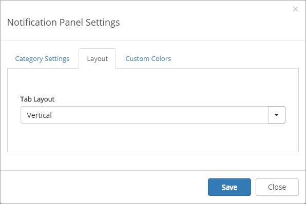

Notification Panel
===========================
The notification panel is a concept in Omnia Intranet mainly used on a start page. The purpose is to help end users to find out what information has been updated within different areas of the intranet. There are a number of settings for the visual appearance, here's a common example:

.. image:: notification-panel-exampl-b.png

The following built-in controls will generate automatic notifications in the Notification Panel:

+ My Tasks: When new tasks are assigned to the current user.
+ Announcements: When a new announcement is posted which the current user has read access to.
+ Last Updated Documents: Documents modified by others in team sites that the current user is following.
+ My Recent Documents: Last modified documents by the current user.
+ News Viewer: New news articles posted by others.
+ Aggregated Calendar: New events appearing in the view.
+ RSS Reader: New RSS items in the feed.

Notification Panel Settings
***************************
The following settings are available:

Category Settings
+++++++++++++++++
Here you can add, edit and delete categories to be displayed in the Notification Panel. To the left is the list of categories, to the right you can see the settings for the selected category. You can set the rendering order for the categories by using drag and drop.

.. image:: notification-panel-settings-category-b.png

Add Category
-------------
If you would like to add a new category in the notification panel, follow these steps:

1. Click "Add Category" on the left-hand side.
2. Add a category title and select an icon from the Font Awesome library.
3. Add one or more available view controls (installed in Omnia) from the list.
4. You can sort the rendering order of the view controls using drag and drop. 
5. Select notification type: Automatic or Custom. Automatic can be used on all Omnia view controls. This means that the notification count on the category will be calculated based on the result in the view. A custom notification service can be used for legacy web parts or view controls that require specific business logic.

Edit Category
-------------
Follow these steps to edit a category:

1. Click on any of the existing categories on the left-hand side.
2. Change title, icon or view controls etc.
3. Click "Save".

Delete Category
---------------
Follow these steps to delete a category:

1. Hover any of the existing categories on the left-hand side.
2. Click on the remove icon.
3. Click "Save".

The Layout tab
**************
On this tab you can set Tab Layout.

+ **Responsive**: On small screens the tabs will be shown horizontally, on larger screens it will be shown vertically.
+ **Horizontal**: The tabs will always be shown horizontally.
+ **Vertical**: The tabs will always be shown vertically.
 
Note! Additional design can be applied using a customer specific CSS extension.

The Custom Colors tab
*********************
You should primarily set colors through Theme colors in Omnia Admin (System/Settings/Default colors). If you still would like custom colors for the control, you can set them using this tab.

.. image:: notification-custom-colors.png
