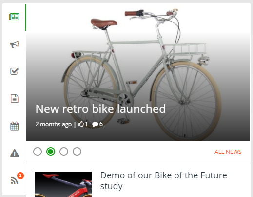

Notification Panel
===========================
The notification panel is a concept in Omnia Intranet mainly used on the start page. The purpose is to help the end user to find out what information has been updated within different areas of the portal. There are a number of settings for the visual appearance, here's a common example:

Notification Panel Settings
***************************
The following settings are available:

Category Settings
+++++++++++++++++
Here you can add, edit and delete categories to be displayed in the Notification Panel. To the left is the list of categories, to the right you can see the settings for the selected category.

.. image:: notification-panel-settings-category
   :width: 40pt

You can set the order for the categories by using drag and drop.

(Below: text to be edited)

### Add Category
If you would like to add a notification, you use Add Category. Follow these steps:

1. Click "Add Category" on the left-hand side.
2. Add a category title and select an icon from the Font Awesome library.
3. Add one or more available view controls (installed in Omnia) from the list.
4. You can sort the rendering order of the view controls using drag and drop. 
5. Select notification type: Automatic or Custom. Automatic can be used on all Omnia view controls. This means that the notification count on the category will be calculated based on the result in the view. A custom notification service can be used for legacy web parts or view controls that require specific business logic. Note! If "Custom" is selected, a notification service url needs to be provided (Example: User feed notification url: https://pfp-tc1.azurewebsites.net/api/social/following/new?dayLimit=30)

### Edit Category
Follow these steps to edit a category:

1. Click on any of the existing categories on the left-hand side.
2. Change title, icon or view controls etc.
3. Click "Save".

### Delete Category
Follow these steps to delete a category:

1. Hover any of the existing categories on the left-hand side.
2. Click on the remove icon.
3. Click "Save".

### Layout
On this tab you can set Tab Layout.

+ **Responsive**: On small screens the tabs will be shown horizontally, on larger screens it will be shown vertically.
+ **Horizontal**: The tabs will always be shown horizontally.
+ **Vertical**: The tabs will always be shown vertically.
 
Note! Additional design can be applied using a customer specific CSS extension.

### Custom Colors
You should primarily set colors through Theme colors in Omnia Admin (System/Settings/Default colors). If you still would like custom colors for the control, you can set them using this tab.

The following Omnia controls are related to the notification panel:

+ Aggregated Calendar
+ Announcements
+ Banner
+ Important Announcements
+ Latest Documents
+ My Tasks
+ News Viewer
+ User Feed

