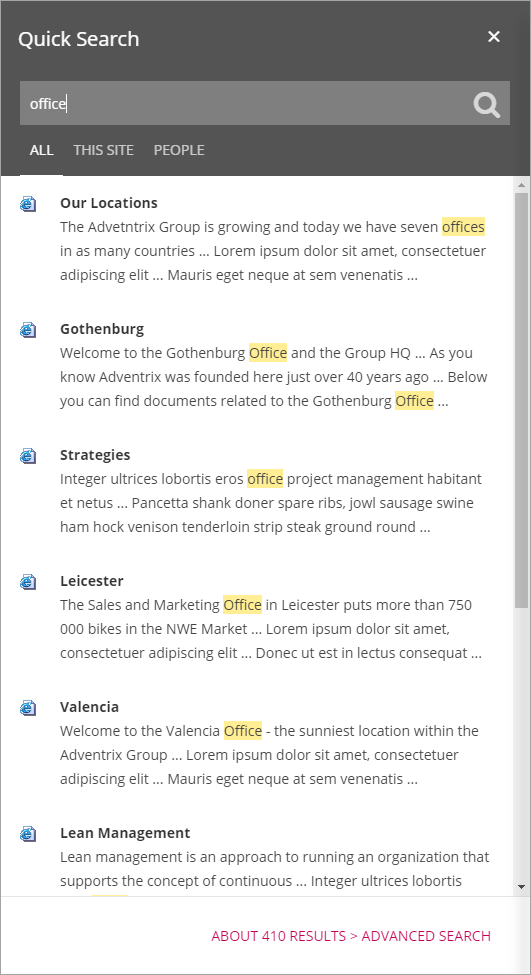
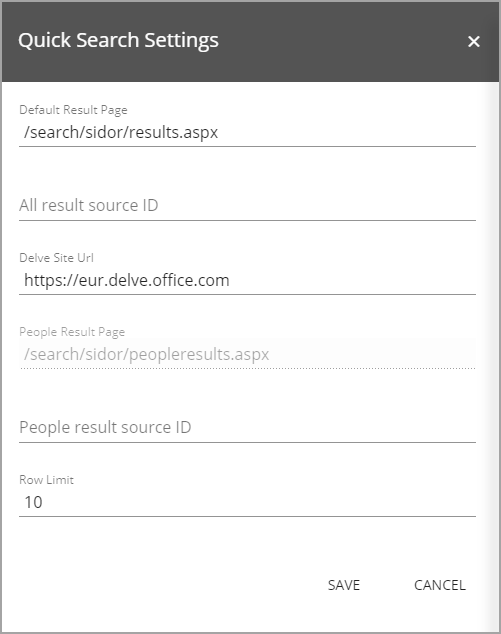

Quick Search
===========================

.. toctree::
   :titlesonly:

   setup/setup-search-center/index
   setup/setup-delve-people-search/index
   setup/setup-result-source/index

The Quick Search control makes it possible for the end user to search for content and people in the portal without going to the Enterprise Search Center. The Quick Search control is shown across all SharePoint sites in Omnia.

The Quick Search settings are master page scoped. All sites using this master page will inherit the settings.

There are three different search scopes available for the end user:

+ **ALL**: Search in all content in the portal.
+ **THIS SITE**: Search in all content in the current site.
+ **PEOPLE**: Only search for people.

The sorting of the search result is based on the default relevance ranking model in SharePoint.

Here's an example of a search for all content:

Users can select ""Advanced Search" to go to Sharepoints standard search for a more detailed search.

Settings for the control
************************
The following settings are available:

+ **Default Result Page**: The url to the default result page in the Enterprise Search Center.
+ **All result source ID**: ID can be set if needed.
+ **Delve Site Url**: If the option "Adcanced Search" should take the user to Delve instead of to the Enterprise Search Center, insert the Url to the Delve site here.
+ **People Result Page**: The url to the People result page in the Enterprise Search Center.
+ **People result source ID**: ID can be set if needed.
+ **Row Limit**: The maximum number of search result items in the list, can be set here.
