Quick Search
===========================

.. toctree::
   :titlesonly:

   setup/setup-search-center/index
   setup/setup-delve-people-search/index
   setup/setup-result-source/index

The Quick Search control makes it possible for the end user to search for content and people in the tenant without going to the Enterprise Search Center. The Quick Search is shown across all SharePoint sites in Omnia.

The Quick Search settings are master page scoped. All sites using this master page will inherit the settings.

A search result are divided into results for Documents, People, and Pages. Here's an example:

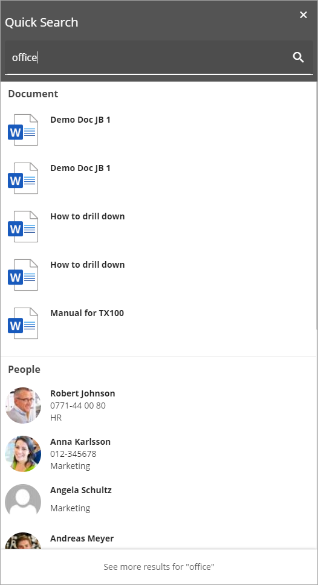

A document can be previewed before it's opened. Point at the document and a preview icon is shown.

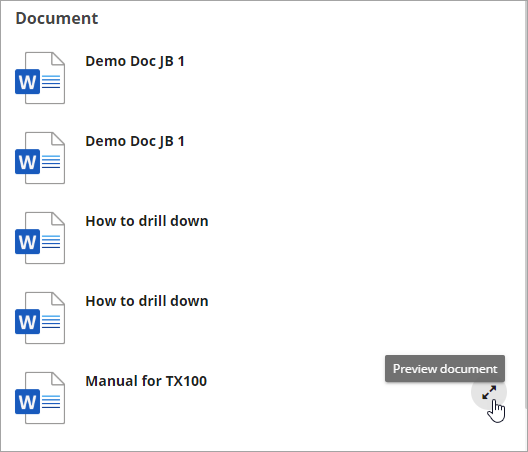

Click the icon to display the preview. Here's a very simple example:

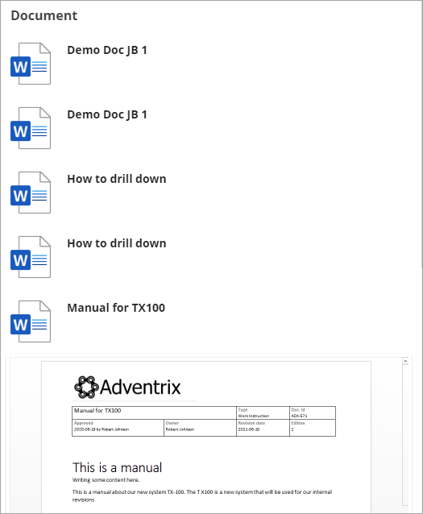

For People search results, the name can be clicked to display the person's Delve page.

Pages can also be previewed. A preview icon can be displayed the same way as for documents.

Here's an example of a page preview:

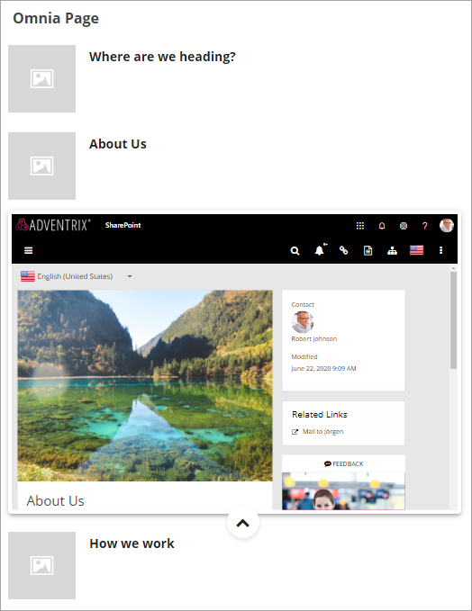

Users can select "Advanced Search" to go to Enterprise Search Center for a more detailed search.

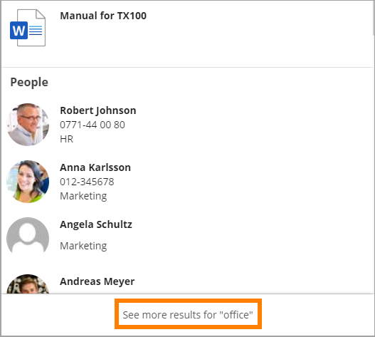

The advanced search result is shown in a flyout, meaning the user will still be on the page where the quick search was conducted.

Here's an advanced search example:

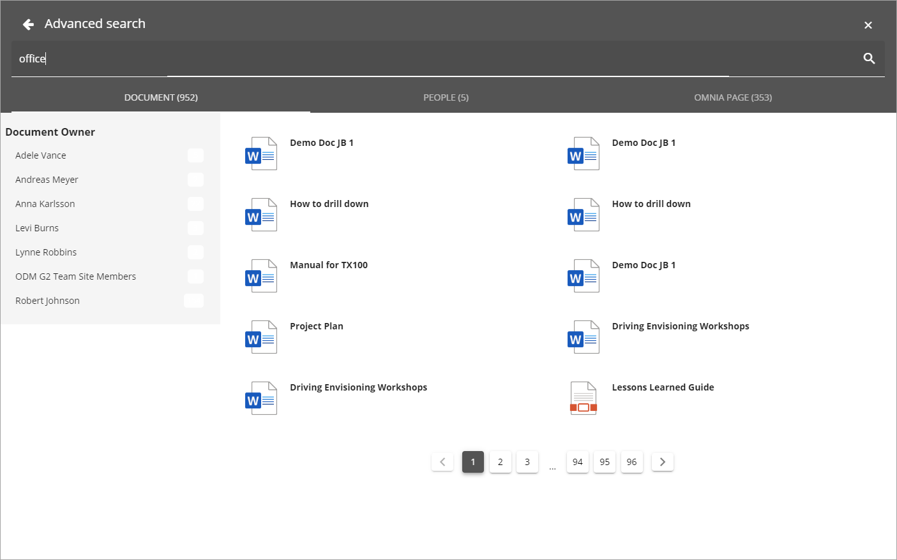

The search result is no divided into three tabs. Refiners can alos be available, if set up (see below).

Settings for the control
*************************
The following settings are available:

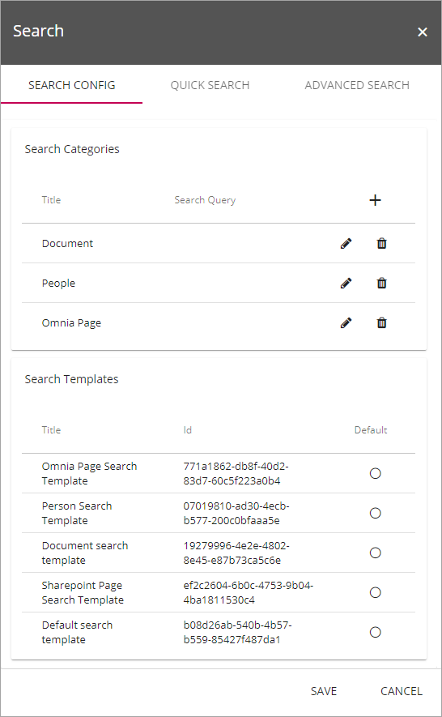

The Search Config tab
----------------------
The following can be set here:

+ **Search Categories**: Available search sategories are listed. You can edited or delete them using the icons. New search categories can be created, see below. Search categories are used to divide the Quick search result an d to be displayed as tabs in the Advances search.
+ **Search Templates**: Available search templates are listed. (More information will be added soon).

Create a new Search category
-----------------------------
To create a new search category, click the plus.

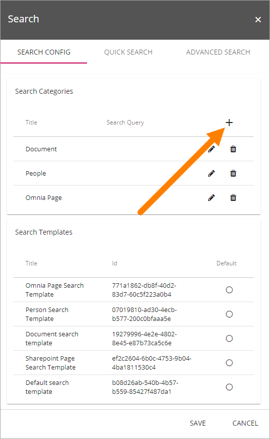

Use these settings to create the category:

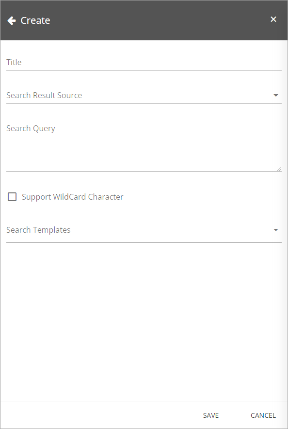

1. Add a name for the search category under Title.
2. Select a search resulta source from the list.
3. Type the search query. (More information will added about this soon).
4. Decide if search result will take wild card characters into account.
5. Select one or more Search templates. (More information will be added sbout this soon).
6. Save the new search category.

The Quick Search tab
---------------------
You can set the following on this tab:

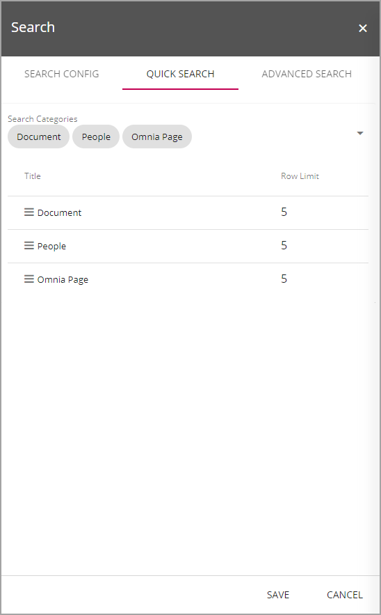

+ **Search Categories**: The selected search categories for Quick search are listed. You can add or remove categories using the list to the right.
+ **Title/Row limit**: For each selected search category can set the number of search results to be shown for each category. **Important note!** This setting is valid for Quick search only. When a user chooses to display the Advanced search, all search results are shown there per category.

The Advanced Search tab
------------------------
Here you handle settings for Advanced search:

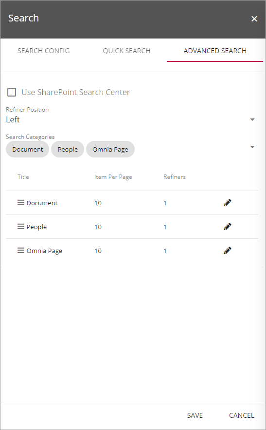

+ **Use Sharepoint Search Center**: If you want to use a Sharepoint Search Center instead of Omnias, select this option.
+ **Sharepoint Search Center Url**: To be able to use a Sharepoint Search Center, you must add the Url here.
+ **Refiner position**: Refiners can be shown to the left ot to the right, default setting is left. Note that for any refiners to be shown you must add refiners, see below. 
+ **Search Categories**: The selected search categories for Advanced search are listed. You can add or remove categories using the list to the right.
+ **Title, Item Per Page, Refiners**: Existing settings for search categories are shown here. To edit the settings, click the pen.

The following settings are avilable for a search category (valid for Advanced searh only):

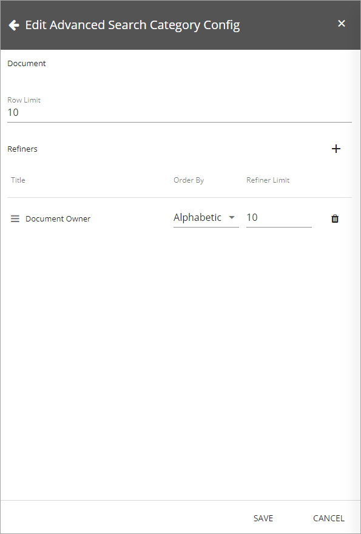

+ **Row Limit**: Set the number of search hits to be displayed on each "page". When more results are available, a navigation is shown at the bottom of the tab. See below for an example.
+ **Refiners** Refiners can be used by users to shorten a long search result. Available refiners (if any) are shown below. You can remove a refiner by clicking the dust bin. You can also add new refiners.

To add a new refiner, do the following:

1. Click the plus.

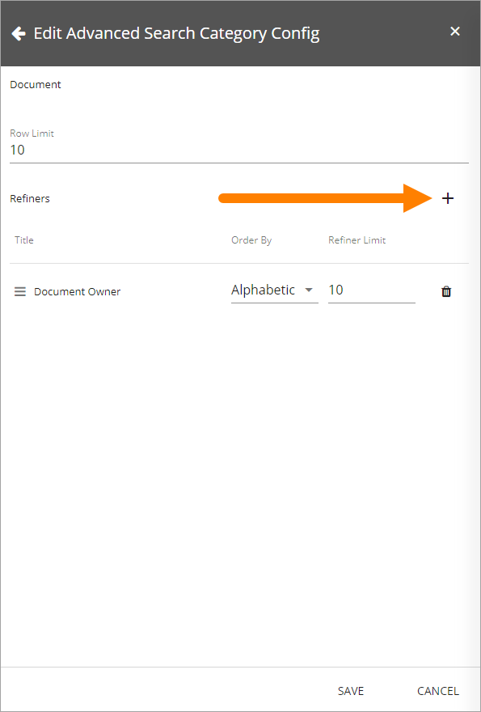

2. Select a property to be used as a refiner.

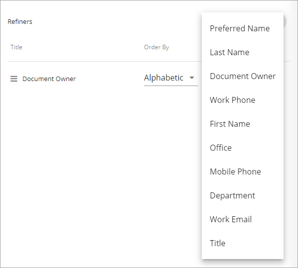

3. Set the sorting for the refiners (Order By). You can use Alphabetic or Count. When using Count, the refiner with the most search hits is shown at the top.
4. Set Refiner Limit. This is the number of refiners that will be shown. If you for example select Document Owner as and refiner, and set the Refiner Limit to 10, only ten of the document owners will be listed.
5. Click Save.
6. Click Save on the main settings page as well (very important, or your changes may not be saved!)

Here's an example of an Advanced search with Document Owner as refiner at the left. Also note the navigation at the bottom.

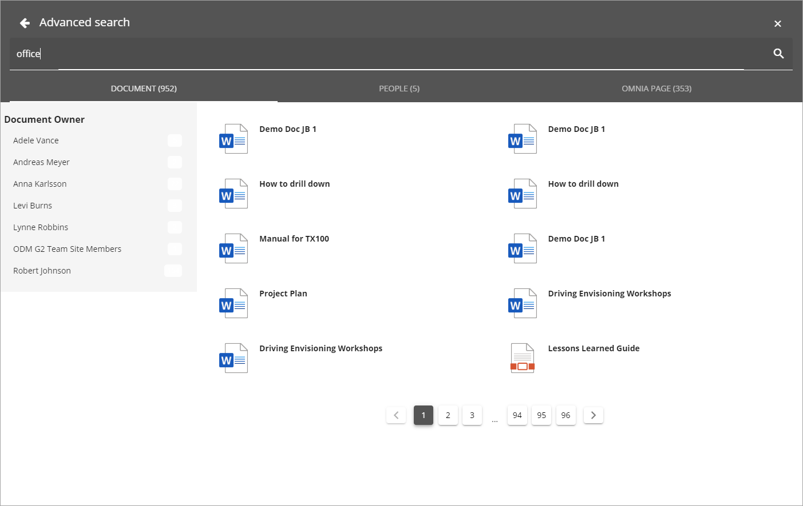

As you can see, only 7 document owners are listed, simply because there are only 7 doccument owners in our demo system!

