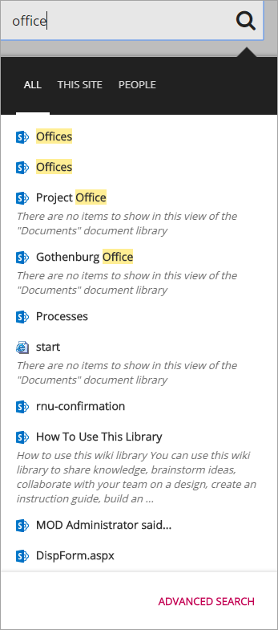

Quick Search
===========================

The Quick Search control makes it possible for the end user to search for content and people in the portal witout going to the Enteprise Search Center. The Quick Search control is shown across all SharePoint sites in Omnia.

The Quick Search settings are master page scoped. All sites using this master page will inherit the settings.

There are three different search scopes available for the end user:

+ **ALL**: Search in all content in the portal.
+ **THIS SITE**: Search in all content in the current site.
+ **PEOPLE**: Only search for people.

The sorting of the search result is based on the default relevance ranking model in SharePoint.

Settings for the control
************************
The following settings are available:

.. image:: Images/quick-search-general.png

The General tab
---------------
On the General tab you can set the following (most of it normally used by programmers only):

+ **Default Result Page**: The url to the default result page in the Enterprise Search Center.
+ **"All" result source ID** ID can be set if needed.
+ **People Result Page**: The url to the People result page in the Enterprise Search Center.
+ **"People" result source ID** ID can be set if needed.
+ **Row Limit**: The maximum number of search result items in the list.

The Custom colors tab
---------------------
You should primarily set colors through Theme colors in Omnia Admin (System/Settings/Default colors). If you still would like custom colors for the control, you can set them using this tab.

.. image:: Images/quick-search-colors.png
