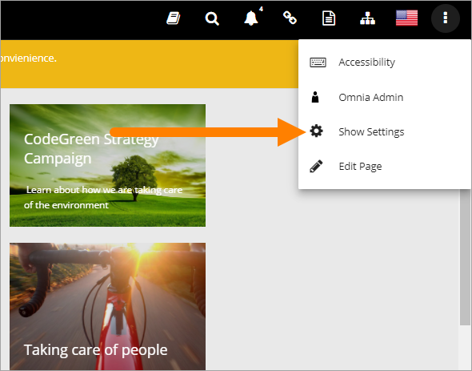
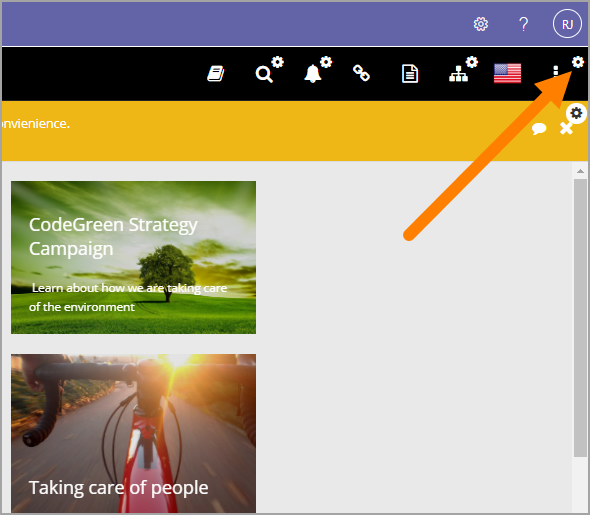
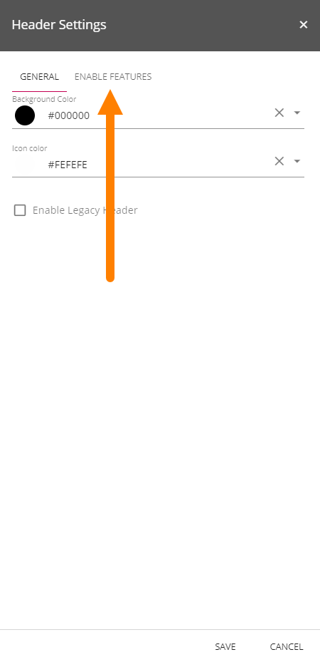
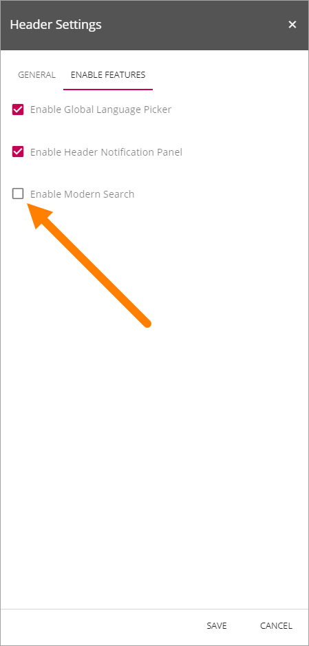
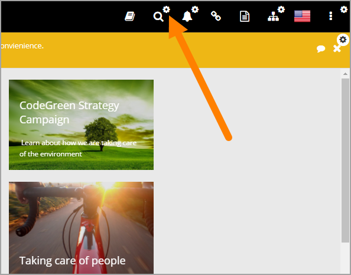
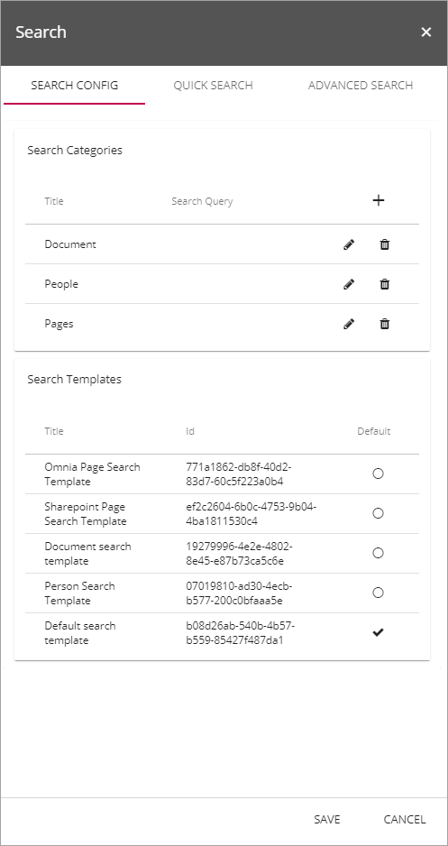

Activate Modern Search
=========================

To be able to use modern search it must first be activated. Do the following:

1. Show settings.

2. Open the Header settings.

3. Select "ENABLE FEATURES".

4. Select "Enable Modern Search".

You can now edit the settings for search:

These settings are available:

See this page for a detailed description of the settings: :doc:`Quick Search and Advanced Search </my-workplace/quick-search/index>`

