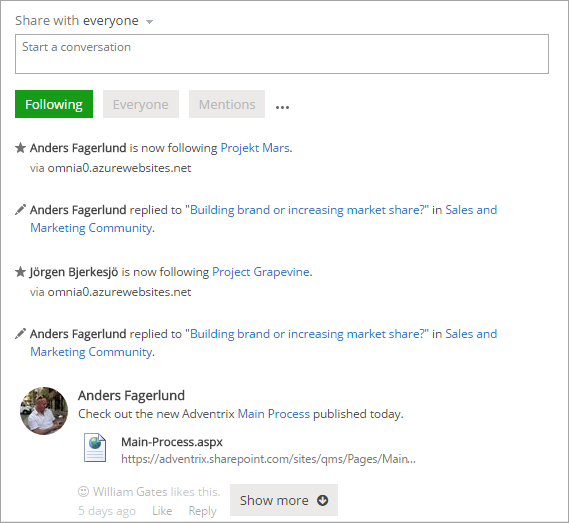
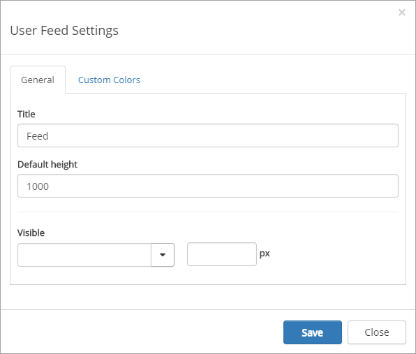

User Feed
===========================

The Omnia User Feed can be added through a web part on any Omnia web page or can be part of the Notification Panel.

Adding a User Feed to a page
*****************************
To add a User Feed to a Omnia web page, or the start page, do the following:

1. Go to the page.
2. Edit the page in advanced mode.
3. Add the web part to a suitable web part zone. The web part is called "User Feed" and is found in the "Omnia" Category.
4. Check in the page. (You must do that to be able to access the settings.)
5. To access the settings for the control, activate the Edit option and click the settings gear for the control.

User Feed settings
******************
The control has the follwing settings:

+ **Title**: You can edit the title displayed for the list.
+ **Default height**: Set the default height in pixels. When there is more to display in the list, a "Show more" button is shown (see image at the top of the page).
+ **Custum colors**: You should primarily set colors through Theme colors in Omnia Admin (System/Settings/Default colors). If you still would like custom colors for the control, you can set them using this tab.

.. image:: user-feed-colors.png

User feed in the notification panel
***********************************
In the notification panel "Notification" must be set to "Custom", for the User Feed.

.. image:: user-feed-notif-settings.png
