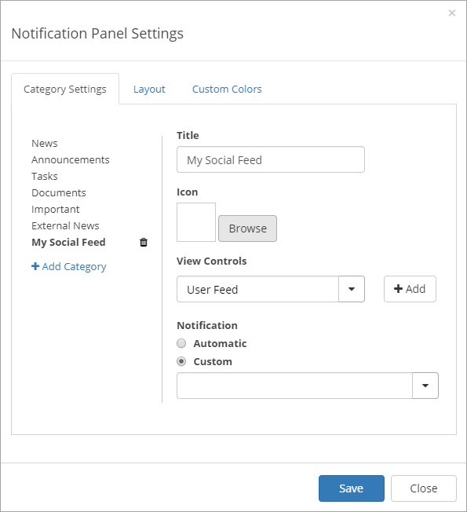

User Feed
===========================

.. toctree::
   :titlesonly:

   setup-user-feed/index
   setup-everyone-site/index

**Note!** The User Feed in Omnia is based on the SharePoint Newsfeed. Microsoft recommends using other techniques withing the Microsoft 365 suite for social capabilities.

Please read more here: https://techcommunity.microsoft.com/t5/Microsoft-SharePoint-Blog/In-June-2018-we-re-making-changes-to-the-native-social/ba-p/178430

The Omnia User Feed can be added as a web part on a legacy page or as a block on a Quick Page. The User Feed can also be part of the  Notification Panel.

.. image:: omnia-user-feed.png

When posting a message here, users can select to make it available to everyone (if the option is activated, see below) or just to members of a certain team site. The list displays team sites the user is following.

.. image:: user-feed-select.png

User Feed settings
******************
The control has the following settings:

.. image:: user-feed-settings-frame.png

The General tab
----------------
+ **Title**: You can edit the title displayed for the list.
+ **Default height**: Set the default height in pixels. When there is more to display in the list, a "Show more" button is shown (see image at the top of the page).
+ **Show everyone site**: If it should be possible to post a message to everyone, select this option.
+ **Everyone team site url**: For posting to Everyone to work, a url to a site all users has access to, must be inserted here. See the set up instructions for more information.
+ **Visible**: You can edit settings for when this control should be visible on a smaller screen. You can select "Always", "Max width", "Min width" and set the width in pixels.

The Custom colors tab
----------------------
You should primarily set colors through Theme colors in Omnia Admin (System/Settings/Default colors). If you still would like custom colors for the control, you can set them using this tab.

.. image:: user-feed-colors.png

User feed in the notification panel
***********************************
In the notification panel "Notification" should be set to "Custom" and "News Feed Notification Provider".

