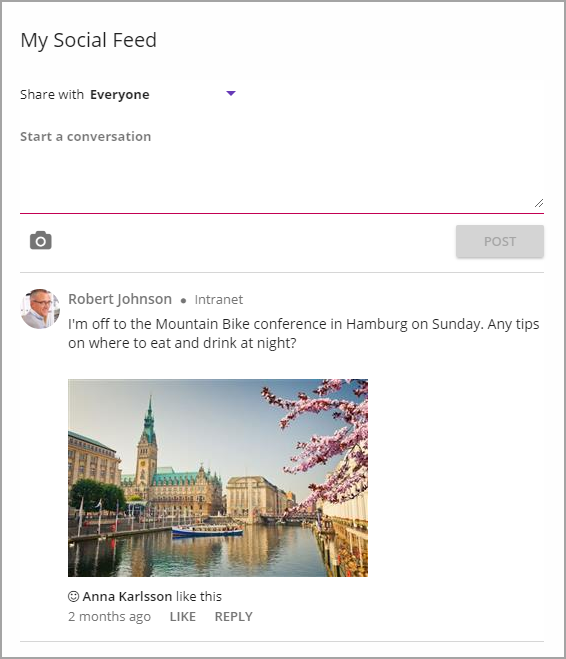
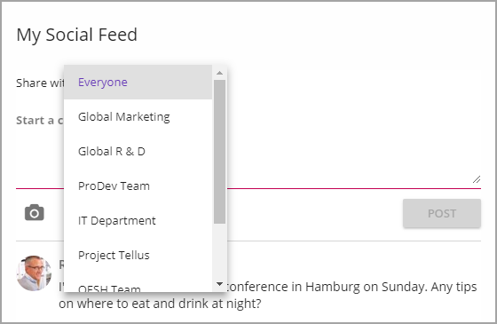
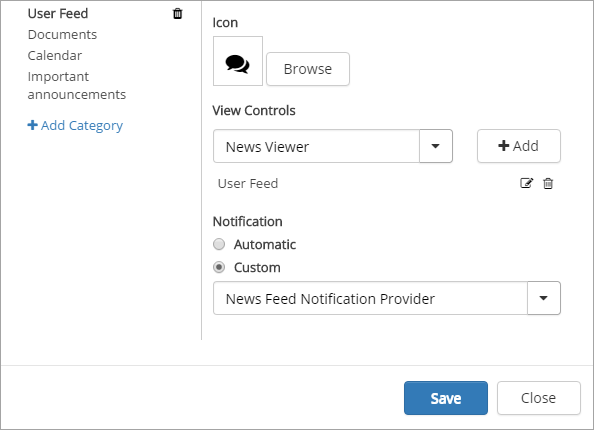

User Feed
===========================

The Omnia User Feed can be added as a web part on a legacy page or as a block on a Quick Page. The User Feed can also be part of the  Notification Panel. All feed posts to everyone or from team sites the user is a member of will be shown in the list.

When posting a message here, users can select to make it available to everyone or just to members of a certain team site.

User Feed settings
******************
The control has the following settings:

.. image:: user-feed-settings-frame.png

+ **Title**: You can edit the title displayed for the list.
+ **Default height**: Set the default height in pixels. When there is more to display in the list, a "Show more" button is shown (see image at the top of the page).
+ **Show everyone site**: If it should be possible to post a meessage to everyone, select this option.
+ **Everyone team site ur**: The url to the Everyone site is shown eher, and can be edited if needed.
+ **Custum colors**: You should primarily set colors through Theme colors in Omnia Admin (System/Settings/Default colors). If you still would like custom colors for the control, you can set them using this tab.

.. image:: user-feed-colors.png

User feed in the notification panel
***********************************
In the notification panel "Notification" must be set to "Custom", for the User Feed.

