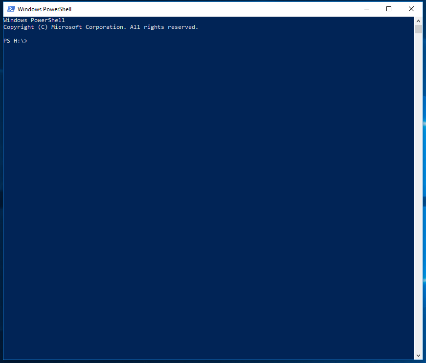
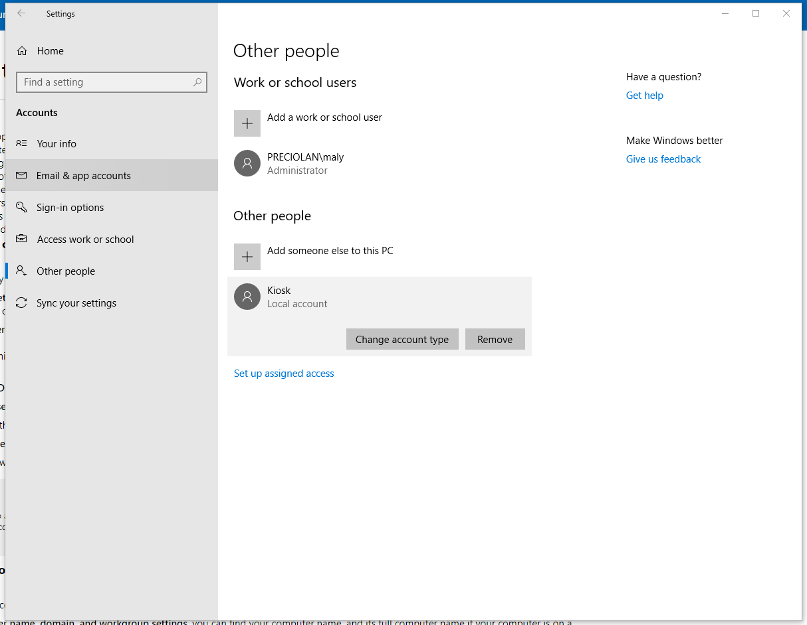

Client Security and Recommendation
======================

Recommend ways to setup Big Picture
---------------------------------------------------

Since Big Picture can be seen as an only-display extension, meaning that it does not require much or any user interaction once its setup, therefore we recommend a few ways to set it up:

**Operating system level Kiosk Mode (Recommended)**

Kiosk Mode that is also called Assigned Access is a mode that comes with windows, and that allows the user to configure an account that is only allowd to use a specific
software without access to anything else like the start menu or the task manager for example, and forces the app to be in fullscreen mode. This way when a person uses the computer
that is logged in to the kiosk account, the person can only access the specified app. In this case the app will be Microsoft Edge that will run Big Screen.

In order to setup kiosk mode, we need to be logged in as Administrator, and we need to setup a new user account. This can be simply done by creating a new user in Settings > Accounts > Other people > Add someone else to this PC.
Note that the account does not have to be a microsoft account, but can also be just a local account with a password. Make sure to name the account Kiosk.

- Once that is done, open up Windows Powershell which can be found when searched for in the start menu, it looks like this. 
- Make sure to right click and run it as Administrator:

- Type in the exact sentence following sentence: 

.. code-block :: powershell

    Set-AssignedAccess -AppUserModelId Microsoft.MicrosoftEdge_8wekyb3d8bbwe!MicrosoftEdge -UserName Kiosk

In case of an error, make sure to check the spelling of the sentence above, as the spelling and even the amount of spaces between each word has to be exact.

Now that kiosk mode is up and running, it can be used by logging into the Kiosk user account which will automatically launch Microsoft Edge.

**Things to keep in mind**

- The browser should have the startpage set to the page of big picture. Using the query string fullscreen=true (For example https://tenant.sharepoint.com?fullscreen=true#/start/big-picture) will cause big picture to go into full screen mode automatically. This will enable the computer to be rebooted but still end up on the correct page and put the browser in the correct mode.
- Some TV's might have settings to go into sleep mode or turn off when there is no activity. Make sure to check the TV for such configuration.
- Make sure to change the computers settings for when to go into sleep mode or shutdown after no activity to "never".
- Windows auto-update can cause the devices that are running Big Screen to automatically restart. This should be disabled on the devices that will run Big Picture. The instructions on how to disable it can be found here https://www.windowscentral.com/how-stop-updates-installing-automatically-windows-10

**Note** In order to remove the kiosk account, go to Settings > Accounts > Other people > Click on the Kiosk Account then remove:

**Alternative: Browser-level Kiosk Mode (Not Recommended)**

Browsers, such as Google Chrome offer a browser level kiosk, in which the browser will be entered into full screen mode and give a similar look to that of Operating System kiosk mode. 
The main perk with this feature is that it is much easier to setup and get started with than operating system level kiosk mode, but the reason this is not recommended is because the user can exit this mode in multiple ways and gain full access to the device. Therefore it makes it a non secure
method to use in public spaces where non-personal can access the device.

Physical Security
--------------------------

Physical security is something to be considered when the companies requires the device to be physically protected.
In many cases, the device that is connected to the display, will also be connected and access to the non-public internet. Therefor an intrusion can cause sensitive data leaks
or even damage, therefore we recommend that the device itself should be locked in a safe or a locker that is only accessable by staff members,
and is connected to the monitor that displays big screen wirelessly. this can be done through chromecast, or if its a smart tv then the computer can connect to it using bluetooth.
Make sure to lock the screen after activating Big Screen for an extra secure usage. 

Network security
---------------------------

Network security is something to be considered, since the device that is publicily display will be connected to the company network. Therefore we advice to a create an own wifi-network for the
the device or devices that will be runnin big picture. This network should have the properties of a guest network, but is password protected so that only the machines that are running big picture can access it.
Another alternative is to use a dedicated network, that is completly seperate from the company network for this device. Such options can be purchased at service-providers 
and often comes in the form of a USB stick or router that will be soly connected to the device running Big Picture.

Additional Security
---------------------------------------------

**O365 Security**

To Run big picture, a normal user account that can login to O365 and Omnia is needed. This account should have a minimal amount of permissions. For big picture to work the account needs permissions in the following ways:

- Access to the page where the big picture Glue control is placed
- Access to any data it will show (The news center for example)
- Access to the Glue site system page (The welcome page of the Glue site called Omnia.aspx)