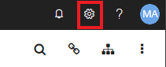
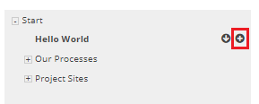
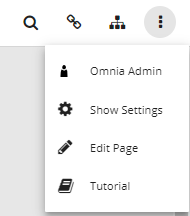

Setup
===========================

Prerequisite
----------------------------

In order to setup and configrue Big picture, a zip file with the name omniax_bigpicture.zip is required.

Install and Setup Big Picture
------------------------------

- Register the extensionId. This is done by first registering the extensionId which can be found inside the zip file, under extension.json.
- Go back to System > Extensions, and Upload the omniaX.bigpicture.zip file.
- Once the file has been uploaded, navigate to Features and activate the tentant scoped feature called OmniaX Big Picture Core and activate it.

Setup Big Picture
----------------------------- 

Now that big picture is sucessfully installed, we will set it up in a page of its own. 

- Go to the start page of the intranet site that you wish to use big picture on.
- Click on the cogwheel in the upper left corner

- Click on Manage Content.
- Click on the plus button of your main page, in this example the start page of the entranet is called hello world:

- Make sure that create page is selected, and write Big Picture in the Title section.
- Click publish.
- Click on the Big Picture site in the menu. 
- Click on the three dotted button, then click on edit page button in the upper left corner.

- Click on the headings button (the middle button).
- Scroll down to OmniaX and drag and drop the Fullscreen Viewer component on the top left Web part.
- Click on the cogwheel to configure the web part and then click on save then publish when finished. 

The manual for features and configuration functions can be found `here
<https://omniax-docs.readthedocs.io/en/latest/big-picture/features/index.html>`_.
