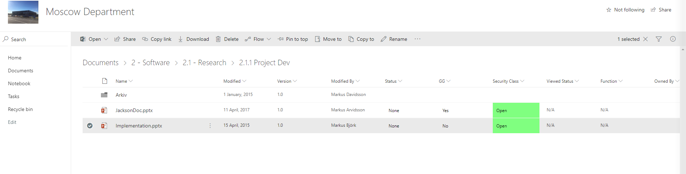
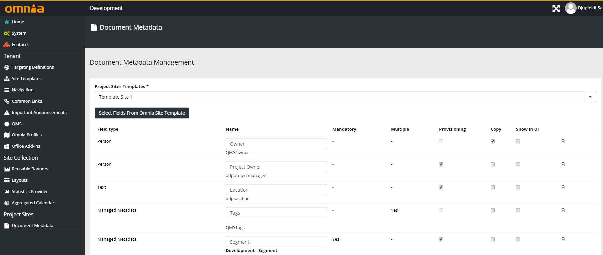
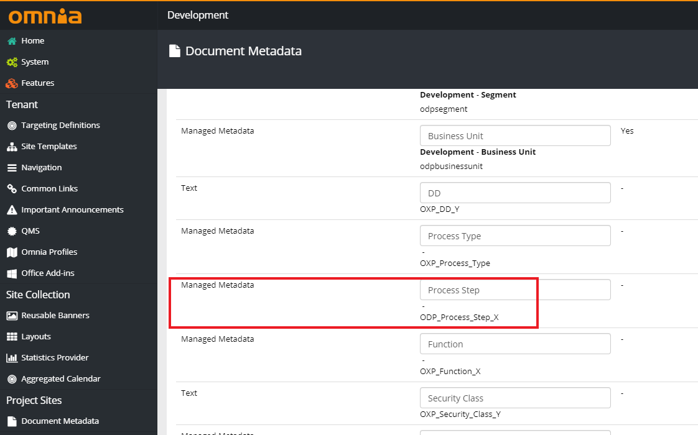
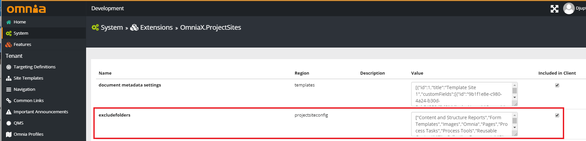

Document Managment
===========================
Projectsites also provides the ability to manage documents using metadata.

Usually once the document is uploaded by a user, the user has to then tag the documents with different tags in order to simplify 
the search and sort of these documents, which can in of itself be a complicated process. With project-sites we simplify this by using columns as seen above in order to sort document by their metadata, which is specificied by the user in the Document Metadata functionality that is found in Omnia Admin.

Document metadata automatically gives each uploaded document by the tool viewer metadata that the user has defined.
An example of how this is works is when the user provides a process step field in the document metadata. 

The user then selects a process in the process viewer, and then uses the tool viewer to create a document.
This Document will then have that process name in its metadata, and can then be filtered by it. 

There is also the option to exclude folders that the adminstrator of the site does not want the user to be able to place documents in.
This option can be found in Omnia Admin > System > Extensions > OmniaX.ProjectSites: 
  
