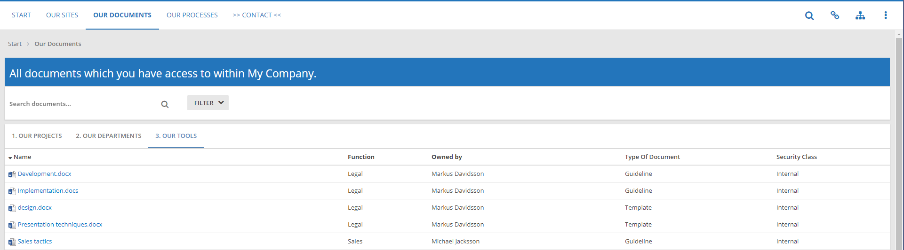
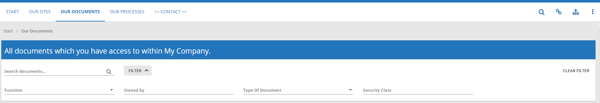
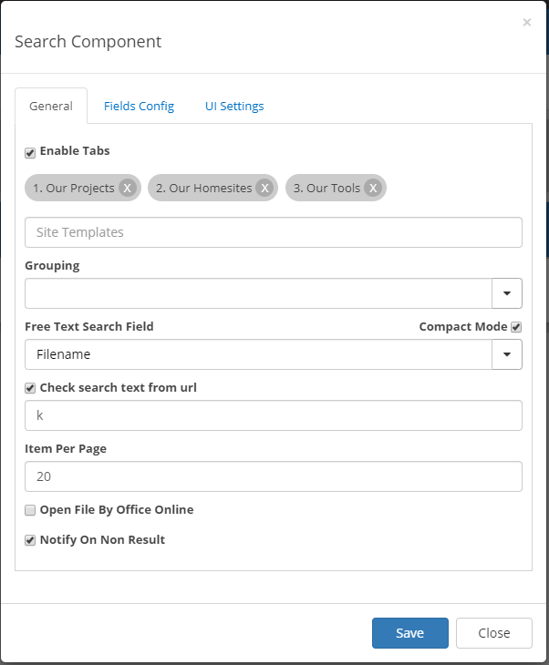
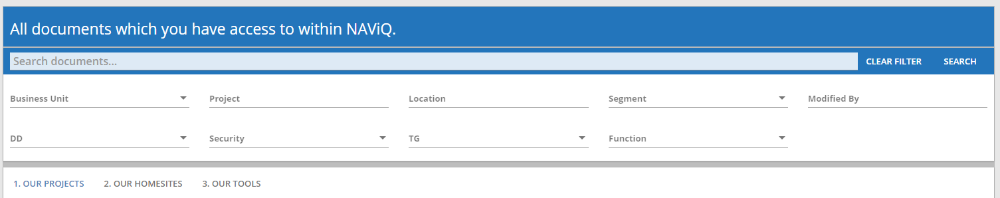
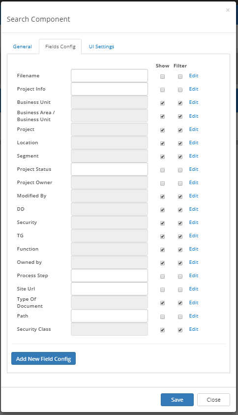
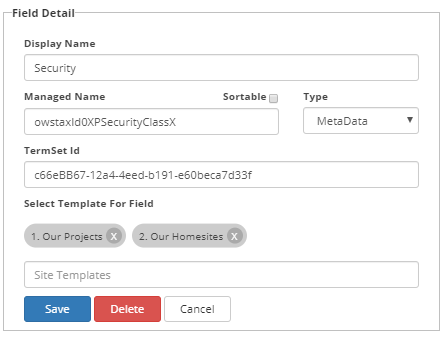
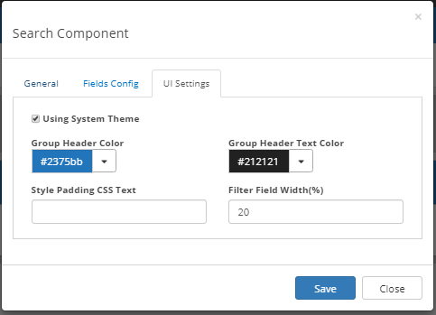

Document Searchpage
===========================

Projectsites provides the ability to view and access all the documents that have created using projectsites in a straight forward way.

Here we can see all the documents that have been created using project sites, as well as the metadata that these documents have been tagged with. This user has chosen to create three maps with the names our projects, our departments,
our tools and specificy which documents they should contain. 

We also have the option to include a search bar to search for specific document among all projects, which is helpful when dealing with a large amount of documents.
There is also a filtering option that can be used to view documents of a specific tag/metadata:

Here we can filter the documents by function, owned by, type of document and security class. These metadata fields have been specified by the user to be included in all documents that
are created using projectsites.

Configuration
---------------------------------------------------------

The search page functionality comes with multiple configuraion options that can be used to personalize and improve the user experience:

- Enable tabs allows for the document maps to be visable for the user. The tabs shown will be dependent on which site template the user selects in the site template input field.
- Grouping allows the user to group documents based on a specific metadata.
- Compact mode gives the search field a more compact feel and look. it is used in imagie number two, and without it the search functionality will look as following: 

- Free text search field allows the user to choose in which way they would like to search for a document, wether it be by file name or by some other metadata.
- Item per page decides how many items will be shown per page.
- Open file by office online gives the option to open a selected file by the office online products.
- notify on non results notifies the user if their search gave no results.

Searchpage also allows the user to select which columns with field data should be shown and even create new fields: 

Here we can both select the fields that we would like to be displayed. We can also choose if they can be included in the filter, as well as actually edit their configuration. 
Field detail allows the user to also select which maps the field will be displayed in: 

Like most other Omnia products, the searchpage's userinterface can be configured to change the colors and style of: 

