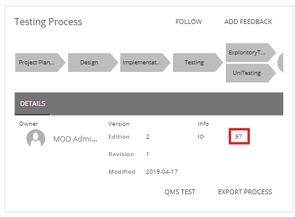
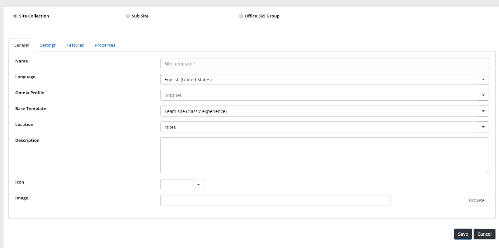
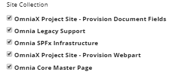
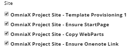
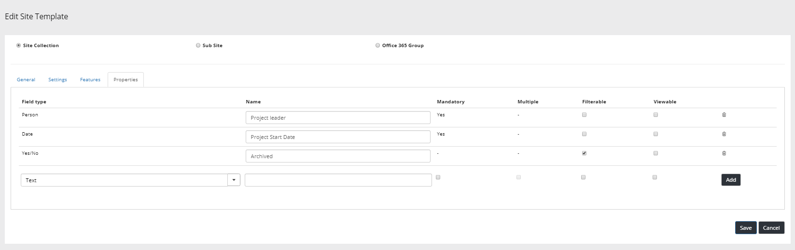
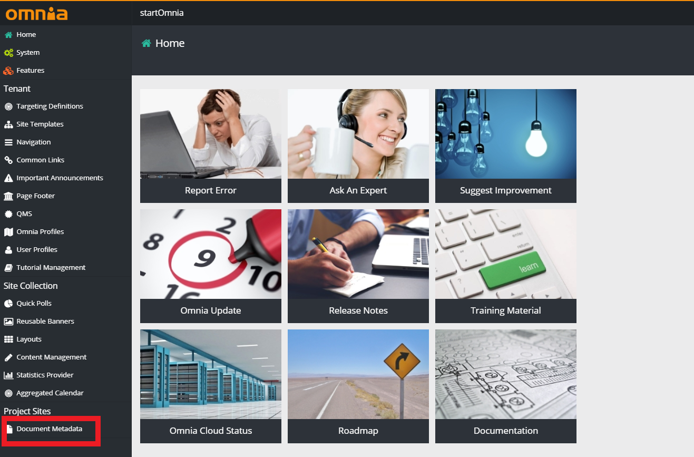
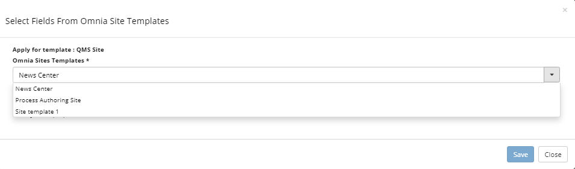
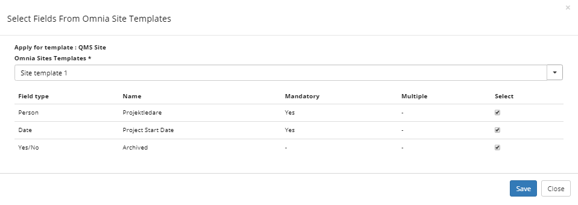

Project-sites Setup 
===========================

Prerequisites
---------------------------------------------------------
**Note!** In order to be able to use project-sites, you need to have the extension zip file OmniaX.ProjectSites.zip and have an Omnia QMS project already setup.

Install and Setup Project Sites
---------------------------------------------------------

1.  Go to Omnia Admin > System.

2. Register this extension. This is done by first registering the extensionId which can be found inside the zip file, under extension.json.
 
3. Go back to System  > Extensions, and Upload the OmniaX.ProjectSites.zip file. 

4. Once the file has been uploaded, make sure to fill in the processidtemplate1 field with the correct template it. It can be found in the process-viewer of your Omnia QMS site. 

5. Make sure to fill in the Omnia QMS site url, which is the site url of your Omnia QMS app that you wish to activate project-sites on. 

6. Make sure to fill in the Omnia QMS web api url, which is the url of the server that your intranet is built upon. An example is https://omniaext1.azurewebsites.net/api. 

7. Click save. 

8. Go to Omnia Admin > Features.  

9. Make sure that the following tenant scoped features are activated:  
- OmniaX Project Site Core  
- OmniaX ProjectSite-TentantBundle 
- Omnia Angular1 Support
 
10. Make sure that the following site collection scoped features are activated:  
- Omnia Core Master Page. 
- OmniaX Project Site Provision Document Fields.
- Omnia Legacy Support. 
- Omnia SPFx Infrastructure. 
- OmniaX Project Site Provision Webpart.

11. Make sure that the following site scoped features are activated: 
- Omnia Team Site - Prerequisites
- OmniaX Project Site - Example Site
 
12. Go To Omnia Admin > Site Templates > Add template. 

13. Name the template site template 1.

14. Make sure to have the language selected as your prefered language. 

15. Make sure to choose the correct Omnia Profile for your intranet.

16. Make sure that the base template is Team site (classic experience).

17. Make sure that it has the correct location.

18. Go to the features tab and make sure that these Site Collection and Site features are checkmarked:  

19. Go to the properties tab and add the properties you wish your project-site template to have. An example would be the following: 

20. Go to Document Metadata. 
    

21. Click on the Select Fields From Omnia Site Template button.

22. Select site template 1 that we created earlier.

23. Select all the fields that we created earlier, then click save.

24. The next step is to create a new site for our project sites. Go to the intranet homepage where you have your Omnia QMS setup and click on my sites button, then create new site. 

25. Choose site template 1.

26. Enter Project Sites in the title field. You may enter an optional description to the site. When you are done, click next.

27. Fill in the fields of the properties that we have previously selected. Make sure to fill in the ones that are required, then click next. 

28. In the owner field, enter the name of the site administrator. 

29. In the members field, enter the name of the members that you wish to have the ability to edit the site. 

30. in the readers field, enter the name of the members that will only be able to read the site, without having editing capabilities. 

31. Click Create. 

