Project-sites web components
===========================

Project-sites has four major web components that can be used for the purposes of displaying documents and processes. 

In order to access these components, follow these steps:

1. Go to the project-sites site that you have created in the project-sites setup step. 
2. Click on the Edit Page button.

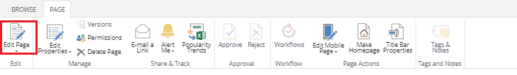

3. Click on Add a Web Part.
4. Scroll down through the folders in the Categories section to OmniaX - Project-sites, click on it and you will see the parts to the right.

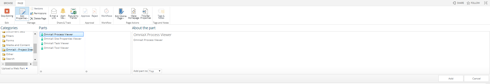

OmniaX Process Viewier
---------------------------------------------------------

Process Viewier is a tool that is used to view a process or multiple processes. 

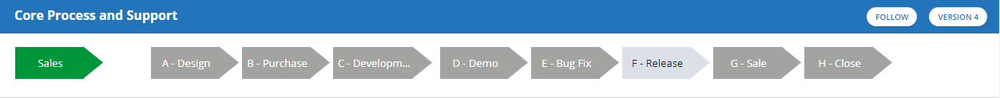

After adding it as a component, we can configure it using the following options:

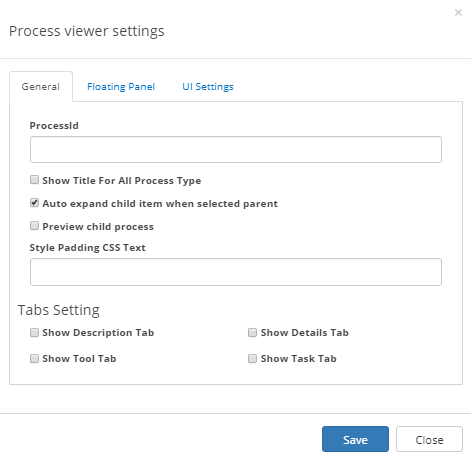

- in the processId section we will be adding the Id of our process that we would like to view in the process viewer.

- Show title for all process gives us the ability to show the title of our processes.
- Preview child process is allows us to preview the sub-process of a process as seen in the example below:
   
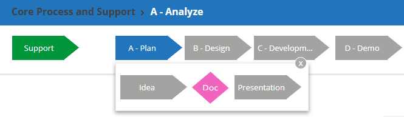

- Style Padding CSS Text is an option to add some style padding to the text. 
- Tab settings - Show Description Tab is a function that allows us to see the description of a process.
- Tab settings - Show Details Tab is a function that allows us to see details and information about a process, and we also recieve the option to export the process as we can see in the example below:

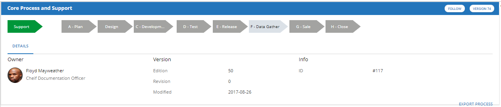

- Tab settings - Show Tool Tab allows us to preview the documents that are attached to a specific process as seen in the example below: 

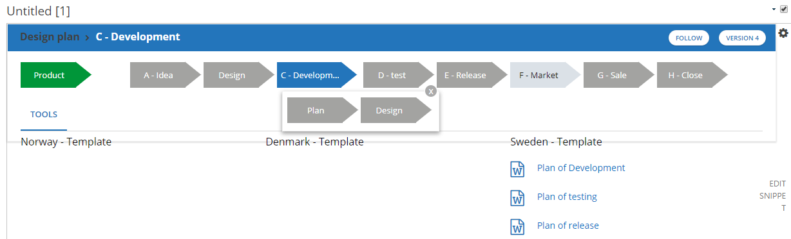

- Tab settings - Show Task Tab

The next step is to setup the optional floating Panel, which is  

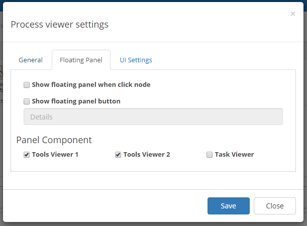

The process viewier also has the option of changing the colors of specific processes. The settings of this function can be found in the third tab that is called UI Settings.

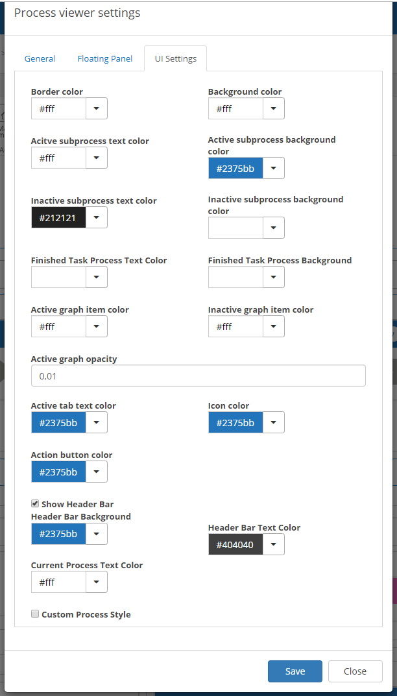

Here we can see and customize the colors of every part of the process viewier. At the buttom we can see a button with a checkmar box that is called Custom Process Style, which is a functionality that allows us to easily customize each process individually as seen in the example down below:
  
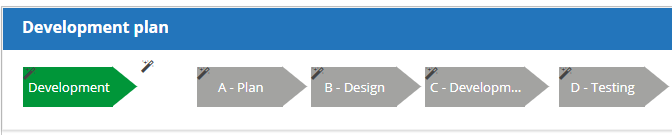

Once we click on the magic wand of the process that we would like to style, a process styling pop-up will be revealed. It allows the user to change the background color of the process, the text color and the size of the process component. The pop-up also contains an option that is called advanced mode, which allows the user to do all that was previously mentioned, but in CSS-code. 

OmniaX Site Properties Viewer
---------------------------------------------------------

Site properties viewer allows the user to display site properties that have been provided when creating the site.

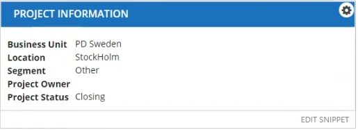

These properties can also be find under Site Quick Edit > Site Properties. There is also the option to customise the site properties viewer colors in the custom colors tab that can be found in the viewer settings:

   
OmniaX Task Viewer
---------------------------------------------------------

Task viewer is a component that allows the user to display tasks that are conneced to the selected process. It provides the follow options:

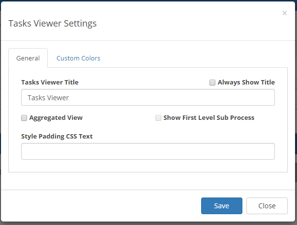

The task viewer settings provide the options of changing the task viewer title and how it should be displayed. It also provides an option for an aggregated view of the tasks, similar to that of the process tool viewer, 
as well as a CSS input field for padding the text. There is also settings to customise the colors of the task viewer in the Custom Colors tab.

OmniaX Tool Viewer
---------------------------------------------------------

The tool viewier is a functionality that is used for managing documents that are connected to our processes. 

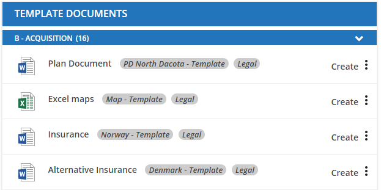

Along side the process tool, we can also view which heading and 33fgfunction the documents belong to. The tool viewer has multiple configurations and options: 

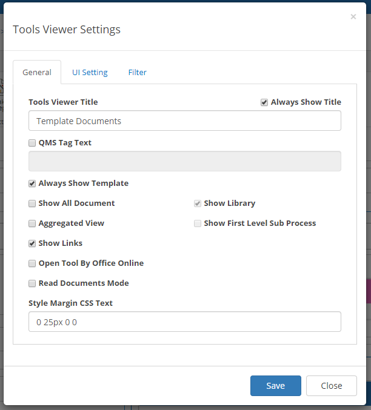

- Tools Viewier Title allows us to select the title of our tool viewer and gives the option to always display it or not.
- Show all documents displays an expandable tab at the end of the tool viewer that allows us to see the documents that are attached to the other processes, and not only the currently selected process:

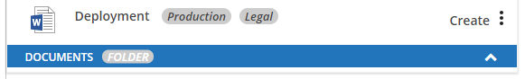

- The show library function is connected to show all documents, as it is required in order to display which libraries all the documents are sorted in.
- Aggregated view allows the user to remove the fold/unfold documents tab that also displays the name of the sub-process the documents belong to, and instead show all the documents 
 that belong to the selected process, including the documents that belong to any sub-process of the selected process: 

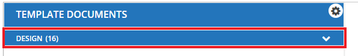

- Show first level sub process is connected to Aggregated view. It allows the user to have to fold/unfold tab, but only displays the name of the first level sub process. 
For example if you have a process named Development, and this process has a sub-process that is named Apps that have documents in it. Show first level sub process will only display Development instead of Development - Apps in the tab.

- Show links allows the user to view the links that are connected to the documents of the selected process or sub-process.
- Read documents mode allows the user to view and create documents. 
- Disable create disables the ability to create documents in this tools viewer.
- Style Margin CSS Text allows the user to modify the styling of the text display in the tools viewer.

The user has also the ability to change the overall UI of the tools viewer, by modifying the coloring and font-size options provided in the UI Settings tab. 
The user can also choose to use the system theme UI by using the provided system theme feature: 

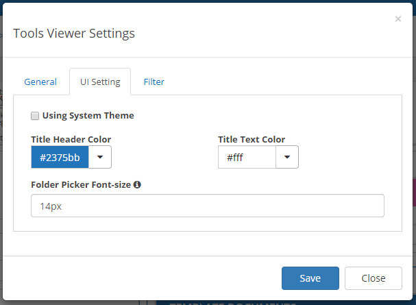

Tools viewer also provides the option to view and filter documents in many ways: 
 
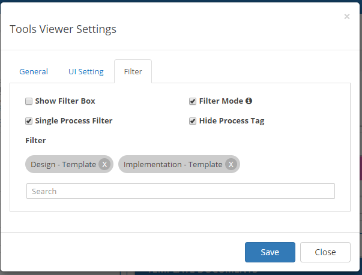

- Show filter box is an option that displays magnifying glass that when clicked expandes to a search bar above the documents. It allows us to search for documents with a specific heading among the displayed documents:
- Filter mode, which only shows tools when they have tags that can be filtered, allows the user to filter documents based on their heading.
- Single Process Filter is the option to select if the filtering should happen on a single process step instead of multiple processes. 
- Hide process tag is the option that can be chosen when using single process filter, and it is used to hide the process tag. 
- The search bar can be used to look up the processes or headings that can be selected as filters.

