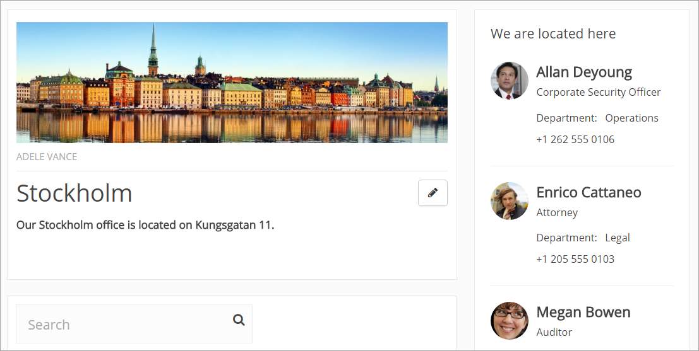
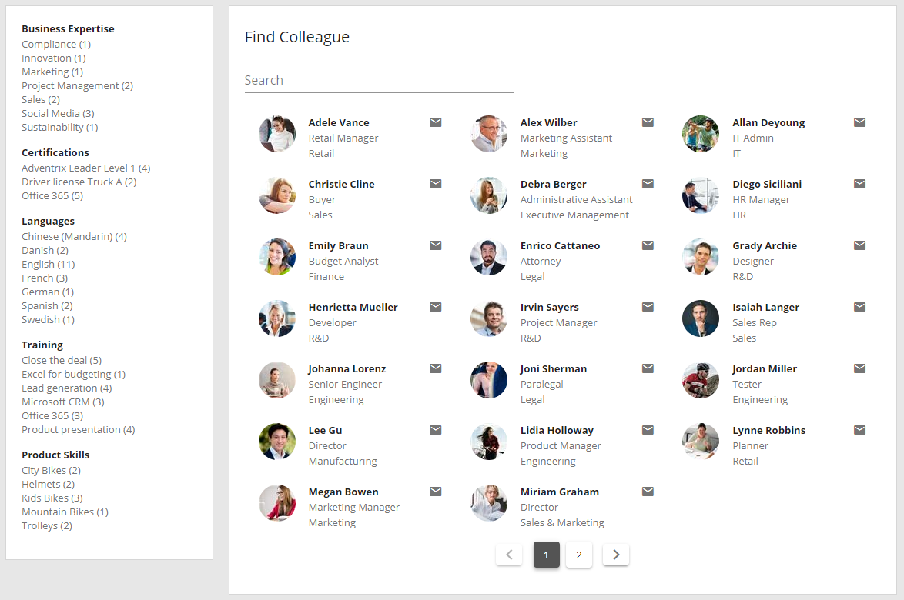
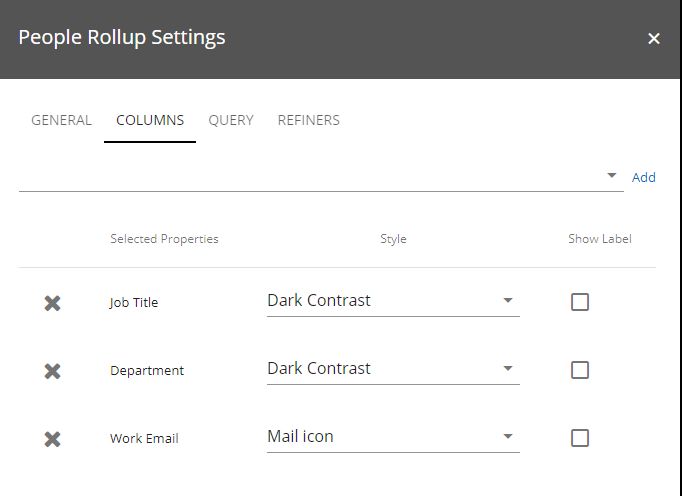
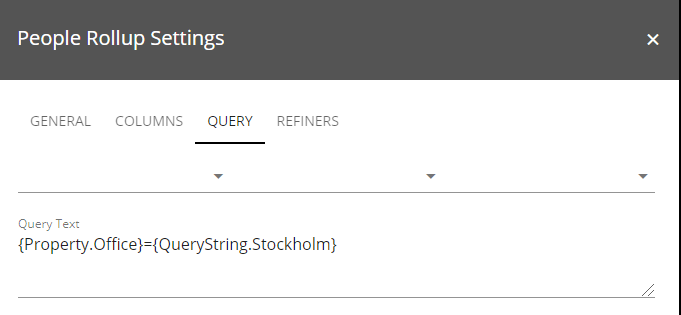
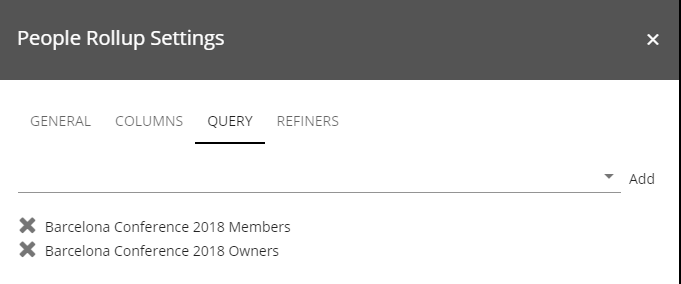
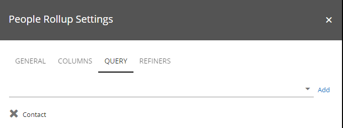

People Rollup
===========================

.. toctree::
   :titlesonly:

   setup/index

You can use this control on any page, both legacy pages and Quick Pages, and even in a team site. Use it to display information for one or a number of colleagues. The control can be used for a vast number of applications but some examples are:

+ Display contact person for a page or for something else.
+ List colleagues working at a particular office.
+ List members or owners in a group site.
+ Create a people directory.

Here are two examples:

Settings for the control
*************************
The following settings are available:

.. image:: peoplerollup-settings-general.png

The General tab
----------------
On the General tab, the following settings are available:

+ **Query Type**: Select type of information to use for the Query (=detailed settings of what to display). You can use fields from user profiles, Sharepoint groups or fields defined in the properties for this site. The latter has to be set up in Omnia Admin by an administrator, using Properties for Content Management. For example: To display a contact person you would most likely use "User Fields On Page", to display colleagues working at a particular office - "Profile Query", and to display members in a group site - "Sharepoint Groups".
+ **Title**: Here you can add a title to display at the top of the list.
+ **Default Sort Order**: Select sort order. What sort orders are available can differ depending on Query Type chosen.
+ **Sort Direction**: Select Ascending or Descending sorting.
+ **Paging Type**: Can be "Classic" or "Scroll". Classic: The result list will be divided into pages based on the Page Size. Scroll: By default, the page will load as many objects that can fit the screen. When the user scrolls down, the number of objects set in Page Size will load.
+ **Page Size**: Defines the number of objects to display per list "page".
+ **No of pages**: If a lot of people should shown in one People Rollup, you can set the number of pages to be displayed in the pager. Otherwise the pager will be very wide.
+ **Total Columns**: The total number of columns allowed in the People Rollup.
+ **Show Profile Image**: Select if the profile photo(s) for the person(s) should be shown.

The Columns tab
----------------
Here you decide which property fields to show information from. It can look like this:

The properties you can choose from are those defined by an administrator for Content Management, for this site.

1. Start by adding fields.
2. Then select which style to use and whether to show a label or not, for each field selected, under "Selected Properties".

The Query tab
---------------
What you can do here depends on which Query Type you select on the General tab.

If you selected "Profile Query", do the following:

1. Select settings for the query, and click "Add filter".

Here's an example of a query for displaying colleauges at the Stockholm office. You can see the actual query in the field below, which was added when clicking "Add filter".

Note for advanced users: You can use all search related options here in the Query field.
 
If you selected "Sharepoint groups" as Query Type, select a group from the list and click "Add group". If available, you can add more than one group this way.

**Note!**
You must select the field even if there should be only one field available.

If you selected "User fields On Page" as Query Type, select a field from the list and click "Add field". If available, you can select any number of fields this way.

**Note!**
You must select the field even if there should be only one field available.

 
