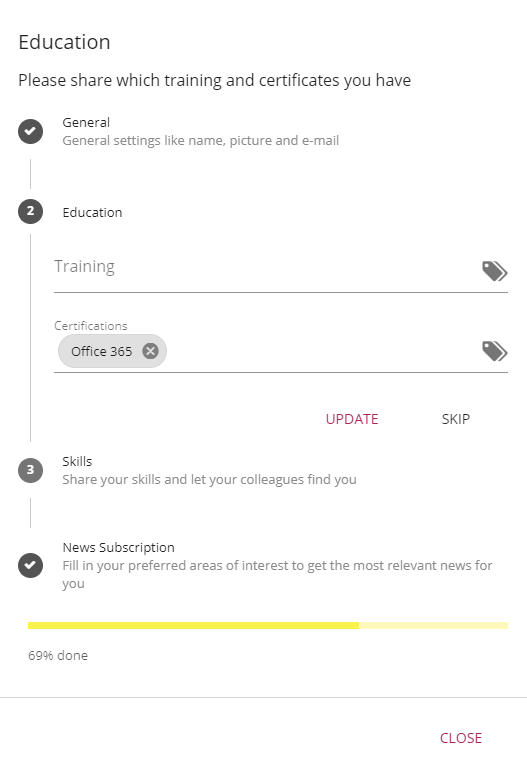
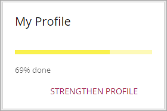
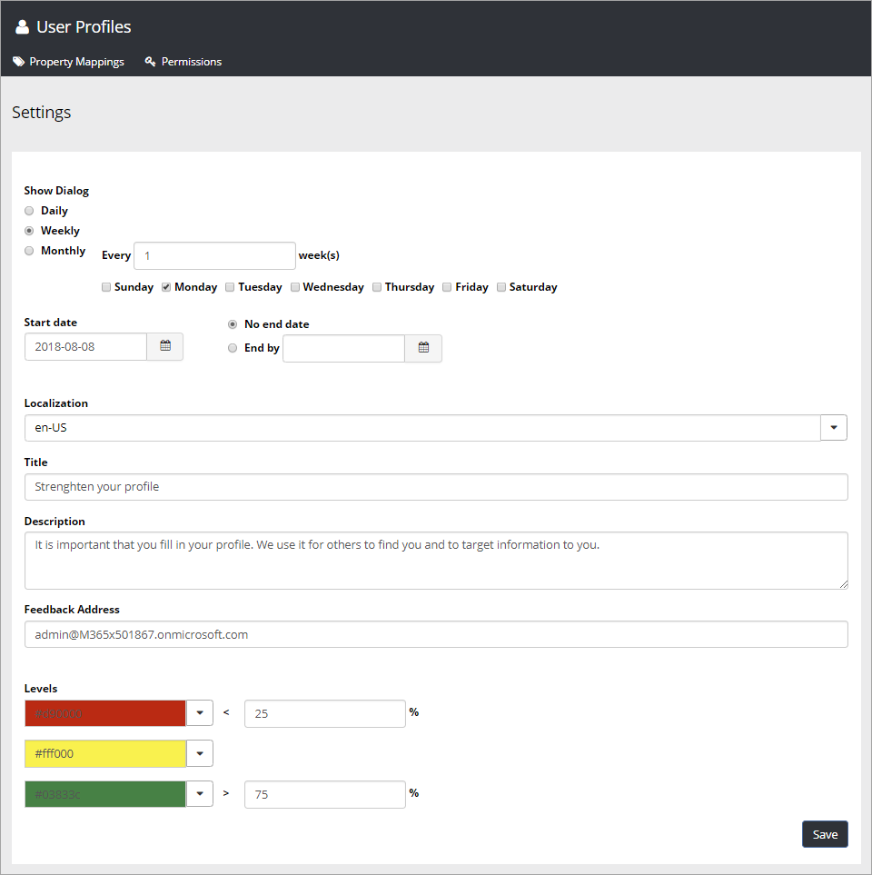
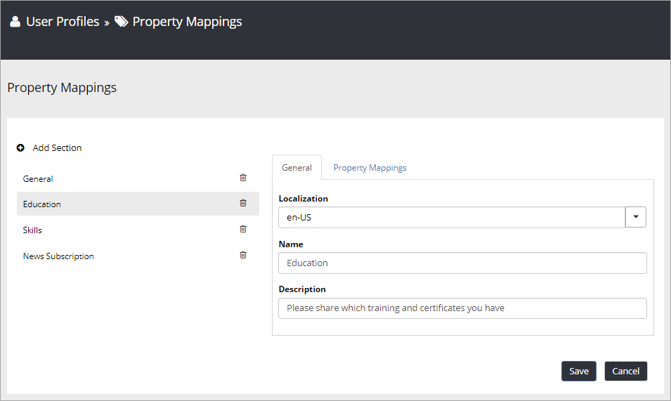
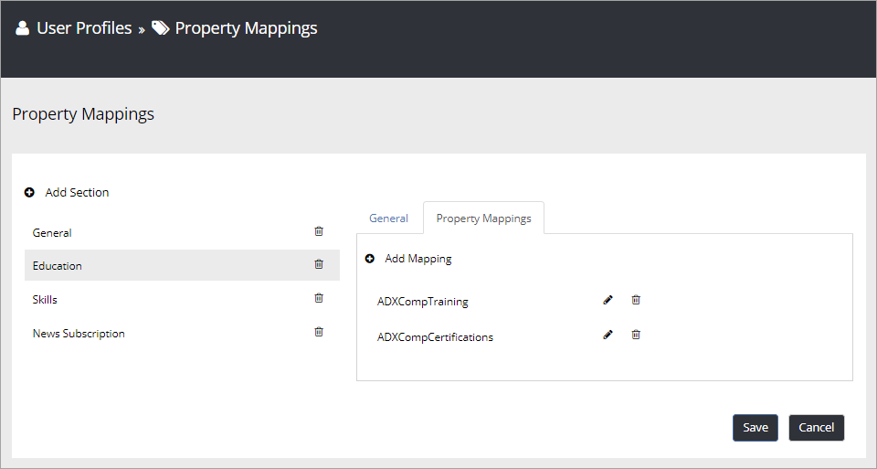
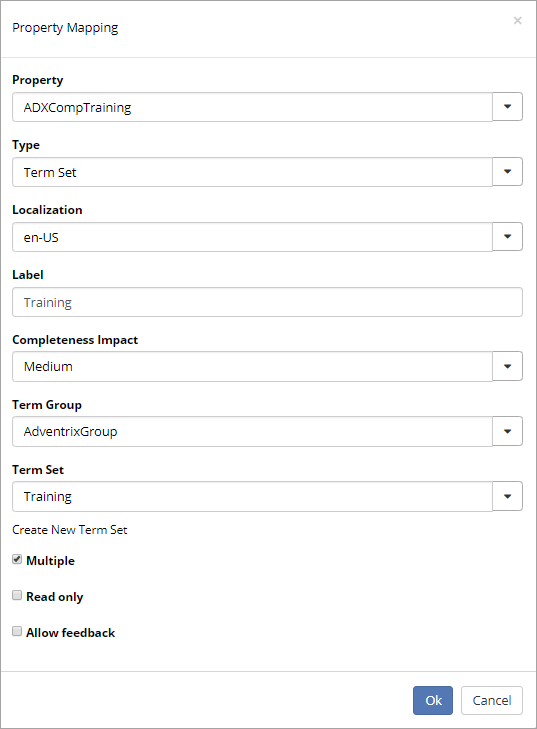

User Profile Completion Wizard
===============================

.. toctree::
   :titlesonly:

   setup/index

The user profile completion wizard is a tool to help end users fill in their user profiles.

The wizard is shown as a dialog and can be accessed via the Strengthen Profile block.

It can also be scheduled to appear automatically to the end user via settings in Omnia Admin > User Profiles.

+ **Show Dialog**: The schedule that should be used to show the User Profile Completion Wizard to the end user. The dialog is shown on all Omnia pages and are shown until the user closes the dialog.
+ **Localization**: Select which language to localize the Title and Description in. Available localization labels can be set in System > Settings > Intranet Core.
+ **Title**: The overall title that should be shown in the Wizard when no specific section is selected.
+ **Description**: The overall description that should be shown in the Wizard when no specific section is selected.
+ **Feedback Address**: The e-mail address that should be used when an end user sends feedback for a specific property.
+ **Levels**: Here you can set three levels of profile completeness with a mathing color for each level and procentage span.

As an administrator you can set up sections and properties in the User Profile Completion Wizard. Each section can have its own title and description in different languages.

Within each section, you can add property mappings.

A property mapping supports the following settings.

+ **Type**: Can be any of the following values: "Profile Picture", "Text", "Multiline Text" or "Term Set". You have to make sure the type match the related user property.
+ **Property**: Select a built-in or custom property from the User Profile Properties in SharePoint. (Note! If "Profile Picture" is selected as Type, you do not have to select a property, because it will be stored in Office 365.)
+ **Localization**: Select a language if you need to localize the label.
+ **Label**: The label that should be shown for the end user.
+ **Completeness Impact**: If the user complete this property, this decides what the impact should be on the profile completeness percentage. You can select "Low", "Medium" and "High".
+ **Term Group**: If "Term Set" is selected as type, you need to select a Term Group and a Term Set.
+ **Term Set**: The "Term Set" will present the terms the end user has to select from when filling out this property.
+ **Multiple**: Decides whether multiple choice should be allowed. (Note! Make sure the user profile property supports multi choice.)
+ **Read only**: Decides whether the property should be editable or not. A read-only property can be used to show a certain value for the end user without having the possibility to change it. It is preferably used in combination with "Allow feedback". 
+ **Allow feedback**: If this checkbox is selected, a small feedback icon will appear next to the property and the end user can send feedback to a central location (set in the main settings) that is responsible for this value in the backend.

