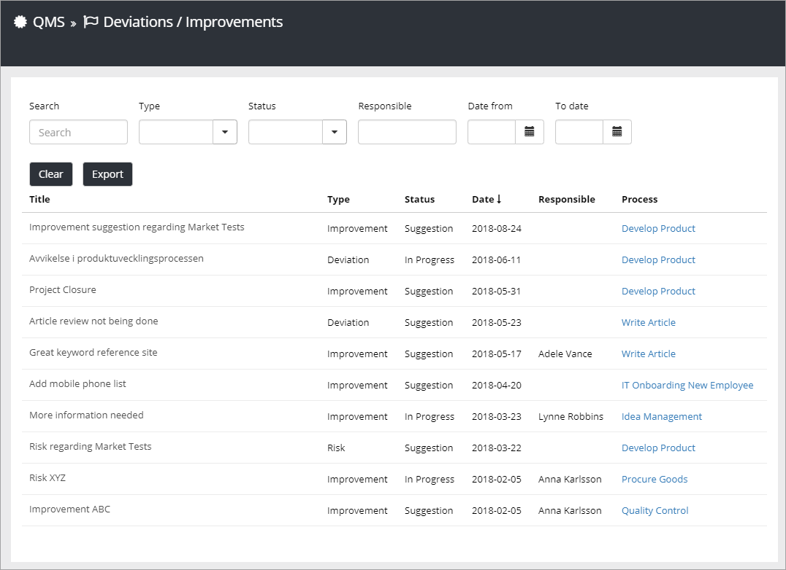

Settings
===========================

The author(s) of a process can handle user feedback on the tab "Deviation/Improvement", when working with the process.

Here, an administrator can check the status of all user feedback for all processes in the tenant, to make sure that feedback postings are beeing handled. The columns "Status" and "Date" are two important columns to check in that respect, see below.

Use "Search" to search the list. Use "Type", "Status", "Responsible", "Date from" and "Date to" to filter the list. An example: If you would like to check the progress of all feedback postings labeled Risk, select "Risk" under "Type".

Click "Clear" to show the full list after searching or filtering. Use "Export" to export the list to an Excel file.

The columns contain the following information:

+ **Title**: The user enters a title when sending the feedback. A process author can edit the title.
+ **Type**: Type of feedback is shown here. It can be Improvement, Deviation or Risk. The user sending the feedback selects a Type. A process author can change type.
+ **Status**: The Status is shown here. When a user sends a feedback posting, the Status will be "New". The author handling the feedback can change the Status to "Suggestion", "In progress", "On hold" or "Closed".
+ **Date**: The Date when the user sent the feedback is shown in this column, the latest at the top. You can click the heading to sort the list with the oldest at the top.
+ **Responsible**: If someone is named as Responsible for this feedback, by any of the process authors, the name will be shown here.
+ **Process**: For a closer look at the process, click the link here. You can even work with the feedback for the process if you have the right permissions.

For more information about how to work with feedback for a process, see: :doc:`Important Announcements </web-content-management/news/important-announcements/index>`
