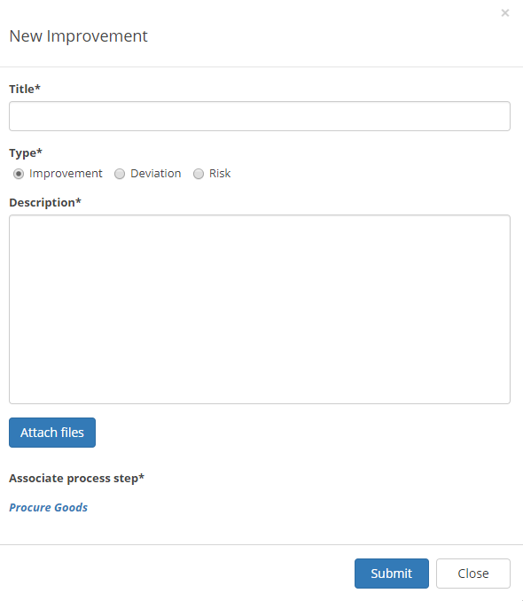

Deviations/Improvements
===========================

Using the the option "Add Feedback" any user that has access to a published process can send feedback:

.. image:: qms-add-feedback.png

The users types a title, selects type of feedback: Improvement, Deviation or Risk, adds a text for the feedback and can even attach files:

When a process is edited, all feedback is available on the "Deviation/Improvement" tab:

.. image:: qms-improvement.png

A feedback post can be handled here, information and actions added and history viewed:

.. image:: qms-improvment-settings.png

