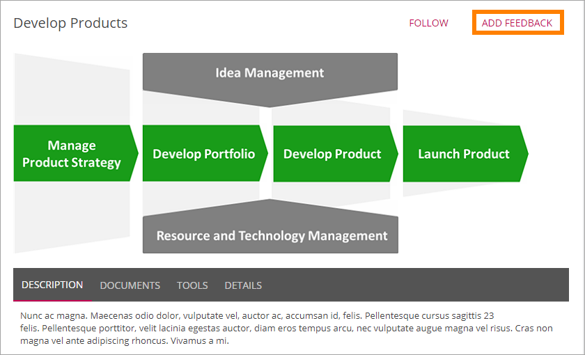
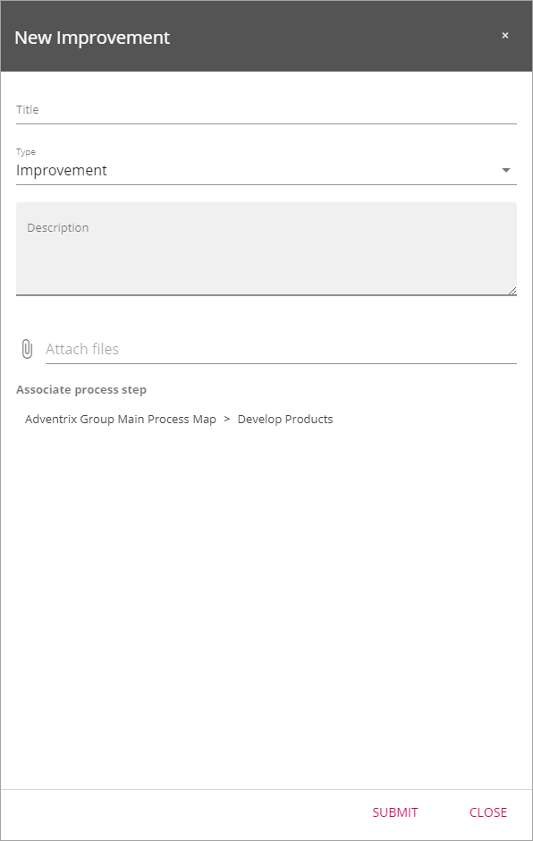
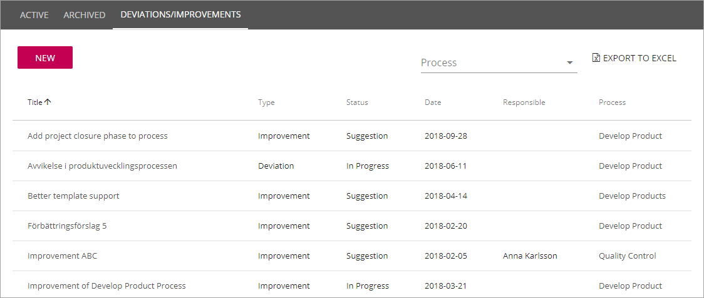
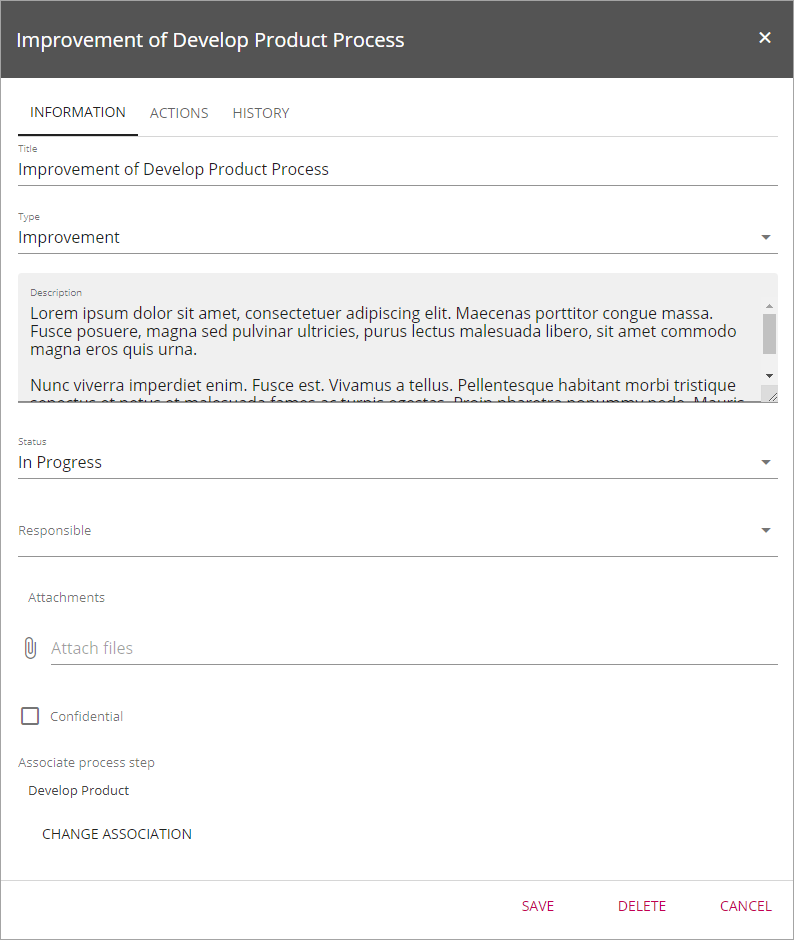
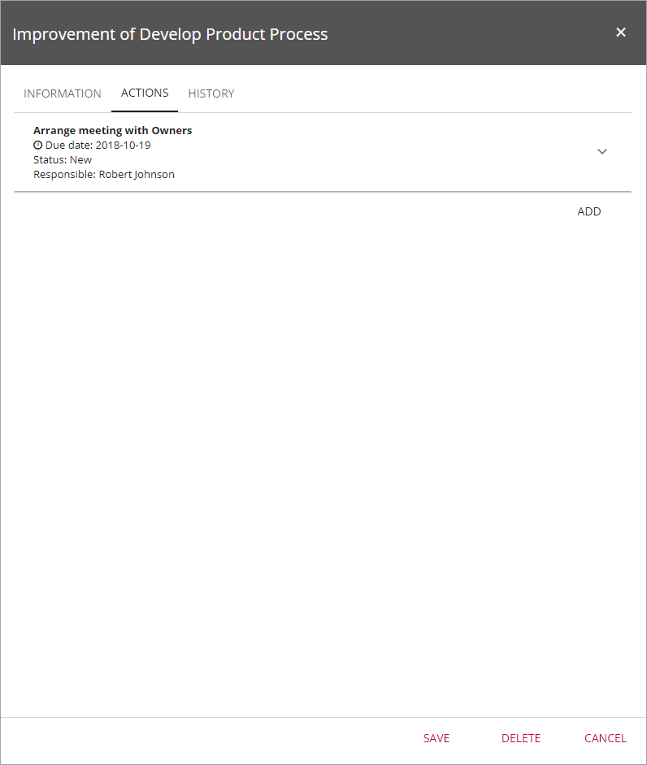
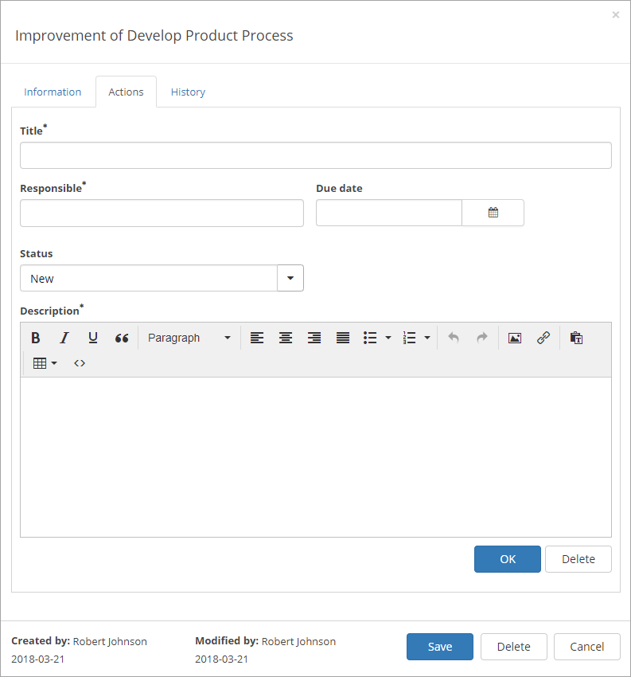
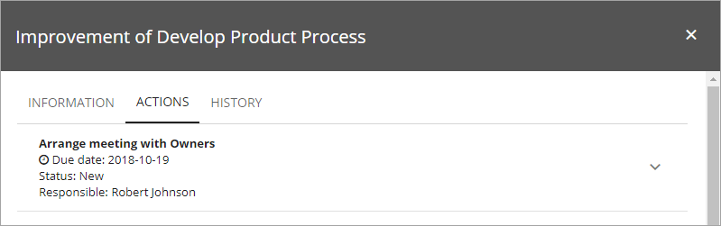
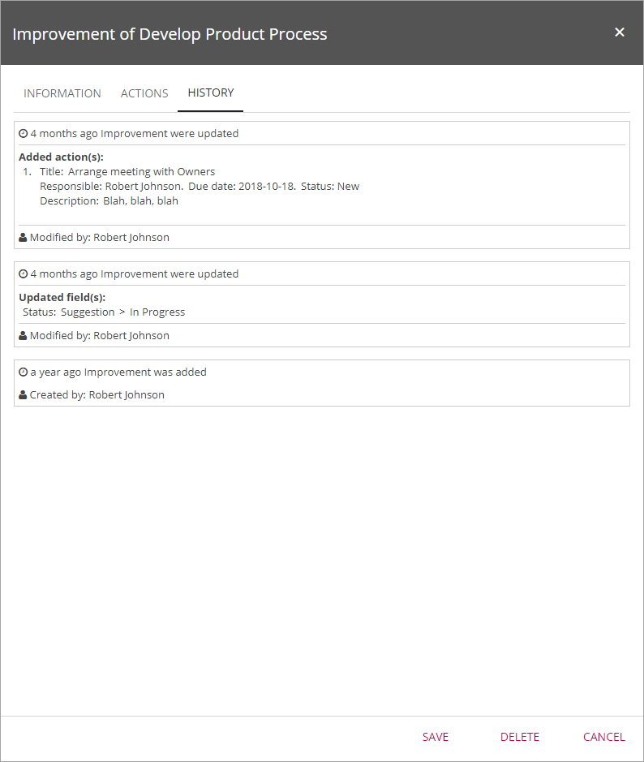

Deviations/Improvements
===========================

Using the the option "Add Feedback" any user that has access to a published process can send feedback:

The user types a title, selects type of feedback: Improvement, Deviation or Risk, adds a text and can even attach files:

When a process is edited, all feedback concerning that process, is available on the "Deviation/Improvement" tab:

You can use the link to the right to export the list to Excel. You can click the headings to change between ascending and descending sorting.

You can also add feedback yourself, for example if you have got feedback some other way than through the system. Just click "New" and use the tabs as described below.

To work with a feedback post, just click the link.

Working with deviations/improvements
************************************

When editing feedback, you work with three tabs, se the sections below.

Information
------------
On this tab, the following options are available:

Use the options this way:

+ **Title**: What you see is the title the user added when sending the feedback. Change the title if needed.
+ **Type**: When sending the feedback, the user entered a type. You can change th type here if needed.
+ **Description**: When sending the feedback, the user entered a description. You can edit or add to the description, if needed.
+ **Status**: Status should be changed as the work with the feedback post progresses. When the user sends the feedback, the status is always "New". Status can be changed to "Suggestion", "In progress", "On hold" and "Finished". Note that as feedback postings are visible in a list in Omnia Admin as well, changing status is a great way to show that the feedback is actually dealt with.
+ **Responsible**: When some of the Process Authors has started working on a feedback post, it is a good idea to enter a name in this field so that others can see who's responsible for this feedback post.
+ **Attach files**: Files can be attached using this button. It can be any type of file.
+ **Confidential**: This is an old setting. kept for compatibility reasons. Not used in later installments.
+ **Associate process step**: Here you can add information about which process step(s) the feedback is valid for.
+ **Delete**: This feedback post can be deleted, if needed, using this button.

Actions
--------
Use this tab to add and edit actions for the feedback.

To specify any actions that has taken place or will be needed, click "Add" and specify using these fields:

+ **Title**: Add a title for the action.
+ **Responsible**: The person responsible for the action can be named here.
+ **Due date**: Specify a Due date for the action, if needed.
+ **Status**: Here you can note the status for the action as the work progresses. Status can be "New", "Active", "Done", "On hold" or "Closed".
+ **Description**: Here you can type a description about what this action is about. Note the format options and note that you can add images, links and tabled.
+ **Save**: Click Save to save the action.

Active actions are shown in the list of actions this way:

To edit an action, just click on it and the same fields as decribed above will be available.

History
--------
History for the actions on this feedback is listed on this tab.

