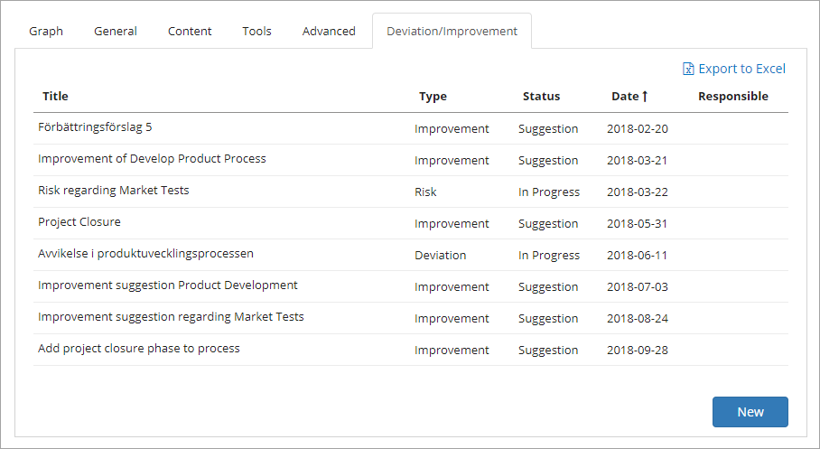
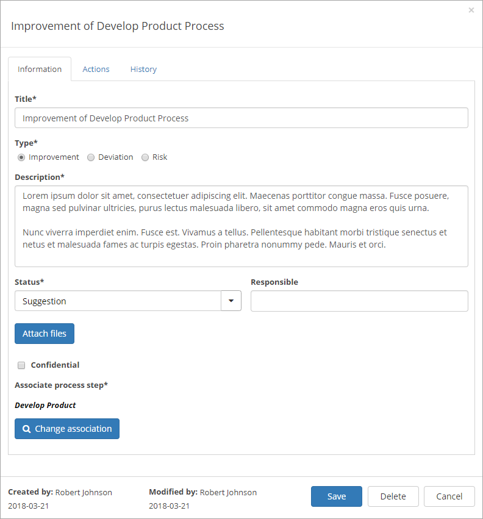
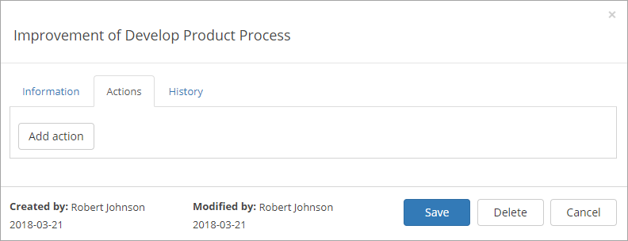
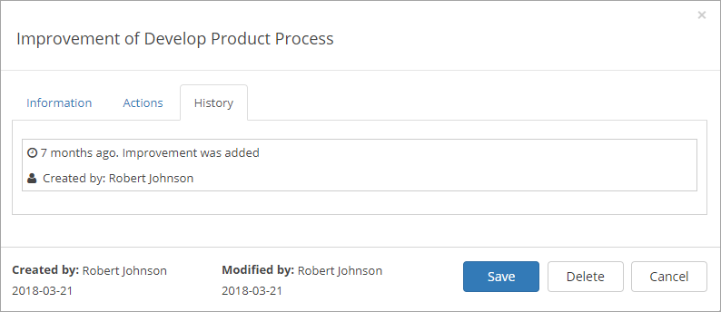

Deviations/Improvements
===========================

Using the the option "Add Feedback" any user that has access to a published process can send feedback:

.. image:: qms-add-feedback.png

The user types a title, selects type of feedback: Improvement, Deviation or Risk, adds a text and can even attach files:

.. image:: qms-feedback-add-border.png

When a process is edited, all feedback concerning that process, is available on the "Deviation/Improvement" tab:

You can use the link to the right to export the list to Excel. You can click the headings to change between ascending and descending sorting.

You can also add feedback yourself, for example if you have got feedback some other way than through the system. Just click "New" and use the tabs as described below.

To work with a feedback post, just click the link.

Working with deviations/improvements
************************************

When editing feedback, you work with three tabs, se the sections below.

Information
------------
On this tab, the following options are available:

Actions
--------
Use this tab to add and edit actions for the feedback.

History
--------
History for the actions on this feedback is listed on this tab.

