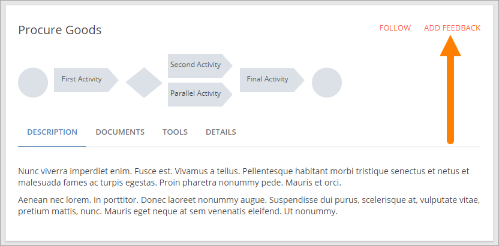
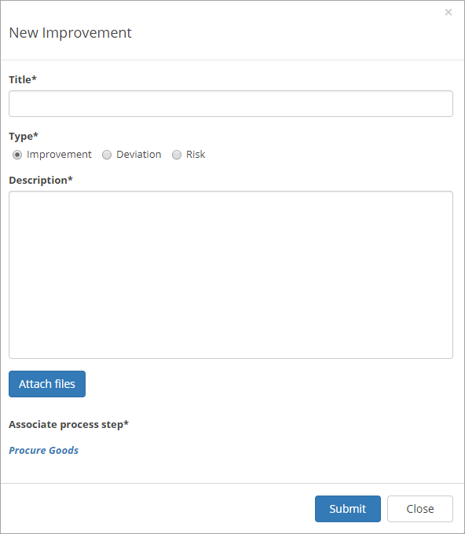
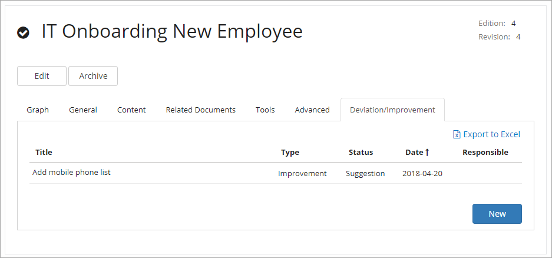
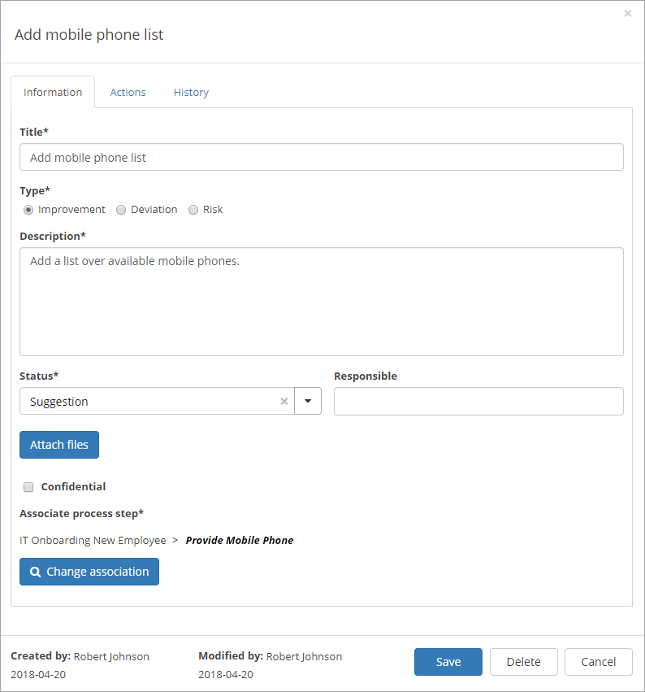

Deviations/Improvements
===========================

Using the the option "Add Feedback" any user that has access to a published process can send feedback:

The user types a title, selects type of feedback: Improvement, Deviation or Risk, adds a text and can even attach files:

When a process is edited, all feedback concerning that process, is available on the "Deviation/Improvement" tab:

Working with deviations/improvements
************************************

A feedback post can be handled here, information and actions added and history viewed:

You work with three tabs, se the sections below.

